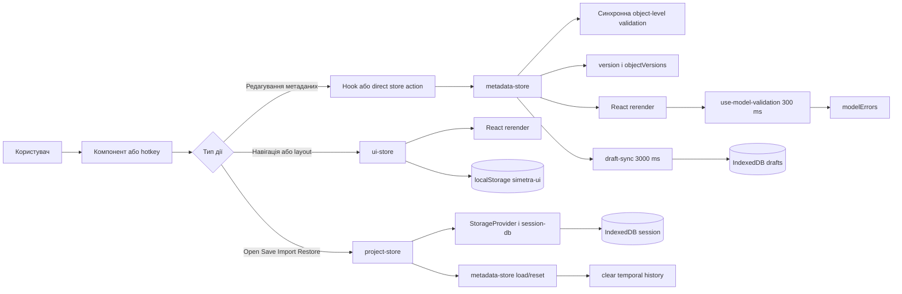

# State Management

## Призначення і межі

Simetra свідомо не зводить увесь runtime у один store. Поточна архітектура розділяє стан на три окремі контури з різними інваріантами:

| Store | Канонічна відповідальність | Що принципово не зберігає |
|---|---|---|
| `metadata-store` | Доменна модель `ProjectModel` і всі мутації метаданих | layout, selection, file/session lifecycle |
| `ui-store` | Навігація, layout, tabs, floating windows, вибір у UI | `ProjectModel`, save baseline, filesystem context |
| `project-store` | Файловий контекст, save baseline, restore/recovery orchestration | доменні мутації, persisted UI layout |

Такий поділ зменшує кількість випадкових зв'язків між редагуванням моделі, runtime UI і файловими сценаріями. Найважливіший наслідок: undo/redo працює тільки для доменних змін, а не для layout чи permission state.

Поточна точка інтеграції store-архітектури в shell: [../../apps/web/src/components/layout/app-shell.tsx](../../apps/web/src/components/layout/app-shell.tsx).

## Огляд трьох store

### Поточний стан

- `metadata-store` у [../../apps/web/src/stores/metadata-store.ts](../../apps/web/src/stores/metadata-store.ts) є canonical in-memory представленням `ProjectModel`.
- `ui-store` у [../../apps/web/src/stores/ui-store.ts](../../apps/web/src/stores/ui-store.ts) керує вибором, навігацією та window-management.
- `project-store` у [../../apps/web/src/stores/project-store.ts](../../apps/web/src/stores/project-store.ts) оркеструє open/save/import/export/session restore поверх storage layer.

### Планований стан

- Узагальнений object-scoped `viewState` поки не реалізований.
- Поточна система зберігає тільки частину view-контексту: `selectedField`, `selectedTabularSection`, `selectedObject` і `activeSection` для tab/window.
- Обмеження detach/attach для глибшого view state зафіксоване як Phase 1 known limitation у [../phase1-known-limitations.md](../phase1-known-limitations.md).

## Metadata Store

Джерело: [../../apps/web/src/stores/metadata-store.ts](../../apps/web/src/stores/metadata-store.ts).

### Відповідальність

- Зберігає canonical `model: ProjectModel`.
- Виконує всі доменні мутації через Zustand + immer.
- Є єдиним store, підключеним до zundo temporal history.
- Підтримує version-based dirty tracking замість deep diff.

### Групи дій

Store організований навколо груп доменних операцій, а не навколо UI-сценаріїв:

- object actions: `createObject`, `updateObject`, `deleteObject`, `renameObject`, `duplicateObject`
- attribute actions: `addAttribute`, `removeAttribute`, `updateAttribute`, `reorderAttributes`
- tabular section actions: додавання/видалення табличних частин і їх атрибутів
- enum actions: `addEnumValue`, `removeEnumValue`, `updateEnumValue`, `reorderEnumValues`
- register actions: `addDimension`, `updateDimension`, `reorderDimensions`, `addResource`, `updateResource`, `reorderResources`
- project action: `updateProject`
- lifecycle actions: `loadModel`, `resetModel`, `setModelErrors`

Архітектурний сенс такого групування: компоненти не повинні знати внутрішню структуру конкретного metadata kind. Вони маршрутизують intent до відповідної групи дій, як це робить [../../apps/web/src/hooks/use-field-update.ts](../../apps/web/src/hooks/use-field-update.ts) для редагування полів з [../../apps/web/src/components/properties/field-properties.tsx](../../apps/web/src/components/properties/field-properties.tsx).

### Інваріанти стану

- `model` є єдиним джерелом істини для метаданих у пам'яті.
- `version` інкрементується при кожній успішній доменній мутації.
- `objectVersions['Kind/Name']` інкрементується для зміненого об'єкта і використовується для object-scoped dirty tracking.
- `validationErrors` містить синхронні помилки конкретної мутації.
- `modelErrors` містить асинхронно оновлені помилки project-level validation.

### `validationErrors` проти `modelErrors`

Це дві різні архітектурні площини, і їх не можна зливати в один канал:

- `validationErrors` виникають всередині action у `metadata-store`, коли конкретна операція дає невалідний результат або порушує локальний інваріант, наприклад duplicate name чи invalid object shape.
- `modelErrors` виставляються окремо через `setModelErrors` після дебаунсної перевірки всієї моделі в [../../apps/web/src/hooks/use-model-validation.ts](../../apps/web/src/hooks/use-model-validation.ts).

У UI ці два набори помилок комбінуються тільки на рівні відображення. Приклад такого злиття без зміни джерел істини: [../../apps/web/src/components/properties/field-properties.tsx](../../apps/web/src/components/properties/field-properties.tsx).

### Rename і cascade refs

`renameObject` є не просто перейменуванням label. Воно змінює identity key `Kind/Name`, переносить `objectVersions` на новий ключ і виконує cascade update усіх reachable reference targets у моделі.

Поточна cascade-логіка оновлює:

- `owners`
- `recorderTypes`
- `registerMovements`
- `attribute.ref`
- `attribute.allowedTypes`
- такі самі ref-поля в `dimensions`, `resources` і tabular section attributes

Архітектурний наслідок: rename робить dirty не лише сам об'єкт, а й усі об'єкти, у яких було оновлено посилання. Це коректно, бо фактично змінюється серіалізований graph моделі, а не тільки ім'я у UI.

### Межа zundo

`metadata-store` загорнутий у `temporal(...)` і є єдиною частиною системи, що має undo/redo history. Поточна конфігурація:

- історія обмежена `limit: 100`
- equality спирається на зміну `model`
- `validationErrors`, `modelErrors` і `objectVersions` не є самостійними одиницями history

Практичний наслідок: відкриття проєкту, імпорт, reset і restore повинні явно очищати temporal stack. Це робить `project-store` після `loadModel` або `resetModel`, щоб history не протікала між різними project sessions.

## UI Store

Джерело: [../../apps/web/src/stores/ui-store.ts](../../apps/web/src/stores/ui-store.ts).

### Відповідальність

`ui-store` тримає runtime-стан, який потрібен для навігації та presentation orchestration, але не є частиною доменної моделі:

- selection: `selectedObject`, `selectedTabularSection`, `selectedField`
- navigation: `openTabs`, `activeTabId`
- window management: `floatingWindows`, `activeWindowId`, `nextWindowZIndex`
- editor context: `activeSection` у кожній вкладці та кожному floating window
- tree/navigation state: `expandedTreeNodes`, `searchQuery`
- layout state: `panelLayout`, `propertiesPanelOpen`, `focusedPanel`, `commandPaletteOpen`

Selection model у `ui-store` трирівнева: `selectedField` є найспецифічнішим контекстом, `selectedTabularSection` описує контекст табличної частини, а `selectedObject` є object-level anchor для поточного вибору. Цей стан є volatile: він не входить до `ProjectModel`, не персиститься між сесіями і може скидатися під час закриття вкладок/вікон, видалення об'єкта або reconcile з актуальною моделлю.

### Window-management модель

Поточна реалізація тримає два паралельні робочі контейнери:

- tabs для основної навігації
- floating windows для detached editors

Ідентичність прив'язана до `Kind/Name` через `refToTabId`. Це дає один стабільний ключ для:

- відкритої вкладки
- dirty-індикатора в [../../apps/web/src/components/window-manager/tab-bar.tsx](../../apps/web/src/components/window-manager/tab-bar.tsx)
- floating window identity у [../../apps/web/src/components/window-manager/floating-window.tsx](../../apps/web/src/components/window-manager/floating-window.tsx)
- зіставлення з `objectVersions` та `lastSavedObjectVersions`

`activeSection` зберігається окремо per-tab і per-window. Це поточний компроміс: store already preserves редакторську секцію при перемиканні tabs/windows, але ще не має повноцінного object-scoped view state.

### Persisted subset

`ui-store` використовує Zustand persist, але зберігає лише стабільний піднабір стану в `localStorage` під ключем `simetra-ui`:

- `expandedTreeNodes`
- `propertiesPanelOpen`
- `panelLayout`

Не персистяться:

- `openTabs`
- `activeTabId`
- `floatingWindows`
- `activeWindowId`
- `selectedObject`
- `selectedTabularSection`
- `selectedField`
- `searchQuery`
- `commandPaletteOpen`
- `focusedPanel`
- `nextWindowZIndex`

Це свідомий архітектурний вибір: persist-ити тільки стабільні UI preferences, а не volatile runtime context.

### Поточний стан проти planned `viewState`

Поточний стан:

- є selection state
- selection state вже трирівневий: `selectedField -> selectedTabularSection -> selectedObject`
- є per-tab/per-window `activeSection`
- є tabs/windows/layout state

Планований стан:

- окремий object-scoped `viewState`, який переживає detach/attach без втрати локального editor context
- runtime-only характер такого state вже визначений, але сама модель ще не реалізована

Отже, `viewState` потрібно документувати як roadmap-елемент, а не як частину поточного store API.

## Project Store

Джерело: [../../apps/web/src/stores/project-store.ts](../../apps/web/src/stores/project-store.ts).

### Відповідальність

`project-store` ізолює file lifecycle від доменних мутацій. Його основні зони відповідальності:

- `projectHandle` і directory context
- save baseline через `lastSavedVersion` і `lastSavedObjectVersions`
- operation flags: `isSaving`, `isLoading`, `lastError`, `openWarnings`
- session restore orchestration через `sessionRestoreStatus`
- project provenance через `projectOrigin`
- recovery state через `pendingRecovery` і `hasDraftFallback`

### Життєвий цикл файлу і проєкту

Store оркеструє такі сценарії:

- `newProject`
- `saveProject`
- `openProject`
- `exportProject`
- `importProject`
- `restoreSession`
- `requestDirectoryPermission`
- `restoreDraft`

Він не редагує модель напряму, окрім керованих lifecycle-переходів через `metadata-store.loadModel()` або `resetModel()`. Після цього `project-store` одразу:

- очищає temporal history
- оновлює save baseline
- узгоджує session/draft persistence
- синхронізує file context і recovery state

### Ключові поля

- `projectHandle`: актуальний File System Access handle або `null`
- `sessionRestoreStatus`: `idle`, `restoring`, `awaiting-permission`, `restored`, `failed`, `recovery-available`
- `lastSavedVersion`: глобальний save baseline
- `lastSavedObjectVersions`: baseline для per-object dirty tracking
- `projectOrigin`: `new`, `directory`, `zip-import`, `draft-recovery` або `null`
- `pendingRecovery`: наявність новішого draft відносно збереженої сесії
- `hasDraftFallback`: можливість відновлення без доступу до директорії

### Чому `project-store` не використовує persist middleware

Це навмисне рішення, а не пропуск:

- store містить async lifecycle і permission-driven transitions
- `projectHandle` та recovery state залежать від браузерних capabilities і моменту user gesture
- session і drafts мають зберігатись у контрольованій схемі IndexedDB, а не в JSON snapshot `localStorage`

Тому `project-store` не є store-персистенцією у стилі Zustand persist; він є orchestration layer над [../../apps/web/src/storage/session-db.ts](../../apps/web/src/storage/session-db.ts) і storage provider.

## Межі Undo/Redo

Undo/redo є доменною функцією, а не глобальною rewind-моделлю всього UI.

### У history входить

- зміни `ProjectModel` у `metadata-store`
- create/update/delete/rename/reorder дії над metadata graph

### У history не входить

- вибір у дереві і selection поля
- tabs і floating windows
- panel layout, z-index, focused panel
- `projectHandle`, save/load flags, restore state
- `validationErrors` і `modelErrors` як окремий rewindable state

Такий кордон не дає перетворити undo на нестабільний глобальний time-travel. Користувач відміняє редакторські зміни моделі, а не випадкові layout-перемикання.

## Persistence Model

### UI preferences

`ui-store` зберігає стабільний subset у `localStorage` через persist middleware: [../../apps/web/src/stores/ui-store.ts](../../apps/web/src/stores/ui-store.ts).

### Session і drafts

Session та crash-recovery живуть у IndexedDB database `simetra-session`: [../../apps/web/src/storage/session-db.ts](../../apps/web/src/storage/session-db.ts).

Поточні object stores:

- `session`: `projectHandle`, `projectModel`, `lastSavedVersion`, `savedAt`
- `drafts`: `model`, `version`, `savedAt`

Autosave draft працює через [../../apps/web/src/storage/draft-sync.ts](../../apps/web/src/storage/draft-sync.ts):

- тригериться тільки від змін `metadata-store.version`
- дебаунсить запис на 3000 ms
- може бути `pause`/`resume` під час open/reset/restore/save

### Restore orchestration

[../../apps/web/src/hooks/use-session-restore.ts](../../apps/web/src/hooks/use-session-restore.ts) запускається на mount у [../../apps/web/src/components/layout/app-shell.tsx](../../apps/web/src/components/layout/app-shell.tsx) і делегує реальне відновлення `project-store.restoreSession()`.

Архітектурно це означає:

- bootstrapping restore не живе в root component state
- shell лише піднімає side effects
- рішення про FS restore, permission request чи draft recovery приймає `project-store`

## Dirty Tracking

Джерело: [../../apps/web/src/hooks/use-is-dirty.ts](../../apps/web/src/hooks/use-is-dirty.ts).

Simetra навмисно не використовує deep diff для визначення незбережених змін.

### Глобальний dirty state

- current state: `metadata-store.version`
- save baseline: `project-store.lastSavedVersion`
- правило: якщо значення різні, проєкт dirty

### Object-scoped dirty state

- current state: `metadata-store.objectVersions['Kind/Name']`
- save baseline: `project-store.lastSavedObjectVersions['Kind/Name']`
- правило: різниця означає dirty конкретного об'єкта

### Наслідки для rename і cascade

Rename має два архітектурно важливі ефекти:

- сам об'єкт отримує новий identity key і нову object version
- усі об'єкти, чиї reference fields були cascade-оновлені, також отримують інкремент version

Через це dirty tracking відображає реальний граф змін, а не тільки локальну подію на одному entity. Новий save baseline фіксується лише після успішного `saveProject()` або після lifecycle-сценаріїв open/import/restore.

## Validation Flow

### Синхронний контур

Під час кожної доменної мутації `metadata-store` виконує object-level `safeParse` через схеми з `@simetra/core`. Це покриває:

- shape validation
- required fields
- локальні інваріанти конкретного action
- локальні перевірки унікальності імен або дочірніх елементів

Помилки потрапляють у `validationErrors` і доступні одразу після мутації.

### Debounced model-level контур

[../../apps/web/src/hooks/use-model-validation.ts](../../apps/web/src/hooks/use-model-validation.ts) запускає project-level перевірку з debounce 300 ms. Вона проходить по всій моделі і поповнює `modelErrors`.

Поточний охват:

- duplicate names у межах одного kind
- object-level Zod validation для всієї моделі
- reachable reference validation для `ref`, `allowedTypes`, `owners`, `recorderTypes`, `registerMovements`

Архітектурний компроміс: миттєвий feedback залишається дешевим і локальним, а дорожча цілісна перевірка моделі винесена в окремий дебаунсний контур.

## Потік даних

Типовий шлях для editor action проходить через component/hook/store boundaries, а не через прямі локальні мутації.

Приклади точок входу:

- [../../apps/web/src/components/properties/field-properties.tsx](../../apps/web/src/components/properties/field-properties.tsx) для field edits
- [../../apps/web/src/hooks/use-field-update.ts](../../apps/web/src/hooks/use-field-update.ts) для routing до правильної store action
- [../../apps/web/src/components/layout/top-bar.tsx](../../apps/web/src/components/layout/top-bar.tsx) для save/undo/redo/open/import/export

## Що варто тестувати

Поточний test surface уже дає опорні приклади в [../../apps/web/src/__tests__/ui-store.test.ts](../../apps/web/src/__tests__/ui-store.test.ts), [../../apps/web/src/__tests__/module-a-bugfixes.test.ts](../../apps/web/src/__tests__/module-a-bugfixes.test.ts), [../../apps/web/src/__tests__/app-shell.test.tsx](../../apps/web/src/__tests__/app-shell.test.tsx) і [../../apps/web/src/__tests__/storage.test.ts](../../apps/web/src/__tests__/storage.test.ts).

Найцінніші архітектурні перевірки для stores/hooks:

- `metadata-store`: інкремент `version` тільки при реальних мутаціях, коректний `objectVersions`, rename migration ключа, cascade ref updates, межі undo/redo
- `ui-store`: tab/window lifecycle, `activeSection` per-tab/per-window, z-index progression, persisted subset без volatile runtime state
- `project-store`: baseline updates після save/open/import/restore, стани `sessionRestoreStatus`, recovery branching, відсутність history bleed між проєктами
- `use-is-dirty`: глобальний і object-scoped dirty без deep diff
- `use-model-validation`: debounce, duplicate detection, reachable refs, синхронізація `modelErrors`
- `use-session-restore`: одноразовий bootstrap при mount shell
- integration-level: hotkeys у shell, top-bar save/undo/redo, маршрут component → hook → store для field edits

## Антипатерни

- Тримати UI state у `metadata-store`. Це ламає межу між canonical model і presentation runtime.
- Додавати layout або window state в undo/redo history. Користувач не очікує відкату panel size чи active window разом із доменною зміною.
- Будувати dirty tracking на deep diff усього `ProjectModel`. Для великої моделі це дорожче, шумніше і складніше після rename/cascade.
- Дублювати validation logic у компонентах. Компоненти повинні відображати store errors, а не повторювати доменні правила.
- Persist-ити volatile runtime state: `openTabs`, active window, command palette, transient selection, z-index counters.
- Документувати planned `viewState` як уже реалізований API. Поточна система має лише частковий editor context, а не завершену view-state модель.

## Пов'язана документація

- [OVERVIEW.md](./OVERVIEW.md) — коротка карта всієї архітектури та місце state management у монорепо.
- [ui-components.md](./ui-components.md) — component hierarchy, tree layer і window system.
- [storage-and-persistence.md](./storage-and-persistence.md) — storage provider, filesystem flows, IndexedDB persistence і recovery.
- [metadata-model.md](./metadata-model.md) — `ProjectModel`, reference model і межі валідації.
- [patterns-and-decisions.md](./patterns-and-decisions.md) — стабільні рішення, патерни й антипатерни.
- [../BRD-metadata-configurator.md](../BRD-metadata-configurator.md) — бізнес-специфікація типів метаданих, JSON-формату і UI-вимог.

