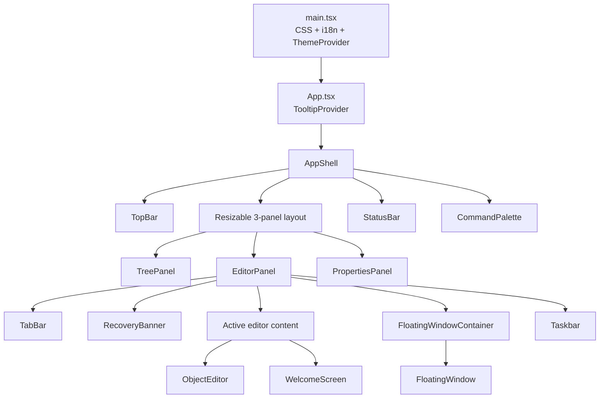
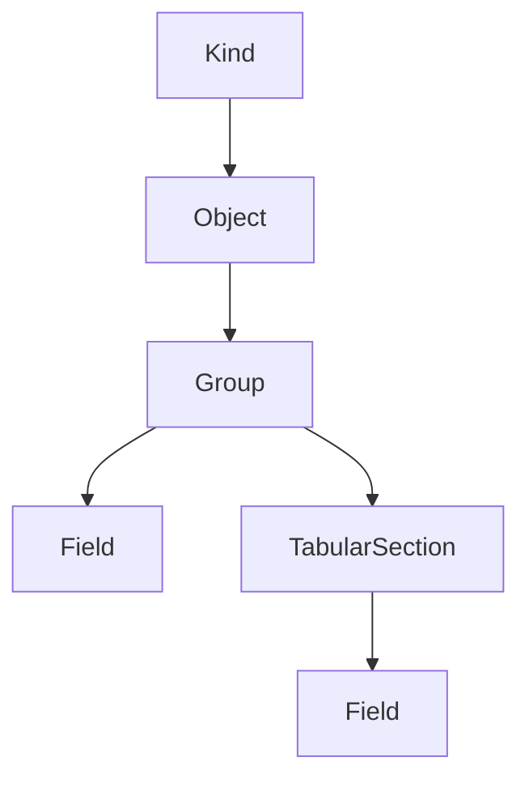
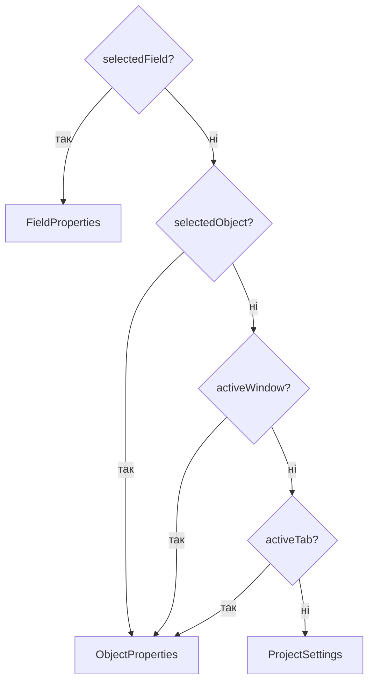

# UI Components Architecture

> Документ описує поточну UI-архітектуру в `apps/web`. Це не довідник props і не каталог дрібних API компонентів. Фокус: композиція shell, межі відповідальності, стабільні патерни та зони, де реалізація ще часткова.

## Призначення і межі

UI-рівень Simetra організований як 3-panel shell з верхньою та нижньою службовими панелями. Архітектурна ціль цього шару — розвести глобальну навігацію, робочу область редактора та context-sensitive властивості так, щоб:

- shell відповідав за композицію, lifecycle та global hotkeys;
- дерево відповідало за навігацію і структурні CRUD-операції;
- центральна панель відповідала за редакторський workflow;
- права панель відповідала за детальне редагування активного контексту;
- мутації доменної моделі проходили через store/hooks, а не через локальний стан окремих layout-компонентів.

**Поточна реалізація:** bootstrap і shell уже стабільно розділені на окремі рівні: [main.tsx](../../apps/web/src/main.tsx), [App.tsx](../../apps/web/src/App.tsx), [app-shell.tsx](../../apps/web/src/components/layout/app-shell.tsx).

**Частково / planned:** shell вже збирає основні runtime-сценарії, але не має окремого orchestration layer для dialog routing або централізованого hotkey-router.

Ключові файли:

- [main.tsx](../../apps/web/src/main.tsx)
- [App.tsx](../../apps/web/src/App.tsx)
- [app-shell.tsx](../../apps/web/src/components/layout/app-shell.tsx)
- [editor-panel.tsx](../../apps/web/src/components/layout/editor-panel.tsx)
- [tree-panel.tsx](../../apps/web/src/components/layout/tree-panel.tsx)
- [properties-panel.tsx](../../apps/web/src/components/layout/properties-panel.tsx)

## Bootstrap і shell composition

Bootstrap має три явні щаблі:

1. [main.tsx](../../apps/web/src/main.tsx) піднімає глобальні CSS, ініціалізує i18n, додає `ThemeProvider` і монтує React tree.
2. [App.tsx](../../apps/web/src/App.tsx) додає `TooltipProvider` і не містить бізнес-логіки.
3. [app-shell.tsx](../../apps/web/src/components/layout/app-shell.tsx) компонує весь runtime shell: layout, панелі, lifecycle hooks, draft sync та global hotkeys.

На рівні shell відповідальність уже зібрана в одному місці:

- `useSessionRestore()` запускає відновлення сесії;
- `useModelValidation()` виконує project-level validation;
- `startDraftSync()` підключає autosave чернетки;
- global hotkeys для save, undo/redo, command palette, створення об'єкта, tab navigation теж реєструються тут.

Це важлива межа: [app-shell.tsx](../../apps/web/src/components/layout/app-shell.tsx) оркеструє застосунок, але не реалізує доменні CRUD-операції самостійно.

## Ієрархія компонентів

Ролі верхнього рівня:

- `TopBar` — глобальні дії проєкту, а не редагування конкретного об'єкта.
- `TreePanel` — навігація по метаданих і структурні дії над деревом.
- `EditorPanel` — вкладки, floating windows, welcome/recovery стани й сам `ObjectEditor`.
- `PropertiesPanel` — правий context-sensitive маршрут до властивостей поля, об'єкта або проєкту.
- `StatusBar` — зведений runtime-стан проєкту.
- `CommandPalette` — глобальний overlay для команд і швидкої навігації.

**Поточна реалізація:** ця композиція вже є робочим shell, а не прототипом.

**Частково / planned:** окремий формалізований shell service layer поки не виділений; orchestration залишається в `AppShell`.

## Tree layer

Tree layer побудований навколо явного поділу між моделлю вузлів, pure builder-функціями та React-рендерами з interaction logic.

### Межі відповідальності

- [tree-types.ts](../../apps/web/src/components/layout/tree/tree-types.ts) описує типи вузлів і lightweight-контексти для tree-scoped dialog actions.
- [tree-builder.ts](../../apps/web/src/components/layout/tree/tree-builder.ts) будує дані дерева без React і без доступу до store; тут живуть і builder основного sidebar tree, і builder дерева для Data Type Editor.
- [tree-nodes.tsx](../../apps/web/src/components/layout/tree/tree-nodes.tsx) є поточним interaction layer для головного дерева: selection, context menus, structural CRUD, reorder, inline rename.
- [tree-node-presentation.tsx](../../apps/web/src/components/layout/tree/tree-node-presentation.tsx) містить presentation-only примітиви без store access і без CRUD.

Ключова поточна межа: `tree-node-presentation.tsx` **не** є повним presentation layer для всього metadata tree. Основне дерево досі значною мірою рендериться через [tree-nodes.tsx](../../apps/web/src/components/layout/tree/tree-nodes.tsx), а presentation-компоненти інтенсивніше перевикористовуються у [data-type-editor-dialog.tsx](../../apps/web/src/components/editor/data-type-editor-dialog.tsx).

### Глибока ієрархія вузлів

Поточна sidebar-ієрархія будується як:

- `kind`
- `object`
- `group`
- `field` або `tabularSection`
- для табличної частини: `tabularSection -> field`

Для різних metadata kinds дерево деталізується по-різному:

- `Catalog`, `Document`, `CustomTable` — групи `attributes`, а для `Catalog` і `Document` ще й `tabularSections`.
- `InformationRegister`, `AccumulationRegister` — групи `dimensions`, `resources`, `attributes`.
- `Enumeration` — група `values`, значення представлені як field-like вузли.
- `Constant` — без глибоких структурних груп.

### Пошук і поведінка дерева

Пошук керується через `searchQuery` у `ui-store` і UI-стан [tree-panel.tsx](../../apps/web/src/components/layout/tree-panel.tsx).

- `Ctrl/Cmd+F` у дереві відкриває inline search.
- `buildTreeData()` у [tree-builder.ts](../../apps/web/src/components/layout/tree/tree-builder.ts) фільтрує об'єкти, якщо збігається ім'я об'єкта або будь-який структурний нащадок.
- `react-arborist` додатково використовує `searchMatch`, де `kind` і `group` вузли лишаються видимими як структурні контейнери, а пошук по leaf-вузлах йде по `name`.
- Escape закриває search mode і повертає фокус назад у дерево.

Архітектурно це означає, що пошук не перебудовує іншу структуру дерева, а працює як фільтр поверх тієї самої ієрархії.

### Structural CRUD у дереві

Головне дерево вже є не лише навігацією, а й точкою структурних змін:

- `kind` вузли додають нові об'єкти;
- `object` вузли підтримують rename, duplicate, delete, where-used;
- `group` вузли додають поля, виміри, ресурси, табличні частини або enum values;
- `field` вузли підтримують delete і reorder up/down;
- `tabularSection` вузли підтримують додавання полів і видалення самої табличної частини.

Важлива межа: tree layer ініціює structural intent, але реальні зміни маршрутизуються в `metadata-store`, а selection/focus — у `ui-store`.

**Поточна реалізація:** deep tree, пошук, structural CRUD і tree-scoped dialogs уже реалізовані.

**Частково / planned:** interaction і presentation ще не розділені повністю; головне дерево залишається досить щільно пов'язаним із store access та context menu logic у одному файлі.

Ключові файли:

- [tree-types.ts](../../apps/web/src/components/layout/tree/tree-types.ts)
- [tree-builder.ts](../../apps/web/src/components/layout/tree/tree-builder.ts)
- [tree-nodes.tsx](../../apps/web/src/components/layout/tree/tree-nodes.tsx)
- [tree-node-presentation.tsx](../../apps/web/src/components/layout/tree/tree-node-presentation.tsx)
- [tree-panel.tsx](../../apps/web/src/components/layout/tree-panel.tsx)
- [data-type-editor-dialog.tsx](../../apps/web/src/components/editor/data-type-editor-dialog.tsx)

## Editor layer

Editor layer зведений навколо одного reusable редактора об'єкта — [object-editor.tsx](../../apps/web/src/components/editor/object-editor.tsx).

### Стабільна композиція

- [section-config.ts](../../apps/web/src/components/editor/section-config.ts) є декларативною картою секцій per metadata kind.
- [vertical-nav.tsx](../../apps/web/src/components/editor/vertical-nav.tsx) відповідає за навігацію секцій і клавіатурний перехід між ними.
- [object-editor.tsx](../../apps/web/src/components/editor/object-editor.tsx) резолвить об'єкт, обирає `SECTION_CONFIG[kind]`, нормалізує `activeSection` і рендерить контент поточної секції.

Це важливий стабільний патерн: і вкладки, і floating windows використовують **той самий** `ObjectEditor`, тому редакторська поведінка між цими режимами не дублюється й не роз'їжджається.

### Стратегія контенту секцій

Поточна стратегія не розбиває кожен metadata kind на окремий великий editor-компонент. Замість цього `ObjectEditor` працює через switch по активній секції:

- `main` — readonly summary для `displayName` і `description`;
- `data` — основна структурна робота з полями;
- `values` — спеціалізована секція для `Enumeration`;
- `numbering`, `movements`, `settings` — placeholder-секції з явним повідомленням `coming soon`.

Реально реалізовані редактори контенту:

- [attribute-table.tsx](../../apps/web/src/components/editor/attribute-table.tsx)
- [tabular-sections-editor.tsx](../../apps/web/src/components/editor/tabular-sections-editor.tsx)
- [enum-values-editor.tsx](../../apps/web/src/components/editor/enum-values-editor.tsx)

Для регістрів секція `data` збирає три таблиці підряд: `dimensions`, `resources`, `attributes`. Для `Catalog` і `Document` секція `data` поєднує `AttributeTable` і `TabularSectionsEditor`.

### Що вже реалізовано, а що ні

**Поточна реалізація:**

- секції `main`, `data`, `values` мають реальний контент;
- вертикальна навігація вже є основною моделлю editor navigation;
- `activeSection` не жорстко пришита до kind і перевизначається declarative config-ом.

**Частково / planned:**

- `numbering`, `movements`, `settings` уже присутні в навігації, але не є завершеними фічами;
- ці placeholder-секції не можна трактувати як повноцінний функціонал лише тому, що вони відображаються в UI.

### Важливе архітектурне правило

Багато детальних змін навмисно винесені не в центральний editor content, а у праву панель властивостей:

- секція `main` показує readonly summary;
- детальне редагування поля відбувається переважно через `FieldProperties`;
- налаштування об'єкта й частина auxiliary dialogs живуть у `ObjectProperties`.

Отже `ObjectEditor` є редактором структури та навігації по секціях, але не є єдиною точкою редагування всіх деталей.

## Properties panel

[properties-panel.tsx](../../apps/web/src/components/layout/properties-panel.tsx) є routing-компонентом, а не універсальним form-компонентом. Його головна роль — визначити, який контекст зараз важливіший.

Пріоритет контексту зараз такий:

1. `selectedField`
2. `selectedObject`
3. активне floating window
4. активна вкладка
5. `ProjectSettings`

### Ролі дочірніх компонентів

- [field-properties.tsx](../../apps/web/src/components/properties/field-properties.tsx) — детальне редагування атрибута, validation errors per field, відкриття `DataTypeEditorDialog`, маршрутизація field updates через `useFieldUpdate()`.
- [object-properties.tsx](../../apps/web/src/components/properties/object-properties.tsx) — rename/displayName/type settings об'єкта, об'єктні validation errors, запуск `StandardAttributesDialog` та `AdditionalIndexesDialog`.
- [project-settings.tsx](../../apps/web/src/components/properties/project-settings.tsx) — fallback-контекст для налаштувань проєкту, database і generation параметрів.

**Поточна реалізація:** логіка вибору контексту централізована і проста.

**Частково / planned:** окремий object-scoped `viewState`, який би узгоджував ще більше локального контексту між tabs/windows, поки не є частиною цього маршрутизатора.

## Window system

Window system побудований як runtime-модель tabs + floating windows у [ui-store.ts](../../apps/web/src/stores/ui-store.ts), а не як окремий DOM-only менеджер.

### Компоненти і ролі

- [tab-bar.tsx](../../apps/web/src/components/window-manager/tab-bar.tsx) — основна навігація між відкритими об'єктами, pin/close/reorder, drag-to-detach, dirty indicator.
- [floating-window-container.tsx](../../apps/web/src/components/window-manager/floating-window-container.tsx) — абсолютний контейнер для немінімізованих вікон усередині editor viewport.
- [floating-window.tsx](../../apps/web/src/components/window-manager/floating-window.tsx) — окреме MDI-подібне вікно з `ObjectEditor` усередині.
- [taskbar.tsx](../../apps/web/src/components/window-manager/taskbar.tsx) — смужка для мінімізованих вікон.

### Стабільні правила

- `TabItem` і `FloatingWindow` обидва несуть власний `activeSection`.
- `detachTab()` переносить вкладку у floating window, зберігаючи `activeSection`.
- `attachWindow()` повертає floating window назад у вкладку, також зберігаючи `activeSection`.
- `minimize`, `maximize`, `restore`, `focus`, `move`, `resize` є частиною `ui-store`, а не локального state окремого window-компонента.
- floating window відкриває той самий [ObjectEditor](../../apps/web/src/components/editor/object-editor.tsx), що й центральна вкладка.

### Detach / attach

- У [tab-bar.tsx](../../apps/web/src/components/window-manager/tab-bar.tsx) вертикальний drag вище порогу від'єднує вкладку у вікно.
- У [floating-window.tsx](../../apps/web/src/components/window-manager/floating-window.tsx) перетягування вікна до верхньої межі контейнера прикріплює його назад у вкладки.

Архітектурно це не два незалежні редактори, а два presentation-режими над одним editor contract.

### Z-index convention

Z-index домовленість зараз розподілена між двома місцями:

- [globals.css](../../packages/ui/src/styles/globals.css) задає архітектурний порядок шарів: `panels(10) -> tab-content(20) -> floating-windows(30) -> dialogs(40) -> command-palette(50)`.
- [ui-store.ts](../../apps/web/src/stores/ui-store.ts) підтримує runtime-лічильник `nextWindowZIndex`, який стартує від `30` і піднімає активне floating window над іншими.

**Поточна реалізація:** tabs/windows/taskbar уже працюють як єдина система навігації.

**Частково / planned:** централізований z-index service або окремий window manager domain layer поки не виділені; домовленість розподілена між CSS-конвенцією та store.

## Dialog architecture

Dialog-архітектура в Simetra **розподілена по feature-компонентах**. Поточної централізованої dialog manager-системи немає, і документ не повинен описувати її як існуючу.

### Де розміщені діалоги

- [tree-panel.tsx](../../apps/web/src/components/layout/tree-panel.tsx) тримає tree-scoped `DeleteConfirmDialog` і відкриває [where-used-dialog.tsx](../../apps/web/src/components/editor/where-used-dialog.tsx).
- [object-properties.tsx](../../apps/web/src/components/properties/object-properties.tsx) керує [standard-attributes-dialog.tsx](../../apps/web/src/components/editor/standard-attributes-dialog.tsx) і [additional-indexes-dialog.tsx](../../apps/web/src/components/editor/additional-indexes-dialog.tsx).
- [field-properties.tsx](../../apps/web/src/components/properties/field-properties.tsx) керує [data-type-editor-dialog.tsx](../../apps/web/src/components/editor/data-type-editor-dialog.tsx).

Такий розподіл є навмисним: власник контексту володіє і dialog state для цього контексту.

### Shared draft-state pattern

Для редагувальних діалогів уже сформувався спільний патерн:

- wrapper-компонент керує `open` і `revisionKey`;
- кожне нове відкриття інкрементує `revisionKey` і перевмонтовує body;
- body бере snapshot/saved-state при mount;
- локальний draft порівнюється зі snapshot для `isDirty`;
- save відправляє вузько спрямоване оновлення в store і закриває діалог.

Цей патерн вже є в:

- [data-type-editor-dialog.tsx](../../apps/web/src/components/editor/data-type-editor-dialog.tsx)
- [standard-attributes-dialog.tsx](../../apps/web/src/components/editor/standard-attributes-dialog.tsx)
- [additional-indexes-dialog.tsx](../../apps/web/src/components/editor/additional-indexes-dialog.tsx)

Інший клас діалогів працює без draft state:

- `WhereUsedDialog` — інспекція і навігація;
- `DeleteConfirmDialog` — підтвердження destructive action.

**Поточна реалізація:** dialog ownership уже локалізований у feature-компонентах.

**Частково / planned:** глобального dialog registry або єдиного orchestration layer поки немає, і це не слід вважати реалізованим патерном.

## Command palette і hotkeys

[command-palette.tsx](../../apps/web/src/components/command-palette.tsx) є глобальним overlay-компонентом, який відкривається через `ui-store.commandPaletteOpen` і виконує три класи дій:

- project actions (`save`, `export`, `undo`, `redo`);
- object creation по metadata kind;
- швидку навігацію до наявних об'єктів.

Архітектурно palette не містить власної доменної логіки: вона лише збирає список команд і диспетчеризує intent у `project-store`, `metadata-store` та `ui-store`.

Hotkeys наразі розділені на два рівні:

- global hotkeys у [app-shell.tsx](../../apps/web/src/components/layout/app-shell.tsx): `mod+k`, `mod+s`, `mod+z`, `mod+shift+z`, `mod+n`, `mod+w`, `ctrl+tab`, `ctrl+shift+tab`, `alt+enter`;
- tree-local hotkeys у [tree-panel.tsx](../../apps/web/src/components/layout/tree-panel.tsx): відкриття пошуку та `Escape` для виходу з search mode.

**Поточна реалізація:** palette і global hotkeys уже інтегровані в shell.

**Частково / planned:** `focusedPanel` уже є в `ui-store`, але поки не перетворився на повноцінний hotkey routing layer для всіх панелей.

## i18n architecture

I18n bootstrapping відбувається в [apps/web/src/i18n/index.ts](../../apps/web/src/i18n/index.ts), який імпортується на старті з [main.tsx](../../apps/web/src/main.tsx).

### Поточна модель

- використовується `i18next` + `react-i18next`;
- ресурси підключені статично з [uk.json](../../apps/web/src/i18n/locales/uk.json) і [en.json](../../apps/web/src/i18n/locales/en.json);
- використовується один i18next namespace `translation`;
- логічне namespacing ключів реалізоване через префікси в JSON: `action.*`, `metadata.*`, `tree.*`, `editor.*`, `properties.*`, `project.*`, `commandPalette.*`, `dialog.*`, `tabs.*`, `floatingWindow.*`, `statusBar.*`, `storage.*`.

Компоненти звертаються до перекладів через `useTranslation()`, а в окремих випадках читають `i18n.language` для вибору локалізованого відображення значень.

### Обмеження поточної реалізації

- `lng` і `fallbackLng` ініціалізуються як `uk`;
- runtime language switch у shell не реалізований;
- у коді немає окремого language store, language selector або викликів `changeLanguage()` як частини user workflow.

Отже двомовні ресурси вже підготовлені, але перемикання мови під час роботи застосунку поки не є завершеною фічею.

## Стратегія тестування UI-архітектури

Для цього шару найцінніші не snapshot-тести, а перевірка архітектурної поведінки й інваріантів.

### Уже підтверджені напрямки

- [tree-builder.test.ts](../../apps/web/src/__tests__/tree-builder.test.ts) перевіряє builder-и дерева для sidebar і Data Type Editor.
- [ui-store.test.ts](../../apps/web/src/__tests__/ui-store.test.ts) покриває tabs/windows lifecycle, detach/attach, z-index, focus invariants і persisted UI subset.
- [app-shell.test.tsx](../../apps/web/src/__tests__/app-shell.test.tsx) перевіряє базовий shell rendering.
- [data-type-editor-dialog.test.tsx](../../apps/web/src/__tests__/data-type-editor-dialog.test.tsx) перевіряє поведінку важливого редакторського діалогу.

### Що варто тестувати на архітектурному рівні

- пріоритет контексту в `PropertiesPanel`;
- збереження `activeSection` при detach/attach між tabs і floating windows;
- відсутність дублювання одного об'єкта одночасно в тих самих tabs/windows сценаріях;
- tree search на глибоких рівнях `kind -> object -> group -> field/tabular section`;
- handoff між structural CRUD у дереві та selection/focus у правій панелі;
- явність placeholder-секцій, щоб вони не виглядали як завершений функціонал.

**Поточна реалізація:** pure builders і `ui-store` вже тестуються як основні носії архітектурних інваріантів.

**Частково / planned:** покриття для `PropertiesPanel`, floating window rendering та dialog distribution поки менш формалізоване, ніж store-рівень.

## Антипатерни

- Не припускати існування глобального dialog manager, якщо діалоги фактично розподілені по feature ownership.
- Не дублювати editor logic окремо для tabs і floating windows: обидва режими мають триматися на спільному `ObjectEditor`.
- Не перетворювати архітектурний документ на prop reference.
- Не змішувати presentation і interaction layers у дереві без явного рішення; якщо межа неповна, це треба прямо позначати.
- Не трактувати placeholder-секції `numbering`, `movements`, `settings` як завершені фічі лише тому, що вони присутні у вертикальній навігації.

## Пов'язана документація

- [OVERVIEW.md](./OVERVIEW.md)
- [state-management.md](./state-management.md)
- [storage-and-persistence.md](./storage-and-persistence.md) — storage/runtime persistence, session restore і recovery
- [metadata-model.md](./metadata-model.md) — `ProjectModel`, межі валідації і serializer contract
- [patterns-and-decisions.md](./patterns-and-decisions.md) — стабільні архітектурні рішення і повторно вживані патерни
- [BRD-metadata-configurator.md](../BRD-metadata-configurator.md)
