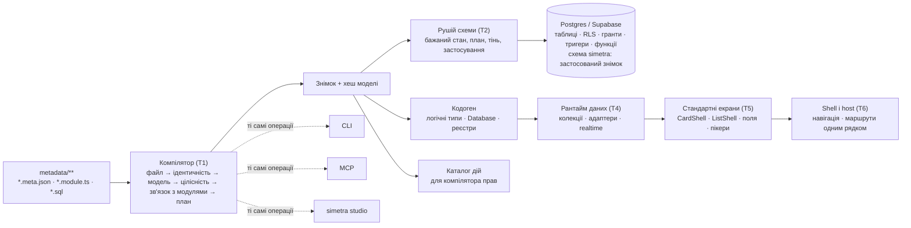

# Simetra на рестарті: що будуємо, що вже вирішено правильно і де треба переглянути

## Про цей документ

- **Питання.** Що насправді будує Simetra, які з ухвалених рішень платформної спеки й спеки П2 витримують критику, де їх треба переглянути, і що показала на практиці база першого споживача — перед тим, як писати наступні спеки й плани.
- **Дата.** 2026-09-29; розвилки закрито 2026-09-30.
- **Метод.** Критична переоцінка головним архітектором: звірка спек, BRD, ROADMAP і восьми ранніх досліджень із живою схемою бази першого споживача (каталог Postgres, лише читання й лише агрегати; у документі — тільки порядок величин) і з двома зовнішніми дослідженнями за першоджерелами станом на 2026-09-29. Версії й дати в таблицях стеку — на цю дату.
- **Джерела.** Дослідження [патернів і антипатернів](../analogues/patterns-and-antipatterns-2026-09.md) та [оцінка стеку](../stack/stack-evaluation-2026-09.md); ранні дослідження в `docs/research` (індекс — [`../README.md`](../README.md)).
- **Куди лягли рішення.** Платформна спека [`2026-09-24-simetra-platform-design.md`](../../superpowers/specs/2026-09-24-simetra-platform-design.md), спека П2 [`2026-09-28-p2-metamodel-compiler-design.md`](../../superpowers/specs/2026-09-28-p2-metamodel-compiler-design.md); розвилки A–I — розділ 9. Продовження дослідження — [карта перевикористання](../stack/reuse-map-2026-09.md).
- **Статус.** Затверджено власником 30.09.2026. Документ — контекст рішень, не правила: чинні правила живуть у спеках.

Критична переоцінка платформи перед брейнштормом, написана як дослідження без рішень. Прототип тут не розглядається як обмеження. Джерела: платформна спека, спека П2, BRD, ROADMAP, вісім досліджень у `docs/research`, архітектурна документація першого споживача, жива схема його бази (каталог Postgres, лише агрегати), інвентар прототипу і два зовнішні дослідження з посиланнями на першоджерела станом на 29 вересня 2026.

*29.09.2026 · Мова звіту: українська*

## 1. Головні висновки

**тримати** — Ядро дизайну правильне

Метадані у git, компілятор як єдині двері, UUID окремо від фізичних імен, вид визначає все, скоуп як складений ключ, проведення як оболонка платформи, підсумки на тригерах. Кожен із цих пунктів підтверджений досвідом 1С, Salesforce, Frappe, Payload і болями їхніх антиподів.

**тримати** — TypeScript, не Rust

Споживач пише розширення мовою платформи, гарячого шляху немає, Prisma і Supabase CLI пішли з нативних мов у TypeScript саме через ціну межі між мовами. Rust заходить лише готовими WASM-бібліотеками.

**переглянути** — Рушій схеми будувати над каталожним diff-двигуном, а не як його

Наміри (перейменування за UUID, фази «розширити → звузити», патчі даних) лишаються нашими, а різницю DDL між бажаним і фактичним станом рахує готовий двигун за власним інтерфейсом. Це змінює Р6 і суттєво зменшує П3.

**переглянути** — Стандартні реквізити як у 1С, тобто через налаштування виду

У базі першого споживача код є лише в одній таблиці з кількох десятків основної схеми, позначка видалення також в одній. 1С сама дозволяє довжину коду 0. Строгість «усе або нічого» перетворить майже всю базу споживача на довільні таблиці.

**уточнити** — Масштаб першої віхи

Спека описує платформу цілком: рушій без простою, облік версій клієнтів, гранти, рантайм, UI, shell, CLI, MCP, студія, доставка. Порядок «база спершу» правильний, але зміни без простою і облік версій клієнтів варто вводити за потребою, не в ядрі П3.

**додати** — Читання регістрів як API платформи

Залишки на дату, обороти за період, зріз останніх для періодичних регістрів відомостей. Без цього регістр не є першокласним примітивом, а це головна ніша Simetra.

## 2. Що ми будуємо

Simetra — це рамка: застосунок оголошує об'єкти (довідники, документи, регістри, перерахування, константи, довільні таблиці), а платформа виводить усе механічне. Рамку тримає не документація, а компілятор: усі двері (CLI, Vite-плагін, MCP, студія) ведуть у нього, і конфігурацію або прийнято цілком, або відхилено з діагностикою. База знає застосований знімок і його хеш, тож дрейф стає гучною помилкою.

Три користувачі платформи, і всі троє рівноправні: команди TypeScript і React, які не хочуть писати механіку; розробники з досвідом 1С, які хочуть знайому облікову модель на відкритому стеку; агенти, для яких MCP-операції і діагностика компілятора є основним інтерфейсом.

Що береться з 1С: облікова модель (види з вбудованою поведінкою, проведення, регістри з вимірами й ресурсами, табличні частини, конфігурація як єдиний опис). Що додається з практики першого споживача: опційний скоуп тенанта, живий рантайм даних, стандартні екрани з адитивною кастомізацією, зміни без монопольного режиму, агентська розробка. Що свідомо не береться: вбудована мова, закритий рантайм, реструктуризація зі зупинкою всіх.

## 3. Що показала жива база першого споживача

Схема першого споживача прочитана з каталогу Postgres, лише читанням і лише агрегатами; нижче наведено лише порядок величин, без імен об'єктів. Це найважливіший вхід для оцінки того, чого коштуватиме прийом бази.

| Що | Порядок величини | Що це означає для платформи |
|---|---|---|
| Схеми застосунку | кілька схем з таблицями і ще кілька лише з функціями | Кілька PG-схем на проєкт (уже в П2, М10) підтверджено |
| Таблиці | близько сотні | Помірний обсяг; переважна більшість таблиць основної схеми несе колонку тенанта |
| Рядків усього (оцінка планувальника) | десятки тисяч | Дані малі. Ризик міграцій низький, складність структурна, не об'ємна |
| Функції | понад сотню, майже всі SECURITY DEFINER | Уся поведінка (права, проведення, нумерація, broadcast) живе в PL/pgSQL. Це і є «дослівний SQL» при прийомі |
| Політики RLS | сотні | Розділені за командами (select/insert/update/delete), тобто вже мають форму, яку можна генерувати |
| Тригери | близько сотні, на більшості таблиць | Незмінність проведеного, broadcast, підсумки, версії кешу, валідація |
| Зовнішні ключі | сотні; кілька складених і кілька на схему провайдера автентифікації | Складений FK у межах тенанта вже трапляється; FK на схему провайдера обов'язковий у моделі |
| Індекси | кілька сотень; частина часткових, поодинокі виразні й з NULLS NOT DISTINCT | Класи, на яких ламалися інструменти зворотної генерації, реально присутні |
| Енам-типи Postgres | кілька типів із десятками значень, використані в десятках колонок | Рішення «прийняті енами як є» (М15) потрібне з першого дня |
| Об'єкти в схемах провайдера | поодинокі тригери на схемі автентифікації, політики сховища файлів, об'єкти realtime, таблиці в publication, cron-задачі | Пресет скоупу гейта для Supabase (§6.9) не порожній |

### Скільки в базі «1С»

- **Документи з проведенням: кілька.** Мають номер, дату, статус, позначку і час проведення, підсумкові суми. Табличні частини винесені в окремі таблиці, з номером рядка і об'єднавчими в'юхами.
- **Регістри накопичення: кілька.** Регістри залишків мають таблиці підсумків на тригерах, оборотний регістр — без підсумків. Реєстратор — пара «тип документа + id» без FK, період, скоуп денормалізовано. Це майже дослівно модель спеки П2 §7.
- **Довідники: кілька десятків таблиць** з назвою, службовими датами і тенантом. Але код є лише в одній, позначка видалення в одній, ієрархія в одній. Видалення в базі фізичне, з каскадами (близько сотні FK з ON DELETE CASCADE).
- **Права: модель даних, а не метаданих.** Ролі, дозволи з умовами й призначення живуть у таблицях; політики викликають функцію перевірки права (сотні викликів) і функцію членства (ще частіше).

> **Наслідок для М3 (строгі стандартні реквізити).** При строгому наборі «код + найменування + позначка видалення» майже жоден довідник споживача не відповідає виду без міграції. Це не аргумент проти строгості видів, але аргумент за те, щоб стандартні реквізити виводились із налаштувань виду так, як у самій 1С: довжина коду 0 означає «коду немає». Тоді промоція довідника з довільної таблиці зводиться до додавання позначки видалення й, за бажанням, коду.

> **Форма RLS.** Домінантний предикат політик — виклик функції членства з колонкою тенанта як аргументом, тобто корельований виклик на кожен рядок. Некорельована форма з масивом доступних id (§6.8 платформної спеки) трапляється лише в кількох відсотках політик. Вимога спеки має реальний ґрунт: після прийому саме ці політики першими варто замінити шаблонами.

## 4. Оцінка ухвалених рішень

Рішення платформної спеки (Р1–Р15) і спеки П2 (М1–М16) я звірив із дослідженнями, аналогами й живою базою. Оцінка означає: тримати без змін, уточнити формулювання або межі, переглянути суть на брейнштормі. Таблиця відображає стан на момент написання; що вирішено за результатами брейнштормінгу — розділ 9.

| Рішення | Оцінка | Чому |
|---|---|---|
| Р2 · JSON-метадані + TS-модулі + SQL-файли | тримати | Інструменти (студія, MCP) мусять редагувати метадані надійно; TS-DSL як у Payload зручніший людині, але не редагується інструментом. Дослідження 5 і Twenty 2.0 підтверджують: JSON із JSON Schema зараз, DSL як цукор пізніше |
| Р3 · Компілятор як єдині двері | тримати | Це і є «рамка». Hasura з її «inconsistent metadata» і Twenty з крихкою побудовою схеми в рантаймі показують ціну відсутності кроку компіляції |
| Р4, Р5 · UUID усюди; фізичне ім'я призначається раз | тримати | 1С робить це двадцять років (DBNames), Salesforce, Baserow, directus-sync теж. Diff за іменами (drizzle-kit, sqldef) не відрізняє перейменування від видалення з додаванням |
| Р6 · Власний планувальник на знімках метаданих | переглянути | Намір (перейменування, фази, патчі) має бути наш. Але різницю DDL між бажаним і фактичним каталогом краще рахувати готовим двигуном за власним інтерфейсом: pg-delta став типовим рушієм нових проєктів Supabase, pg-schema-diff і sqldef — запасні. Власний повний DDL-diff з функціями, політиками, тригерами й ACL — найдорожча частина П3 і не дає унікальної цінності. Деталі — розвилка A |
| Р7 · Зміни без простою, «розширити → звузити», облік версій клієнтів | уточнити | Принцип правильний і відрізняє від 1С. Але перейменування вже безкоштовне (Р5), додавання безпечне, а зміна типу рідкісна. Механіку фаз і облік версій клієнтів вводити, коли з'явиться перша така міграція, а не як умову приземлення П3 |
| Р8 · Адаптер джерела; PostgREST+RLS за замовчуванням | тримати | перший споживач уже читає так; RLS лишається єдиним бар'єром; Server Function як другий адаптер закриває self-host. Спайк (г) щодо аліасів PostgREST і payload realtime лишається обов'язковим |
| Р9 · Одне поле kind | тримати | Два класифікатори — це антипатерн «дескриптор плюс список», від якого перший споживач досі не позбувся |
| Р10, М6 · Скоуп як складений FK, обов'язкова декларація | тримати | PlanetScale (2026) радить спільні таблиці з колонкою тенанта, а не схему на тенанта, і не покладатися лише на RLS. Складений ключ тримає межу даними. У базі споживача такі FK уже є |
| Р11 · Адитивна кастомізація чотирма рівнями | тримати | Урок Odoo XPath і 1С-розширень; Payload довів адитивні слоти. Odoo сам пише, що дефолтний view «never acceptable», тож цінність саме в дешевій точковій кастомізації |
| Р12 · Студія на TanStack Start | уточнити | Start рік у статусі RC. Для локального інструмента SPA плюс маленький сервер простіші. Рішення не термінове (П6), але T5 не має імпортувати Start |
| Р13 · Один флагманський пакет із ярусами | тримати | Досвід simplyCMS. Лінт-зони з негативним тестом — частина рамки |
| Р14 · REVOKE ALL, явні гранти | тримати | З 30.10.2026 Supabase перестає автоматично експонувати таблиці без явного GRANT на всіх проєктах. Рішення спеки випередило зміну провайдера |
| Р15 · Модуль пише лише у власні об'єкти | тримати | Межа контурів компілятором, а не домовленістю |
| М3 · Строгі стандартні реквізити без опційних підмножин | переглянути | Див. §3: у 1С довжина коду 0 і довжина найменування 0 законні. Строгість виду лишається (вид — контракт), але набір виводиться з налаштувань, як у 1С. Розвилка C |
| М5 · Проведення = оболонка платформи + SQL-запит рухів; DSL опційний | тримати | Реальні рухи виходять за межі будь-якого DSL. ERPNext із рукописним Bin і Repost Item Valuation — антиприклад. Додати до оболонки контроль залишків (1С «нова методика»: записати рухи, потім перевірити в тій самій транзакції з блокуванням) |
| М10 · Довільна таблиця з повним фізичним описом | тримати | Без неї прийом неможливий. Але її повнота має доводитись round-trip на синтетиці й на копії схеми, а не описуватись наперед |
| М13 · Власна інтроспекція каталогу вже в П2 | уточнити | Якщо каталожний двигун за інтерфейсом дає модель каталогу, зворотний генератор може будуватись над нею, а не над власним читачем pg_catalog. Власний читач лишається запасним. Розвилка A |
| М15 · Перерахування як text + CHECK з мітками | тримати | Енам-тип Postgres не видаляє значення без переписування таблиці; мітка робить перейменування безкоштовним |
| Реєстратор і поліморфне посилання як пара «тип + id» без FK | уточнити | Так роблять 1С, Frappe, Odoo, Directus і перший споживач, і всі живуть без цілісності. Альтернатива з дослідження патернів: exclusive arcs (FK-колонка на кожен дозволений тип + CHECK «рівно одна заповнена»), як у Payload. Для реєстратора цілісність тримає оболонка проведення, для поліморфного Ref у довідниках цілісність важливіша. Розвилка D |
| §12 · MCP-операції лише в П6 | уточнити | BRD називає агента повноправним користувачем, а MCP над API компілятора коштує дешево. Порядок поверхонь: API компілятора → CLI → MCP → Vite-плагін → студія. Розвилка F |

## 5. Стек: TypeScript, Rust, React, TanStack, Supabase

### Чому TypeScript, а не Rust

Робота ядра — це десятки або сотні об'єктів метаданих, невеликий DDL-diff і очікування на Postgres. Гарячого шляху, який навантажує CPU, тут немає, а це єдина причина, з якої нативна мова виграє. Прецеденти прямо це показують.

- **Prisma** переписала Rust-двигун на TypeScript (7.0 у листопаді 2025, 8 у RC): без Rust важко контриб'ютити, дані серіалізуються на межі мов, бінарник потрібен під кожну ОС, а бандл зменшився з 14 МБ до 1,6 МБ.
- **Supabase CLI** поступово перейшов з Go на TypeScript у 2026 році; репозиторій тепер переважно TypeScript (перевірено через GitHub API).
- **TypeScript 7** пішов у Go, бо перевірка мільйонів рядків навантажує CPU. **Turborepo, Oxc, Rolldown** у Rust з тієї ж причини, і навіть Oxlint був змушений додати JS-плагіни, бо розширення мусять бути мовою споживача.
- **Drizzle, Payload, Twenty** живуть на TypeScript від бази до UI без нативного ядра; **Frappe** на Python на всьому стеку саме для того, щоб хуки писались мовою платформи.

Для Simetra вирішальне те, що споживач — це TypeScript-застосунок, а точки розширення (модулі поведінки, хуки, компоненти, запити рухів у SQL) виконуються й перевіряються в тому ж процесі, з одним tsc і одним vitest. Zod як єдине джерело правди дає типи, JSON Schema для редактора й входи MCP-інструментів з однієї декларації. Rust або Go зробили б із цього два кодогени і матрицю бінарників у CI. Нативний код доречний лише готовими WASM-бібліотеками: парсер SQL (pgsql-parser) для нормалізації виразів, PGlite для швидких unit-тестів згенерованого DDL.

### Рекомендований стек

Поіменний вибір бібліотек і корекції до цієї таблиці — у [карті перевикористання](../stack/reuse-map-2026-09.md).

| Шар | Вибір | Стан на 29.09.2026 | Якщо не спрацює |
|---|---|---|---|
| Мова T0–T6 | TypeScript, tsc з TypeScript 7 | 7.0.2 стабільний; програмний API у 7.1 | WASM-бібліотеки для вузьких задач |
| Метамодель T0 | Zod 4 з toJSONSchema і .meta() | 4.6.5; MCP SDK v2 вимагає Zod 4 | TypeBox 1.x, якщо точність JSON Schema стане критичною |
| Рушій схеми T2 | Планувальник намірів (UUID, фази, патчі) над каталожним diff-двигуном за власним інтерфейсом | pg-delta в альфі, але вже типовий для нових проєктів Supabase; pg-schema-diff і sqldef стабільні | Власна інтроспекція pg_catalog лише для об'єктів, які генерує Simetra |
| Тести БД | PGlite для unit, локальний Supabase і pgTAP для інтеграції | PGlite 0.5.8 | Лише локальний Supabase |
| Сервер T3 | Інваріанти (проведення, нумерація, залишки) у функціях Postgres; тонкий сервер для інтеграцій | Кожен запит PostgREST — одна транзакція | Hono замість server functions |
| Дані T4 | TanStack DB за фасадом Simetra (адаптер джерела) | 0.9.2; 1.0 обіцяли на грудень 2025 і не випустили; версію фіксувати | TanStack Query + Realtime за тим самим фасадом |
| UI T5 | React-компоненти без залежності від фреймворку + адаптер навігації | Refine втратив адаптер TanStack Router через нестабільність API; Payload у 4.0 болісно відв'язується від Next | — |
| Host T6 | Адаптер TanStack Router; шаблон host на TanStack Start у SPA-режимі | Start 1.168, документація досі «Release Candidate» | React Router 8 (framework mode) |
| CLI · MCP · dev-цикл | citty · @modelcontextprotocol/server v2 · Vite 8-плагін | MCP SDK 2.2.0 стабільний, специфікація 2026-07-28 | commander 15 · SDK 1.x · режим watch у CLI |

> **Ризики стеку, які треба тримати в полі зору:** TanStack DB 0.x із частими мажорними змінами; TanStack Start у RC понад рік; pg-delta як «breaking-change alpha»; Effect 4 і Drizzle 1 у RC (їх не брати). Supabase з 30.10.2026 вимагає явних грантів, що збігається з Р14, але означає: генератор має видавати гранти з першої версії.

## 6. Патерни й антипатерни аналогів

Стислий виклад; повне дослідження з першоджерелами — [патерни й антипатерни](../analogues/patterns-and-antipatterns-2026-09.md).

### Що робить сама 1С, і що з цього брати

Кожен вид має власну таблицю з префіксом і номером; відповідність «UUID → номер таблиці» лежить у стиснутому файлі в самій базі, тому перейменування не торкається таблиць. Складений тип розкладається на дискримінатор і типізовані колонки, посилання на кілька типів зберігається парою «номер таблиці + id». FK у базі немає взагалі. Проведення замінює рухи за реєстратором; контроль залишків у новій методиці робиться після запису рухів у тій самій транзакції з керованими блокуваннями. Підсумки регістра накопичення лежать у таблиці помісячних залишків з рядком поточних підсумків на фіктивну дату; при записі рухів платформа оновлює рядки підсумків у тій самій транзакції, і це створює гарячі рядки, які лікують «розділенням підсумків». Реструктуризація на базах у терабайти триває дні навіть у режимі v2.

**Брати:** UUID метаданих, віртуальні таблиці залишків і оборотів, проведення як оболонку платформи, підсумки як похідні дані з можливістю повного перерахунку, розширення як окремий шар. **Не брати:** метадані в бінарних блобах у базі, нумеровані імена таблиць, відсутність FK, реструктуризацію зі зупинкою всіх.

### Механізми порівнянних платформ

| Платформа | Механізм | Урок для Simetra |
|---|---|---|
| Frappe / ERPNext | JSON DocType у репо, синхронізація за MD5; колонки ніколи не видаляються; FK не створюються; docstatus 0/1/2 з cancel/amend; залишки в таблиці Bin оновлює прикладний код, звідси Repost і звіт розбіжностей | Найближчий за ідеєю. Регістри мають бути примітивом платформи, проведений документ незмінний, зворотних міграцій не уникнути |
| Odoo | Моделі як Python-класи; Reference як рядок «model,id» без FK; права лише в ORM, sudo і сирий SQL їх обходять; оновлення між мажорними версіями закриті в Enterprise | Права мають бути в базі (RLS), а не лише в коді. Дефолтні views «never acceptable», тож цінність у дешевій кастомізації |
| Salesforce | Усе в трьох таблицях метаданих і даних з pivot-індексами; перші символи id кодують тип; DX переніс джерело правди з org у VCS | EAV працює лише з власним оптимізатором за великі гроші. Метадані в VCS, стабільні id |
| ServiceNow | Одна таблиця task для 95 % операцій; update sets з колізіями | «Божественний» базовий об'єкт і метадані лише в базі — обидва антипатерни |
| Twenty | Метадані в базі, схема на workspace, GraphQL будується в рантаймі (найкрихкіше місце); у 2.0 з'явився defineObject у файлах | Дрейф від «метадані в базі» до «метадані як код» повторюється в кожному проєкті |
| Payload | Конфіг у TS; Drizzle під капотом, push у dev і лише міграції в prod; поліморфні зв'язки через exclusive arcs; масиви й блоки в окремих таблицях з parent_id і order | Адитивні слоти, табличні частини як окремі таблиці, exclusive arcs як робоча альтернатива парі «тип + id» |
| Directus, NocoBase | Database-first з UI-метаданими в таблицях; знімок схеми не покриває ролі й права, тому з'явився directus-sync із SyncID; у NocoBase перенесення конфігурації — платна функція | Канал «база → файли → інше середовище» добудовують усі, хто почав з метаданих у базі |
| Baserow, Budibase | Реальні таблиці Postgres з колонками field_id; Django-моделі генеруються в рантаймі | Стабільний id поля, але непрозорі імена в SQL (спека це відхилила) |

### Антипатерни і чим Simetra від них захищена

- **EAV і JSONB як універсальні «кастомні поля»** — Magento: продукт як join 11 таблиць. Heap: JSONB без статистики по ключах дав уповільнення в 2000 разів. Захист: користувацькі реквізити стають справжніми колонками через компілятор; JSONB лише для явно розріджених додаткових реквізитів (не-ціль першої віхи).

- **Метадані лише в базі, без VCS** — 1С (сховище → EDT), Salesforce (→ DX), ServiceNow, NocoBase, Directus. Захист: Р2 і Р6, база тримає лише застосований знімок.

- **Рантайм-інтерпретація без компіляції** — Hasura «inconsistent metadata», Twenty. Захист: Р3.

- **Ідентичність за іменем** — drizzle-kit, sqldef, EF Core не розпізнають перейменування. Захист: Р4, Р5.

- **Дрейф між оголошеним і фізичним** — OFBiz і Hibernate лише додають, Frappe не видаляє, Payload забороняє змішувати push і міграції. Захист: гейт дрейфу, тінь, порожній diff як критерій прийому.

- **Поліморфні посилання без FK** — 1С, Frappe, Odoo, Directus. Simetra частково повторює це для реєстратора. Розвилка D.

- **Схема на тенанта** — Каталог роздувається, міграції коштують «тенанти × відношення». Захист: Р10.

- **Рукописний код для регістрів** — ERPNext Bin. Перший споживач сьогодні теж пише кожен регістр руками за шаблоном. Захист: М5 і тригерні підсумки, але потрібне ще читання регістрів як API (§8).

- **Одноразовий скафолдинг** — Патерн Generation Gap: згенероване не редагують, доробки живуть у точках розширення. Захист: Р11, модулі поведінки окремо від метаданих.

- **Стандартні екрани, що протікають** — Odoo, автоформи 1С. Захист: Р11, чотири рівні кастомізації.

- **Сервісна роль в руках агента** — Інцидент Supabase MCP (липень 2025): сервер під service_role, prompt injection злив таблицю токенів. Захист: MCP і CLI виконують дії користувача під його RLS; перший споживач уже так робить (act-as JWT, prepare/commit).

### Що змінилось у 2025–2026

- **Зріле:** Postgres 18 (uuidv7, temporal PK і FK без перекриття періодів, корисні для періодичних регістрів відомостей); Supabase як сервер застосунку з явними грантами; каталожні diff-двигуни від першоджерела (pg-delta, pg-schema-diff, sqldef); Zod 4 і MCP SDK v2; Prisma без Rust.
- **Ризиковане:** TanStack DB 0.9, Zero 1.0 лише з червня 2026 і без SSR, Drizzle 1 і Effect 4 у RC, pgroll 0.x, Convex під FSL, Jazz і LiveStore не сумісні з «Postgres як джерело правди».

## 7. CardShell і що ще брати з першого споживача

CardShell — це композитний UI-контракт картки сутності: крихти, шапка зі стрічкою метаданих і статусом на першому місці, командна панель для дій документа, тіло з типізованими секціями за ролями (main, rail, tray, head), підвал, стани skeleton і error. Та сама повна картка рендериться і сторінкою, і в модалці, без окремих режимів. Headless-ядро не знає роутера, прав і даних: усе приходить сеттерами (навігація, підтвердження видалення, реєстр дій), а конфіг домену довантажується ліниво при першому промаху. Поруч живуть ListShell (list, table, kanban зі станом в URL і persist), FieldMap (одна декларація полів для форми, автозбереження й inline-редагування), пікери, реєстр дій і єдиний конвеєр видалення.

Проблема, яку це вирішило: кожен домен збирав свою картку, список, форму й меню дій. Декларація домену тепер породжує все механічне, а anatomy-тести й ратчети стережуть від форків. Це рукописний прототип метамоделі, і саме тому він платформний.

| Механізм першого споживача | Клас | Коментар |
|---|---|---|
| CardShell, ListShell, FieldMap, пікери, реєстр дій, конвеєр видалення | платформний | Стають T5. Слова «hub» у контрактах не має бути |
| Три осі декларації домену (подання, форма даних, резидентність) і ратчет «поле без споживача» | платформний | Це ядро ідеї метамоделі; ратчет стає стадією компілятора (уже в П2) |
| Патерн 1 (оптимістичний) і патерн 2 (серверний) запису; таксономія колекцій (owner, junction, derived view, sidecar) | платформний | Вже перенесено в спеку як «патерн запису — властивість виду» |
| Authz-модель: coarse/set/point перевірки, умови, версіонування, вісь грантів для не-членів | платформний | Контракт для компілятора прав; конкретні ресурси споживчі. Розвилка E |
| Realtime через broadcast-тригери, топіки зі скоупом, оренди підписок, recovery через мутаційний бар'єр | платформний | Supabase радить broadcast замість postgres_changes від ~3 тис. підписників |
| Регістри з whitelist-в'юхами security_invoker, підсумки на тригерах, post/unpost RPC, незмінність тригерами | платформний | У першого споживача все це рукописне за шаблоном; Simetra має генерувати |
| MCP-шлюз: ланцюг гейтів, act-as JWT, prepare-write → commit після підтвердження людиною, аудит | платформний | Зразок безпечної агентської поверхні над даними |
| Redis cache-aside з версіями в базі; сховище файлів; друк PDF; i18n; дизайн-токени; shell на Zustand | спірно | Ідеї загальні, реалізації прив'язані до продукту. Вирішувати по одному в П4–П6 |
| Предметні сутності й процеси споживача (облік клієнтів, задач, рахунків тощо), ціноутворення, канали сповіщень, адмінка | споживчий | Предметна область, лишається в репо споживача |

### Уроки, записані в документації першого споживача

- Колекція TanStack DB не рефетчиться від інвалідації React Query; довелось вводити ESLint-правило. У платформі синхронізація — властивість, а не крок у кожній мутації.
- Тиха втрата мутації (порожній draft із тостом «успіх», проковтнутий throw на windowed-домені). Платформа мусить робити такі стани гучними.
- Embed на таблицю з кількома FK без явного імені зв'язку падає лише в рантаймі. Імена FK мають бути частиною згенерованих типів (уже в §6.5 спеки).
- Coarse-перевірка і point-перевірка прав мовчки розходяться, бо зв'язка каталог → гранти → політики рукописна в трьох місцях. Це саме те, що компілятор прав має генерувати з однієї моделі.
- Повний стан на клієнті не масштабується: резидентність має бути явною властивістю сутності (windowed, довідник, список).
- Ручні реєстри дублювались, доки не з'явився дескриптор домену, але частина досі рукописна. Єдина метамодель, а не «дескриптор плюс список».

## 8. Прогалини моделі

Те, чого в спеках немає або що названо лише побіжно, з пріоритетом за впливом на першу віху.

| Прогалина | Пріоритет | Пропозиція |
|---|---|---|
| Читання регістрів: залишки на дату, обороти за період, зріз останніх і перших для періодичного регістру відомостей | висока | Генерувати як функції або в'юхи (віртуальні таблиці 1С) із security_invoker, доступні через PostgREST. Без цього регістр не є першокласним примітивом. У П3 |
| Контроль невід'ємних залишків при проведенні | висока | Частина оболонки проведення: записати рухи, перевірити залишки в тій самій транзакції з блокуванням ключів підсумків. BRD 5.6 обіцяє, П2 §7 не згадує |
| Права: хто визначає ролі, як політики звертаються до перевірки права | висока | Контракт платформи: словник дій із виду і функція перевірки права з фіксованою сигнатурою; реалізація (ролі як метадані або як дані тенанта) підключається застосунком. Розвилка E |
| Предвизначені елементи довідників | середня | Окремий розділ у дослідженні 1 (рядки з прапорцем, синхронізація при оновленні, дублі). У спеках 0 згадок. Потрібна форма: рядки-дані з UUID, які компілятор засіває патчем даних |
| Детермінований формат самих файлів метаданих | середня | П2 має детермінований знімок, але для файлів правило «канонічний порядок ключів, без мінливих даних» лише згадано. При UUID масиви не можна сортувати за name; порядок реквізитів сам є інформацією |
| Історія версій об'єктів і аудит | середня | 1С має історію версій, Frappe визнає її відсутність обмеженням. У першого споживача є журнал аудиту і версії сторінок. Кандидат на наскрізну службу платформи після першої віхи |
| Гарячі рядки підсумків | середня | 1С лікує «розділенням підсумків», Modern Treasury асинхронним кешем для гарячих рахунків. Для першої віхи достатньо тригерів; закласти команду повного перерахунку і перевірку інваріанта «підсумки = сума рухів» |
| Нумерація: спільний нумератор для кількох видів документів; поведінка при відкаті транзакції | середня | Перший споживач тримає лічильник у таблиці в тій самій транзакції; це правильно, sequence дає пропуски. Спільний нумератор додати як налаштування |
| Вкладені табличні частини | низька | Frappe не дозволяє (біль), дослідження 3 радить два рівні. Рішення: свідомо заборонити в першій віхі й записати це |
| Послідовності документів (межа перепроведення) | низька | Поза першою віхою; явно записати в «пізніше» |
| Звіти й мова запитів | низька | Половина цінності 1С — СКД. Для першої віхи: віртуальні таблиці регістрів через PostgREST; DSL запитів пізніше |
| Юридична гігієна: DCO, NOTICE, дисклеймер про 1С у README, політика «звідки можна копіювати код» | низька | BRD 10 описує, у репо і AGENTS.md правила немає. Дешево закрити |

Рішення щодо прогалин внесено в платформну спеку й спеку П2 (див. розділ 9 і розділ «Пізніше» спеки П2).

## 9. Розвилки та ухвалені рішення

Розвилки A–I було винесено на брейншторм у цьому порядку з рекомендацією й ціною альтернатив. **Власник затвердив рекомендації 30.09.2026; зміни внесено в платформну спеку ([`2026-09-24-simetra-platform-design.md`](../../superpowers/specs/2026-09-24-simetra-platform-design.md)) і спеку П2 ([`2026-09-28-p2-metamodel-compiler-design.md`](../../superpowers/specs/2026-09-28-p2-metamodel-compiler-design.md)).** Нижче для кожної розвилки лишено варіанти з обґрунтуванням і запис «вирішено»; чинне формулювання правил — у спеках, тут лише причина.

### A. Рушій схеми: писати diff самим чи над готовим двигуном (змінило Р6, М13)

**Варіант 1, як було в спеці:** власний планувальник, власна генерація DDL і власний каталожний diff для всіх класів об'єктів разом з ACL. Плюси: повний контроль, нуль залежностей від альфи. Мінуси: найдорожча частина П3, дублює те, що вже вміють pg-delta, pg-schema-diff і sqldef; кожен клас об'єктів (функції, політики, тригери, гранти, publications, розширення) треба моделювати і нормалізувати самим.

**Варіант 2, рекомендація:** компілятор видає бажаний стан (CREATE-форма для згенерованих об'єктів плюс дослівні SQL-одиниці) і будує його в тіньовій базі; каталожний двигун за власним інтерфейсом рахує різницю «жива база ↔ тінь» і дає план DDL; планувальник Simetra додає зверху те, чого двигун не знає: перейменування за UUID (нуль DDL), фази «розширити → звузити» як два послідовні бажані стани, патчі даних між фазами, лінт руйнівних змін, запис знімка в базу. Прийом наявної бази тоді зводиться до «витягнути модель каталогу → розкласти на довільні таблиці й дослівний SQL → скомпілювати → порожній diff». Плюси: П3 меншає в рази, це буквально робочий процес declarative schemas Supabase, яким споживач і так користуватиметься. Мінуси: pg-delta в альфі, тому інтерфейс двигуна має бути наш, а за ним два запасні двигуни; для не-Supabase Postgres потрібна тіньова база (PGlite або тимчасова база в кластері).

**Вирішено: варіант 2.** Рушій схеми — планувальник намірів над каталожним diff-двигуном за власним портом `SchemaEngine`; перший адаптер — `@supabase/pg-delta` із точно закріпленою alpha-версією й вимкненими евристичними перейменуваннями. Прийом наявної бази — `extract` двигуна → зворотна генерація → компіляція → рендер → тінь → порожній план. Причина: власний повний DDL-diff (функції, політики, тригери, ACL) — найдорожча частина без унікальної цінності, а наміри (перейменування за UUID, фази, патчі даних) двигун і так не знає. Тіньова база: у проді co-located `CREATE DATABASE`, у dev і CI локальний стек Supabase CLI; PGlite лише для швидких юніт-тестів, не для доказу плану. Відхилення від варіанта 2: другого запасного двигуна на старті немає (запасний хід — власний читач pg_catalog), а PGlite не є тінню для доказу. Поглиблення й відхилені альтернативи — у [карті перевикористання](../stack/reuse-map-2026-09.md).

### B. Прийом бази споживача: цілком до порожнього diff чи межа володіння

**Варіант 1, як у спеці:** уся база приймається одразу (таблиці як довільні, решта дослівно), і лише після порожнього diff починається промоція у види. Плюси: одна історія і один гейт дрейфу з першого дня; дані малі, тож ризик низький; з двигуном із розвилки A ціна прийому падає. Мінуси: перша цінність 1С для споживача з'являється лише після прийому.

**Варіант 2, «фікус-душитель»:** Simetra володіє лише тим, що згенерувала або промотувала; решта лишається під declarative schemas споживача; чужі таблиці описуються як зовнішні лише ключем і потрібними колонками для FK. Плюси: нові модулі споживача на платформі з першого місяця. Мінуси: два власники однієї бази, гейт дрейфу треба ділити за володінням.

**Вирішено: варіант 1 як мета, варіант 2 як запасний хід.** З двигуном із розвилки A прийом цілої бази до порожнього плану дешевий; межа володіння вмикається лише якщо прийом застрягне на класах об'єктів, які не виражаються.

### C. Стандартні реквізити: строго все або через налаштування виду (змінило М3)

Рекомендація — модель самої 1С: вид строгий, але довжина коду 0 і довжина найменування 0 законні, позначка видалення й службові дати завжди є. Тоді довідники споживача промотуються додаванням однієї-двох колонок, а не «підганяються» під набір, якого їм не треба. Ціна: реєстр видів має описати, які стандартні реквізити залежать від яких налаштувань (це й так планувалось для ієрархії та власників).

**Вирішено: стандартні реквізити виводяться з виду та його налаштувань, як у 1С.** Набір визначається видом і його налаштуваннями, а не редагується довільно; код і найменування з довжиною 0 відсутні. Причина: у прийнятих схемах код і позначка видалення трапляються рідко, тож строгість «усе або нічого» перетворила б майже всі довідники на довільні таблиці.

### D. Поліморфні посилання й реєстратор: пара «тип + id» чи exclusive arcs

Для **реєстратора** рекомендація — лишити пару без FK: рухи створює й видаляє лише оболонка проведення, проведений документ не видаляється, тож цілісність тримає механіка; один індекс, простий запит «рухи цього документа». Для **поліморфного Ref у довідниках і документах** варіанти: пара дешевша й звична (1С, перший споживач), arcs дають FK-цілісність і індекс на кожну ціль коштом N nullable-колонок, які компілятор і так знає з allowedTypes. Дискримінатор у парі — physicalName цілі.

**Вирішено: пара `<ім'я>_type` + `<ім'я>_id` і для реєстратора, і для поліморфного `Ref`; дискримінатор — physicalName цільового об'єкта; фізичного FK немає.** Цілісність реєстратора тримає оболонка проведення; для поліморфного `Ref` згенерована команда запису перевіряє існування цілі, а видалення чи позначка цілі проходить пошук посилань. Exclusive arcs відхилено: N nullable-колонок і зміна схеми на кожен новий дозволений тип.

### E. Права: ролі як метадані (1С) чи як дані тенанта (перший споживач)

Рекомендація — розділити: словник дій виводиться з виду (метадані, уже в П2); платформа генерує політики й перевірки команд у термінах функції перевірки права з фіксованою сигнатурою (дія, об'єкт, скоуп, ключ); хто визначає ролі, застосунок вирішує сам: статичні ролі в метаданих або ролі як рядки з умовами. Так однотенантний застосунок і SaaS живуть на одному генераторі.

**Вирішено: права — контракт платформи, реалізація за застосунком.** Політики RLS і перевірки команд генеруються в термінах функції перевірки права в некорельованій формі, окремо від скоуп-предиката; реалізацію функції дає застосунок. Опційна оптимізація для Supabase — членство й ролі в JWT через custom access token hook.

### F. Порядок поверхонь: MCP після CLI, а не в П6

Агент за BRD повноправний користувач, а MCP-інструменти над API компілятора (створити об'єкт з id, додати реквізит, перейменувати з каскадом, показати план, пояснити сутність) коштують мало. Рекомендація: API компілятора → CLI → MCP → Vite-плагін → студія.

**Вирішено: порядок поверхонь API компілятора → CLI → MCP → Vite-плагін → студія.** MCP-операції входять до П2 одразу після CLI як тонкі обгортки над тим самим API з тими самими Zod-входами; «показати план» з'являється з П3, Vite-плагін — П4, студія — П6. Це змінило §12 платформної спеки і М12 спеки П2.

### G. Межа з фреймворками: T5 без залежності від Start; TanStack DB за фасадом

Рекомендація — зафіксувати як правило лінт-зон: T5 імпортує лише React, контракти T4 і інтерфейс адаптера навігації; T6 дає типовий адаптер на TanStack Router; TanStack Start лишається в шаблоні host і в студії. Рушій колекцій ховається за адаптером джерела, версію фіксуємо. Ціна: один шар адаптерів. Виграш: заміна host або рушія колекцій не торкається метаданих і екранів.

**Вирішено як рекомендовано.** Правило — лінт-зона; згенерований код звертається до контрактів Simetra, не до API бібліотек. TanStack-екосистема лишається.

### H. Зміни без простою: принцип зараз, механіка за потребою

Перейменування без DDL і додавання в фазі розширення входять у П3. Тригери синхронізації для зміни типу, автоматичне звуження й облік версій клієнтів реалізуються разом із першою міграцією, якій вони потрібні. Це не відмова від Р7, а порядок.

**Вирішено як рекомендовано.** Р7 лишається; механіку, якій ще немає потреби, вводимо разом із першою міграцією споживача, що її вимагає.

### I. Читання регістрів як частина виду

Рекомендація — додати до реєстру видів контракт віртуальних таблиць: для регістру залишків «залишки на дату» і «залишки й обороти за період», для оборотного «обороти за період», для періодичного регістру відомостей «зріз останніх» і «зріз перших». Генеруються в П3 разом із підсумками; читаються адаптером як звичайні джерела.

**Вирішено як рекомендовано.** Клієнт не рахує залишків з рухів; віртуальні таблиці генеруються як функції або в'юхи з security_invoker і читаються через PostgREST. Разом із цим оболонка проведення отримала контроль невід'ємних залишків (налаштування регістру), а прогалини з розділу 8 внесено в спеки або віднесено до «пізніше».

## 10. Що далі

1. Рішення A–I внесено в платформну спеку й спеку П2; карта перевикористання ([`../stack/reuse-map-2026-09.md`](../stack/reuse-map-2026-09.md)) доповнила їх вибором бібліотек, правилами копіювання коду й ліцензійною межею.
2. Наступний крок — план імплементації П2.
3. Далі за планом: П2 → П3 → перша міграція споживача, з П4 на типах typegen паралельно.

Джерела досліджень: спеки в `docs/superpowers/specs` (платформна, П2, хартії П0, ітерація 1), `docs/BRD.md`, `docs/ROADMAP.md`, дослідження з `docs/research`, архітектурна документація першого споживача, каталог Postgres його проєкту (агрегати), npm registry і GitHub API на 29.09.2026, першоджерела за посиланнями в дослідженнях [патернів](../analogues/patterns-and-antipatterns-2026-09.md) і [стеку](../stack/stack-evaluation-2026-09.md). Приватні деталі споживача (імена об'єктів, ідентифікатори інфраструктури) у цей звіт свідомо не включено.
