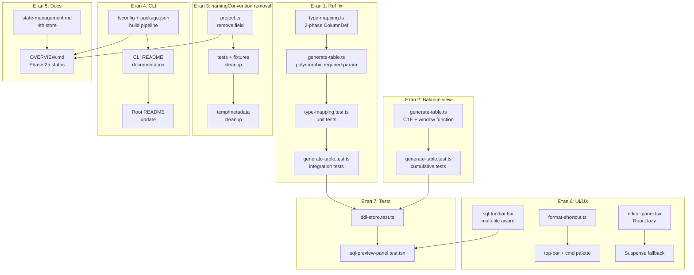

# Task: Phase 2a — Bugfixes & Cleanup

## Контекст

Code review Phase 2a (DDL Generator + SQL Preview) виявив 9 проблем різного рівня критичності. Ця задача покриває **всі** виправлення одним проходом: 2 critical баги в generator-pg, видалення зайвого `namingConvention`, завершення CLI package, оновлення архітектурної документації, та покращення UI/UX SQL Preview.

### Залежності між етапами

```
Етап 1 (Ref nullable)         — незалежний
Етап 2 (Balance view)         — незалежний
Етап 3 (namingConvention)     — незалежний
Етап 4 (CLI package)          — незалежний
Етап 5 (Architecture docs)    — після Етапів 3, 4
Етап 6 (UI/UX improvements)   — незалежний
Етап 7 (SQL Preview тести)    — після Етапів 1, 2, 6
```

---

## Етап 1: Ref — required/unique не потрапляють у DDL (Critical)

### Проблема

У `attributeToColumn()` (`packages/generator-pg/src/type-mapping.ts`) атрибут із `type: "Ref"` повертає результат `refToColumn()` достроково (ранній `return`), **перескочивши** блок `required`/`unique`/`defaultValue`. Функція `refToColumn()` ці прапорці не читає.

Уражені кейси:
- Custom single Ref (Catalog/Document/Enumeration) — `required: true` → nullable, `unique: true` → без UNIQUE
- Custom single Enum Ref (pgEnum strategy) — аналогічно
- Custom polymorphic Ref — `emitPolymorphicColumns()` **завжди** ставить NOT NULL навіть при `required: false`
- Standard single Ref (owner_id, recorder_id) — nullable, але `StandardAttribute` не має `required` поля; потребує вирішення

### Вимоги

- [Х] Рефакторинг `attributeToColumn()` на двофазну схему: спочатку base `ColumnDef` (через `refToColumn()` або `mapFieldType()`), потім **єдиний** epilogue для required/unique/default
- [Х] `refToColumn()` НЕ має дублювати логіку required/unique — тільки base type + FK constraint
- [Х] `emitPolymorphicColumns()` — приймати `required` як параметр; NOT NULL тільки коли `required: true`
- [Х] Юніт-тести в `type-mapping.test.ts`:
  - `attributeToColumn()` для single Ref + `required: true` → NOT NULL
  - `attributeToColumn()` для single Ref + `unique: true` → UNIQUE
  - `attributeToColumn()` для single enum Ref + `required: true` → NOT NULL
- [Х] Інтеграційні тести в `generate-table.test.ts`:
  - Polymorphic Ref + `required: false` → **без** NOT NULL
  - Polymorphic Ref + `required: true` → NOT NULL на обох колонках
- [Х] Виправити існуючий тест polymorphic Ref, який закріплює неправильну поведінку (NOT NULL при `required: false`)

### Clarify

- [Х] Чи потрібно додати поле `required` до `StandardAttribute` схеми для explicit nullability control owner_id/recorder_id?
  - Чому це важливо: зараз стандартні single Ref завжди nullable; для деяких об'єктів owner_id може бути обов'язковим
  - Варіанти: (A) додати `required` у StandardAttribute; (B) залишити owner_id завжди nullable за дизайном
  - Вплив на рішення: зміна схеми core → потребує оновлення standard-attributes.ts і всіх споживачів

### Файли для зміни

- `packages/generator-pg/src/type-mapping.ts` — рефакторинг attributeToColumn, оновлення refToColumn
- `packages/generator-pg/src/generate-table.ts` — оновлення emitPolymorphicColumns (параметр required)
- `packages/generator-pg/src/__tests__/type-mapping.test.ts` — нові юніт-тести
- `packages/generator-pg/src/__tests__/generate-table.test.ts` — нові та виправлені інтеграційні тести

---

## Етап 2: Balance view — net-movement замість cumulative balance (Critical)

### Проблема

`generateAccumulationViews()` (`packages/generator-pg/src/generate-table.ts`) для Balance-регістру генерує `GROUP BY period, dimensions`, що дає **чистий рух за конкретну точку** period, а не кумулятивний залишок. Це порушує BRD §5.6 і task spec, які прямо вимагають «залишки на дату».

Turnovers view — коректний, не чіпати.

### Вимоги

- [Х] Balance view (`{name}_balance`) має використовувати CTE + window function для кумулятивного обчислення:
  - Внутрішній CTE: `GROUP BY period, dimensions` → `{resource}_delta` для кожного ресурсу
  - Зовнішній SELECT: `SUM({resource}_delta) OVER (PARTITION BY dimensions ORDER BY period ROWS BETWEEN UNBOUNDED PRECEDING AND CURRENT ROW) AS {resource}`
- [Х] Якщо dimensions порожні — `PARTITION BY` пропускається, тільки `ORDER BY period`
- [Х] Кожен ресурс має окремий `_delta` у CTE і окремий кумулятивний стовпець у зовнішньому SELECT
- [Х] Turnovers view (`{name}_turnovers`) — **залишити як є**
- [Х] Тести в `generate-table.test.ts`:
  - Multi-period тест: 2+ рухи з різним period → snapshot SQL з `SUM(...) OVER (...)`
  - Регістр без dimensions → balance view без `PARTITION BY`
  - Регістр з кількома ресурсами → кожен ресурс має окремий кумулятивний стовпець

### Файли для зміни

- `packages/generator-pg/src/generate-table.ts` — переписати тіло balance view у `generateAccumulationViews()`
- `packages/generator-pg/src/__tests__/generate-table.test.ts` — оновити/додати тести

---

## Етап 3: Видалення namingConvention з проєкту

### Проблема

Поле `project.database.namingConvention` зі значеннями `snake_case | camelCase` присутнє в core-схемі, але:
- Generator-pg завжди використовує snake_case
- Generator-api не включає це поле в контракт
- camelCase naming для PostgreSQL нестандартний і вимагає quoted identifiers
- Жодних тестів для camelCase не існує

Це зайве ускладнення, яке не дає ніякої додаткової користі. Потрібно повністю видалити.

### Вимоги

- [Х] Видалити поле `namingConvention` з `databaseSchema` у `packages/core/src/schemas/project.ts`
- [Х] Видалити `namingConvention` з default value об'єкта database
- [Х] Видалити всі згадки `namingConvention` з тестів у `packages/core/src/__tests__/`
- [Х] Видалити `namingConvention` з fixture/helper проєктів у `packages/generator-pg/src/__tests__/`
- [Х] Видалити `namingConvention` з файлів метаданих у `temp/metadata/` (якщо присутній)
- [Х] Перевірити CLI (`packages/cli/src/commands/generate.ts`) — видалити, якщо є згадки
- [Х] Перевірити apps/web stores — видалити, якщо є згадки в project-store або будь-якому іншому місці
- [Х] `pnpm typecheck` і `pnpm test` мають проходити після видалення
- [Х] Оновити `docs/BRD-metadata-configurator.md` — видалити згадки namingConvention, якщо є

### Антипатерни

#### ❌ Залишити поле з одним значенням
Enum з єдиним значенням `snake_case` — мертвий код. Якщо підтримується тільки один варіант, поле зайве.

#### ❌ Замінити на коментар "TODO: camelCase later"
Якщо потреби нема — не залишати заглушки для неіснуючих фіч.

### Файли для зміни

- `packages/core/src/schemas/project.ts` — видалити поле
- `packages/core/src/__tests__/schemas.test.ts` — оновити тести
- `packages/generator-pg/src/__tests__/generate-table.test.ts` — оновити fixtures
- `temp/metadata/project.meta.json` — видалити поле (якщо є)
- Можливо: `docs/BRD-metadata-configurator.md`, `apps/web/src/stores/`, `packages/cli/`

---

## Етап 4: CLI package — runtime, bin, документація

### Проблема

`@simetra/cli` має citty-based entrypoint і generate subcommand, але для нього не зафіксовано допустиму runtime/build-стратегію в умовах монорепо, де workspace-пакети експортують `.ts` source напряму.

Наслідки без явної фіксації рішення:
- code review може помилково трактувати відсутність `dist/index.js` як blocker
- compiled entrypoint через plain `tsc` може не працювати з `@simetra/core` / `@simetra/generator-pg`, якщо вони й далі експортують `.ts`
- документація CLI лишається неоднозначною для наступних етапів

### Вимоги

#### Runtime / build pipeline
- [Х] CLI має експонувати робочий executable через `package.json#bin`
- [Х] Для поточного стану монорепо допустимим і preferred вважається runtime-based варіант: `tsx` wrapper або еквівалентний запуск через `node --import tsx`, якщо залежні workspace-пакети продовжують експортувати `.ts` source
- [Х] Dist-based варіант (`dist/index.js`) допустимий лише якщо CLI bundlиться або якщо всі необхідні залежності також продукують JS artifacts і runtime-resolution перевірено end-to-end
- [Х] `packages/cli/package.json` scripts та `exports` мають відповідати обраному runtime/build-підходу і не створювати фальшиве очікування наявності `dist/`, якщо його фактично немає
- [Х] Реальний executable entrypoint має містити shebang `#!/usr/bin/env node` або еквівалентний робочий launcher для обраного підходу
- [Х] Перевірити один із валідних сценаріїв запуску:
  - runtime-based: `pnpm simetra generate --help` або еквівалентний package-local запуск
  - dist-based: `pnpm --filter @simetra/cli build && node packages/cli/dist/index.js generate --help`
- [Х] Для code review: відсутність `dist/index.js` **не є blocker**, якщо CLI запускається через задокументований підтримуваний runtime-підхід і help-команда проходить

#### Документація пакету
- [Х] Створити або оновити `packages/cli/README.md`:
  - Призначення пакету
  - Встановлення / запуск для обраного runtime/build-підходу
  - Повний перелік аргументів команди `generate` (target, input, output, schema, enum-strategy, constants-strategy, output-mode) з описами та дефолтами
  - Приклад типового виклику

#### Документація в головному README
- [Х] Оновити кореневий `README.md`:
  - Додати `packages/cli` і `packages/generator-pg`, `packages/generator-api` до секції Structure
  - Додати секцію "CLI Usage" з базовим прикладом виклику
  - Зберегти лаконічний стиль існуючого README

### Зафіксоване рішення

- [x] Для поточного монорепо `tsx`-based runtime є валідним рішенням і не має вважатися blocker у review
  - Чому це важливо: `@simetra/core`, `@simetra/generator-pg` та інші workspace-пакети зараз експортують `.ts` source напряму
  - Прийняте рішення: runtime-based підхід (wrapper або еквівалент) є preferred, доки монорепо не перейде на JS artifacts або bundling
  - Альтернатива на майбутнє: dist/bundled CLI можна вводити окремим етапом після зміни build-моделі залежних пакетів

### Файли для зміни

- `packages/cli/package.json`
- `packages/cli/bin/simetra.mjs` (для runtime-based launcher)
- `packages/cli/src/index.ts`
- `packages/cli/README.md` (створити або оновити)
- `README.md` (кореневий)

---

## Етап 5: Архітектурна документація — ddl-store та Phase 2a

### Проблема

- `docs/architecture/state-management.md` описує «три окремі контури», але фактично store-ів тепер 4 (ddl-store)
- `docs/architecture/OVERVIEW.md` все ще відносить DDL generation до roadmap
- Пакети `generator-api`, `generator-pg`, `cli` не згадані в OVERVIEW

### Вимоги

- [Х] `docs/architecture/state-management.md`:
  - Оновити таблицю stores з 3 до 4 рядків — додати ddl-store
  - Додати пояснення про **derived feature stores**: store, що читає доменну модель read-only і не мутує її

| Store | Канонічна відповідальність | Що принципово не зберігає |
|---|---|---|
| ddl-store | DDL generation output, validation errors, SQL preview state | доменні мутації, UI layout, file lifecycle |

- [Х] `docs/architecture/OVERVIEW.md`:
  - Оновити Phase 2a статус з `roadmap` на `implemented`
  - Додати пакети `generator-api`, `generator-pg`, `cli` до таблиці пакетів
  - Додати SQL Preview до UI опису, якщо є секція компонентів

### Рекомендовані патерни

#### Derived Feature Store
ddl-store — приклад feature store, який:
- Читає модель з metadata-store через `getState()` (не підписується)
- Не мутує доменну модель
- Має власний ізольований стан (output, errors, selection)
- Не потребує undo/redo (результат regenerable)

Документувати цей патерн як рекомендацію для майбутніх feature stores (export preview, migration preview тощо).

### Файли для зміни

- `docs/architecture/state-management.md`
- `docs/architecture/OVERVIEW.md`

---

## Етап 6: UI/UX покращення SQL Preview

### 6.1: Platform-aware shortcut hints

**Проблема:** Усі tooltip та CommandShortcut hardcode "Ctrl+…", хоча `react-hotkeys-hook` уже використовує platform-neutral `"mod+…"`. На macOS це некоректно.

- [X] Створити `apps/web/src/lib/format-shortcut.ts`:
  - Функція `formatShortcut(combo: string): string`
  - Визначити платформу через `navigator.platform` або `navigator.userAgentData`
  - `"mod"` → `"⌘"` (macOS) або `"Ctrl"` (інше)
  - `"shift"` → `"⇧"` (macOS) або `"Shift"` (інше)
- [X] Замінити hardcoded рядки в `top-bar.tsx` на виклик `formatShortcut()`
- [X] Замінити hardcoded рядки в `command-palette.tsx` на виклик `formatShortcut()`

### 6.2: Shiki lazy-loading

**Проблема:** `codeToHtml` з `shiki` імпортується статично. Shiki (~600KB WASM + grammar) потрапляє в основний бандл, хоча SQL Preview — вторинна фіча.

- [X] У `editor-panel.tsx` замінити статичний імпорт `SqlPreviewPanel` на `React.lazy()`:
  ```
  const SqlPreviewPanel = React.lazy(() => import('../sql-preview/sql-preview-panel'))
  ```
- [X] Обгорнути в `<Suspense>` з fallback (спінер або skeleton)
- [Х] Переконатися, що Shiki і всі sql-preview компоненти потрапляють в окремий chunk

### 6.3: Download — підготовка до multi-file

**Проблема:** `sql-toolbar.tsx` завжди конкатенує всі files в один `schema.sql`, ігноруючи multi-file output.

- [X] Якщо `output.files.length === 1` — поведінка як є (download single file)
- [X] Якщо `output.files.length > 1`:
  - Кнопка «Copy» → копіює вміст **поточного вибраного** файлу (selectedFilePath з ddl-store)
  - Кнопка «Download» → скачує **поточний вибраний** файл з його оригінальним ім'ям
  - Додати окрему кнопку «Download All» → конкатенація всіх файлів як є зараз
- [X] `sql-file-tree.tsx` — додати per-file download icon

### Антипатерни

#### ❌ Динамічний import() всередині useEffect
Не робити `import('shiki')` в useEffect — це створює waterfall. Lazy boundary має бути на рівні компонента через React.lazy.

#### ❌ Platform detection через user-agent string parsing
Використовувати `navigator.platform` (deprecated, але стабільний) або `navigator.userAgentData?.platform`. Не парсити `navigator.userAgent` вручну.

### Файли для зміни

- `apps/web/src/lib/format-shortcut.ts` (створити)
- `apps/web/src/components/layout/top-bar.tsx`
- `apps/web/src/components/command-palette.tsx`
- `apps/web/src/components/layout/editor-panel.tsx`
- `apps/web/src/components/sql-preview/sql-toolbar.tsx`
- `apps/web/src/components/sql-preview/sql-file-tree.tsx`

---

## Етап 7: Тести SQL Preview UI + ddl-store

### Проблема

`apps/web/src/__tests__/` містить 16 тестових файлів, але жодного для SQL Preview або ddl-store. Тестова інфраструктура (Vitest + Testing Library + jsdom) повністю готова.

### Вимоги

#### ddl-store.test.ts
- [X] `generateDdl()` з валідною моделлю → `output.files` непорожній
- [X] `generateDdl()` з broken ref → `validationErrors` непорожній, `output === null`
- [X] `generateDdlForce()` → output навіть при наявності validation errors
- [X] `selectFile()` → `selectedFilePath` оновлений
- [X] `reset()` → стан скинутий до initial

#### sql-preview-panel.test.tsx
- [X] Рендер без output → показує empty state
- [X] Рендер з `validationErrors` → показує validation error UI
- [X] Рендер з `generationError` → показує generation error
- [X] Рендер з output → показує toolbar + viewer
- [X] Multi-file output → показує file tree

### Рекомендовані патерни

#### Mock Shiki у тестах
Shiki використовує WASM, який не працює в jsdom. Мокати через vi.mock:
- `vi.mock('shiki', () => ({ codeToHtml: vi.fn((...) => '<pre>mocked</pre>') }))`
- Або мокати весь `SqlViewer` компонент

#### Mock PostgresGenerator у ddl-store тестах
Замість реального generator, який потребує повну ProjectModel:
- `vi.mock('@simetra/generator-pg', () => ({ PostgresGenerator: vi.fn() }))`
- Контролювати output через mock return value

### Антипатерни

#### ❌ Тестувати реальний Shiki output
Shiki WASM не працює в jsdom. Завжди мокати.

#### ❌ Snapshot повного HTML з Shiki
Зміна версії Shiki зламає всі snapshots. Тестувати поведінку (елементи рендеряться), не HTML-вміст.

### Файли для створення

- `apps/web/src/__tests__/ddl-store.test.ts`
- `apps/web/src/__tests__/sql-preview-panel.test.tsx`

---

## Архітектурні рішення



---

## Пов'язана документація

- `docs/architecture/OVERVIEW.md` — загальна архітектура
- `docs/architecture/state-management.md` — 3-store архітектура (поточна)
- `docs/architecture/metadata-model.md` — стандартні реквізити, derivation rules
- `docs/BRD-metadata-configurator.md` — §5.6 AccumulationRegister, §10.4 Generator API
- `docs/tasks/phase2a-ddl-generator.md` — оригінальна задача Phase 2a
- `.github/instructions/architecture-core.instructions.md` — архітектурні правила
- `.github/instructions/metadata-model.instructions.md` — правила Zod-схем
- `.github/instructions/ui-architecture.instructions.md` — правила UI

---

## Definition of Done

### Per-етап
- [Х] Етап 1: Required single Ref → NOT NULL у DDL; optional polymorphic Ref → без NOT NULL; тести проходять
- [Х] Етап 2: Balance view використовує `SUM(...) OVER (PARTITION BY ... ORDER BY period)`; turnovers view не змінений; тести проходять
- [Х] Етап 3: Жодних згадок `namingConvention` у codebase; `pnpm typecheck && pnpm test` проходять
- [Х] Етап 4: CLI має задокументований і перевірений executable path; runtime-based або dist-based варіант узгоджений з фактичними exports залежностей; README CLI і кореневий README оновлені
- [Х] Етап 5: state-management.md описує 4 store; OVERVIEW.md має Phase 2a як implemented
- [Х] Етап 6: Shortcut hints platform-aware; SqlPreviewPanel lazy-loaded; toolbar multi-file aware
- [Х] Етап 7: ddl-store.test.ts і sql-preview-panel.test.tsx проходять

### Загальне
- [Х] `pnpm lint` — без нових помилок
- [Х] `pnpm typecheck` — без помилок
- [Х] `pnpm test` — всі тести зелені
- [Х] Жодних нових залежностей крім тих, що вже у проєкті
