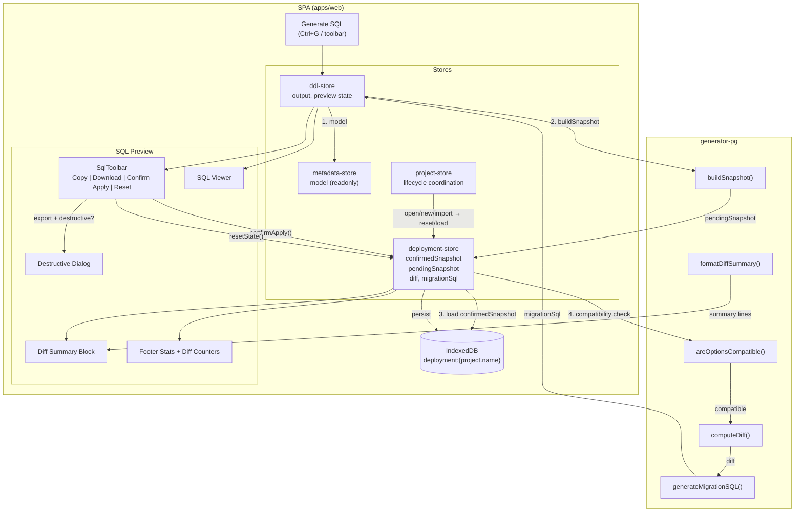
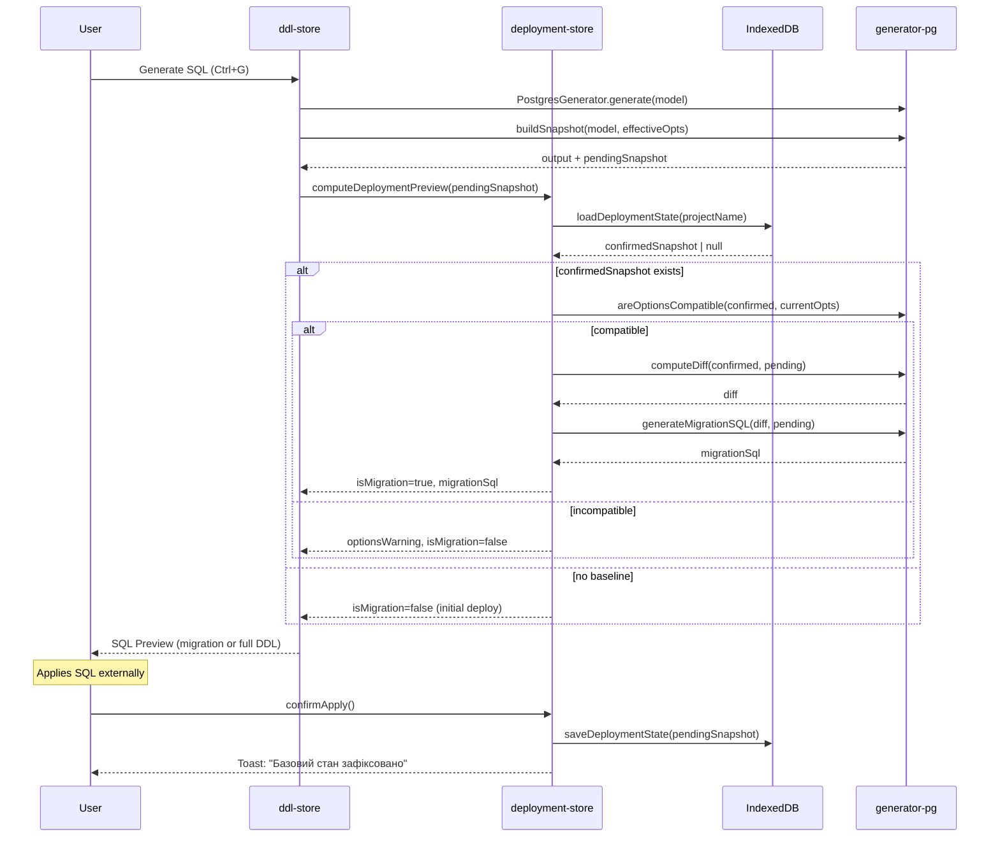

# Task: Phase 2c — Diff Preview, Destructive Confirmation та Confirm Apply у SPA

> **Prerequisite:** Phase 2c Deployment Flow — етапи 1–5 уже реалізовані (DDL генерація, SQL Preview toolbar з Copy/Download/Open SQL Editor, CLI apply з diff-based migration, schema snapshot/diff engine у `generator-pg`).

## Контекст

Phase 2c закрила основний deployment flow: CLI apply працює з diff-based міграціями, SPA має SQL Preview з Copy/Download. Але два критичних пункти залишились нереалізованими:

1. **Preview diff перед apply** — і в SPA SQL Preview, і в CLI `--dry-run`
2. **Destructive changes confirmation** — діалог у SPA з переліком destructive змін

Головна причина: SPA не має механізму фіксування applied baseline. CLI пише snapshot після успішного DB apply, а SPA не має DB connection і не може автоматично визначити, що було застосовано.

### Архітектурне рішення

SPA отримує **locally confirmed deployment state** — це НЕ source of truth про стан БД, а user acknowledgment. Користувач після ручного apply SQL зовнішнім інструментом підтверджує "я застосував цю міграцію", і SPA фіксує snapshot як baseline для наступного diff.

### Чому окремий deployment-store

Відповідно до архітектури store-ів (`docs/architecture/state-management.md`):
- `metadata-store` — доменна модель, undo/redo
- `ui-store` — навігація, layout, volatile UI
- `project-store` — file lifecycle, save baseline, recovery
- `ddl-store` — derived SQL preview (readonly щодо deployment truth)

Deployment state не підходить жодному з існуючих store-ів:
- Це не доменна модель (не metadata-store)
- Це не UI state (не ui-store)
- Це не file lifecycle (не project-store)
- ddl-store — derived preview; зберігати persisted baseline в ньому порушує його nature

Тому вводиться **`deployment-store`** — з IndexedDB persistence, окремий від всіх існуючих store.

### Ключові обмеження

- Web save повністю переписує `metadata/` каталог (`apps/web/src/storage/web-storage.ts`), тому `metadata/.simetra/applied-schema.json` НЕ може бути точкою persistence для SPA — файл буде стертий при кожному save
- `metadata/.simetra/applied-schema.json` залишається ТІЛЬКИ для CLI
- SPA зберігає deployment state в IndexedDB
- `computeDiff()` (`packages/generator-pg/src/schema-diff.ts`) НЕ перевіряє сумісність options між snapshot-ами — потрібен guard

---

## Вимоги

### generator-pg (packages/generator-pg)

- [ ] Додати утиліту `areOptionsCompatible(oldSnapshot, newOptions)` — порівнює `schema`, `enumStrategy`, `constantsStrategy`, `tablePrefix` між збереженим snapshot і поточними effective options
- [ ] Повертає `{ compatible: boolean, reasons: string[] }` — які саме options не збігаються
- [ ] Експортувати з barrel `packages/generator-pg/src/index.ts`
- [ ] Тести: compatible case, кожне поле окремо incompatible, multiple incompatible

### IndexedDB (apps/web/src/storage/session-db.ts)

- [ ] Підняти `DB_VERSION` на 3
- [ ] Додати object store `deployment` у upgrade function
- [ ] Додати TypeScript interface `DeploymentData` для value
- [ ] CRUD helpers: `saveDeploymentState`, `loadDeploymentState`, `clearDeploymentState` з graceful degradation (аналогічно session/draft)
- [ ] Ключ: `deployment:{project.name}` — по назві проєкту

### deployment-store (apps/web/src/stores/deployment-store.ts)

- [ ] Zustand store **без** immer/zundo (не потрібні undo/redo для deployment state)
- [ ] State: `confirmedSnapshot`, `confirmedAt`, `pendingSnapshot`, `currentDiff`, `migrationSql`, `isMigration`, `optionsWarning`
- [ ] Action `computeDeploymentPreview()`: buildSnapshot → areOptionsCompatible → computeDiff → generateMigrationSQL → update state
- [ ] Action `confirmApply()`: зберегти саме `pendingSnapshot` (НЕ пересчитувати!) як `confirmedSnapshot` в IndexedDB
- [ ] Action `resetDeploymentState()`: очистити confirmed baseline, повернутися до initial deploy mode
- [ ] Action `loadFromIndexedDB(projectName)`: завантажити confirmed baseline при відкритті проєкту
- [ ] Graceful degradation: якщо IndexedDB недоступний — store працює in-memory only

### ddl-store — інтеграція (apps/web/src/stores/ddl-store.ts)

- [ ] У `runGeneration()` після успішної генерації DDL — побудувати `pendingSnapshot` і викликати `deployment-store.computeDeploymentPreview()`
- [ ] Обчислити effective options (аналогічно логіці у `PostgresGenerator.generate()`) для передачі в `buildSnapshot`
- [ ] Якщо є confirmed baseline і options compatible — `output` замінити на migration SQL замість повного DDL
- [ ] Якщо options incompatible — зберегти warning і показати повний DDL з пояснювальним банером

### SQL Preview Panel — diff summary (apps/web/src/components/sql-preview/)

- [ ] Між `SqlToolbar` і warnings `Collapsible` додати **diff summary block** (тільки якщо `isMigration === true`)
- [ ] Рендерити `formatDiffSummary(diff)` як список з маркерами: `+` зелений, `~` жовтий, `-`/`[DESTRUCTIVE]` червоний
- [ ] Collapsible з `defaultOpen={true}` — summary важливіший за warnings
- [ ] Badge у toolbar: "Initial Deploy" або "Migration" залежно від `isMigration`
- [ ] Footer stats — додати diff counters: "Added: N | Changed: M | Dropped: K" поруч з existing stats
- [ ] Якщо options incompatible — warning banner замість diff summary: "Налаштування генерації змінились. Рекомендуємо скинути базовий стан."

### SQL Toolbar — deployment actions (apps/web/src/components/sql-preview/sql-toolbar.tsx)

- [ ] Кнопка **"Підтвердити застосування"** — праворуч у toolbar, у зоні deployment actions поруч з Open SQL Editor
- [ ] Видима завжди коли є output
- [ ] При натисканні — `deployment-store.confirmApply()`
- [ ] Toast: "Базовий стан зафіксовано. Наступна генерація покаже лише зміни."
- [ ] Кнопка **"Скинути базовий стан"** — видима тільки коли є confirmedSnapshot
- [ ] При натисканні — confirmation toast (Sonner з undo) → `deployment-store.resetDeploymentState()`
- [ ] Badge "Базовий стан: зафіксовано {date}" або "Базовий стан: не зафіксовано" — компактний, muted

### Destructive Changes Dialog (apps/web/src/components/sql-preview/destructive-changes-dialog.tsx)

- [ ] Новий компонент на shadcn `Dialog` (НЕ AlertDialog — зберігаємо consistency з проєктом)
- [ ] Trigger: натискання Copy / Download / Open SQL Editor при `diff.hasDestructiveChanges === true`
- [ ] Вміст: список тільки destructive пунктів з `formatDiffSummary`, відфільтрованих по `[DESTRUCTIVE]`
- [ ] Заголовок: "Міграція містить деструктивні зміни"
- [ ] Дві кнопки: "Підтвердити і продовжити" (variant=destructive) та "Скасувати"
- [ ] State: локальний `useState` у `SqlToolbar`, НЕ global store
- [ ] Після підтвердження — виконати оригінальну export action (copy/download/open)

### project-store — lifecycle integration

- [ ] При `newProject()` — `deployment-store.resetDeploymentState()`
- [ ] При `openProject()` — `deployment-store.loadFromIndexedDB(model.project.name)`
- [ ] При `importProject()` — `deployment-store.resetDeploymentState()`
- [ ] При `restoreSession()` — `deployment-store.loadFromIndexedDB(project.name)` якщо session restore успішний
- [ ] При `restoreDraft()` — не чіпати deployment state (draft = newer domain changes, baseline може залишитись)

### CLI guard — options compatibility (packages/cli/src/commands/apply.ts)

- [ ] Перед `computeDiff` перевірити `areOptionsCompatible(oldSnapshot, fullOptions)`
- [ ] Якщо incompatible — повідомити які options змінились і запропонувати `--force-initial` для повного DDL замість migration
- [ ] Додати arg `--force-initial` — ігнорує існуючий snapshot і виконує повний initial deploy

### i18n

- [ ] Нові ключі: `deployment.confirmApply`, `deployment.confirmApplyToast`, `deployment.resetBaseline`, `deployment.resetBaselineConfirm`, `deployment.baselineSet`, `deployment.baselineNotSet`, `deployment.baselineDate`
- [ ] Ключі для diff summary: `deployment.diffSummary`, `deployment.initialDeploy`, `deployment.migration`
- [ ] Ключі для destructive dialog: `deployment.destructiveTitle`, `deployment.destructiveDescription`, `deployment.destructiveConfirm`
- [ ] Ключі для options warning: `deployment.optionsChanged`, `deployment.optionsChangedHint`

---

## Clarify (питання перед імплементацією)

- [ ] **Чи потрібен toggle Full DDL / Migration у SQL Preview?**
  - Чому це важливо: користувач може хотіти побачити повний DDL навіть якщо є baseline
  - Варіанти: A) toggle button у toolbar, B) тільки migration mode коли є baseline, C) migration mode + "Show full DDL" link
  - Рекомендація: варіант C — migration за замовчуванням, link "Показати повний DDL" у diff summary block
  - Вплив на рішення: UI complexity, ddl-store API

- [ ] **Чи variant=destructive для кнопки "Підтвердити застосування"?**
  - Чому це важливо: це user acknowledgment, а не справжня destructive дія
  - Варіанти: A) variant=destructive (помітна, бо це ризиковий крок), B) variant=default (нейтральна), C) variant=outline (secondary)
  - Рекомендація: variant=default з icon (checkmark) — це не destructive, а confirmation
  - Вплив на рішення: UI

- [ ] **Чи скидати deployment state при зміні project.name в Settings?**
  - Чому це важливо: IndexedDB ключ = `deployment:{project.name}`
  - Варіанти: A) скинути автоматично, B) "мігрувати" ключ, C) ігнорувати
  - Рекомендація: варіант A — скинути і показати toast "Базовий стан скинуто через зміну назви проєкту"
  - Вплив на рішення: project settings handler, deployment-store integration

- [ ] **Чи потрібен sidecar export/import для deployment state?**
  - Чому це важливо: перенос між машинами, CI/CD use case
  - Варіанти: A) Export/Import JSON button у toolbar, B) CLI-only через .simetra/, C) не зараз
  - Рекомендація: варіант C — не для першої ітерації, можна додати пізніше як окремий task
  - Вплив на рішення: scope задачі

---

## Рекомендовані патерни

### Deployment Store — Zustand без middleware

Окремий store без immer/zundo: deployment state не є undo-able і не потребує immutable mutation helpers. Persistence через explicit async helpers в session-db, НЕ через Zustand persist middleware — аналогічно тому як project-store свідомо не використовує persist.

### Snapshot Pinning при генерації

Критичний інваріант: `confirmApply()` фіксує `pendingSnapshot` — той, що був побудований при останній генерації. НЕ пересчитувати snapshot з поточної моделі на момент confirm. Це запобігає гонці: якщо після генерації зроблені доменні зміни, confirm все одно фіксує "старий" preview.

### Effective Options Resolution

ddl-store зараз не передає explicit options у `PostgresGenerator.generate()`. Generator сам вичитує options з `project.project.database` і `project.project.generation`. Для `buildSnapshot()` потрібні ті самі resolved options. Винести resolution логіку у shared helper, щоб ddl-store і deployment-store використовували однаковий шлях.

### Dialog State — локальний useState

Destructive Changes Dialog використовує той самий патерн, що й delete confirmation у TreePanel: локальний state у батьківському компоненті, без global store. Pending action зберігається в ref або state для виконання після confirm.

### Graceful Degradation

Усі IndexedDB операції обгорнуті в try/catch і тихо деградують при недоступності (private mode, quota exceeded). Deployment store працює in-memory only без persistence — це нормальний режим.

---

## Антипатерни (уникати)

### ❌ Автоматичний confirm при Copy/Download

НЕ фіксувати baseline автоматично коли користувач копіює або завантажує SQL. Copy ≠ Apply. Базовий стан фіксується ТІЛЬКИ через explicit button "Підтвердити застосування".

### ❌ Пересчитування snapshot при confirmApply

НЕ викликати `buildSnapshot()` у момент `confirmApply()`. Фіксувати тільки `pendingSnapshot`, побудований при останньому `generateDdl()`. Інакше виникає гонка: модель могла змінитись між generation і confirm.

### ❌ metadata/.simetra/ як SPA persistence

НЕ писати applied-schema.json через web storage. `saveToDirectory()` повністю перезаписує `metadata/` — файл буде стертий. `metadata/.simetra/` — це CLI-only артефакт.

### ❌ deployment-store у ddl-store

НЕ додавати persisted deployment baseline в ddl-store. За архітектурою state-management.md, ddl-store — derived preview store. DDL store читає deployment baseline, але не володіє ним.

### ❌ Diff без перевірки options compatibility

НЕ робити `computeDiff(old, new)` якщо `old.options.enumStrategy !== effectiveOptions.enumStrategy` (або інші ключові options). Такий diff покаже хибні DROP/CREATE. Завжди перевіряти через `areOptionsCompatible` перед diff.

### ❌ Global dialog store

НЕ створювати global dialog store або dialog manager для destructive confirmation. Використовувати локальний useState — це поточний project-wide патерн для всіх confirmation dialogs.

### ❌ AlertDialog замість Dialog

Зараз у проєкті всі confirmation modals побудовані на shadcn `Dialog`, а не `AlertDialog`. Зберігати консистентність.

### ❌ Multi-environment scoping для MVP

НЕ додавати named environments, environment matrix або per-environment snapshot storage. BRD не описує multi-target deployment. Для MVP достатньо одного baseline per project per browser.

---

## Архітектурні рішення

---

## Пов'язана документація

- `docs/architecture/state-management.md` — межі store-ів, чому окремий deployment-store
- `docs/architecture/storage-and-persistence.md` — IndexedDB schema, web save rewrite behavior
- `docs/architecture/OVERVIEW.md` — загальна архітектура
- `docs/tasks/phase2c-deployment-adapter.md` — батьківська задача, етапи 1–5
- `packages/generator-pg/src/index.ts` — barrel export для snapshot/diff API
- `packages/generator-pg/src/schema-snapshot.ts` — SchemaSnapshot type, buildSnapshot()
- `packages/generator-pg/src/schema-diff.ts` — computeDiff(), formatDiffSummary(), isDestructiveChange()
- `packages/generator-pg/src/generate-migration.ts` — generateMigrationSQL()
- `packages/cli/src/commands/apply.ts` — CLI apply flow з diff-based migration (reference implementation)
- `apps/web/src/storage/session-db.ts` — IndexedDB schema, upgrade pattern
- `apps/web/src/stores/ddl-store.ts` — поточний DDL preview store
- `apps/web/src/components/sql-preview/sql-preview-panel.tsx` — SQL Preview layout
- `apps/web/src/components/sql-preview/sql-toolbar.tsx` — toolbar з export actions
- `apps/web/src/components/layout/tree-panel.tsx` — reference: delete confirmation dialog pattern

---

## Definition of Done

- [ ] `pnpm lint ; pnpm typecheck` — clean
- [ ] `pnpm test` — всі тести проходять
- [ ] `areOptionsCompatible()` exported з `@simetra/generator-pg` з тестами
- [ ] `deployment-store` створений з IndexedDB persistence
- [ ] IndexedDB DB_VERSION=3 з object store `deployment`
- [ ] SQL Preview показує diff summary block при наявності confirmed baseline
- [ ] SQL Preview показує "Initial Deploy" badge при відсутності baseline
- [ ] SQL Preview показує "Migration" badge і diff counters при наявності baseline
- [ ] Кнопка "Підтвердити застосування" у toolbar зберігає pendingSnapshot як baseline
- [ ] Кнопка "Скинути базовий стан" очищує confirmed baseline
- [ ] Destructive Changes Dialog блокує export при `hasDestructiveChanges`
- [ ] Options incompatibility warning показується у SQL Preview з рекомендацією скинути baseline
- [ ] `project-store` скидає/завантажує deployment state при open/new/import
- [ ] CLI `apply` перевіряє options compatibility перед diff
- [ ] CLI `apply --force-initial` дозволяє ігнорувати snapshot
- [ ] i18n ключі додані для uk/en
- [ ] Документація `docs/architecture/state-management.md` оновлена: deployment-store описаний у таблиці store-ів
