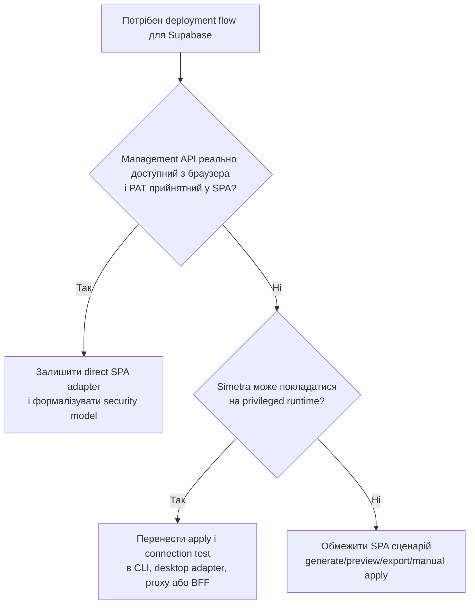

# Task: Phase 2c — Supabase Management API Architecture Blocker

## Контекст

У поточній реалізації `apps/web` вже додано Supabase deployment settings і кнопку `Test Connection` для перевірки з'єднання через Supabase Management API. Водночас поточний task [docs/tasks/phase2c-deployment-adapter.md](docs/tasks/phase2c-deployment-adapter.md) закладає ширше архітектурне припущення: Management API нібито доступний напряму з browser-based SPA через CORS, без власного backend або proxy.

Під час реальної перевірки в браузері це припущення не підтвердилось: виклик до Management API з `Authorization: Bearer {PAT}` завершується CORS preflight failure. Це блокує не тільки `Test Connection`, а й увесь planned apply flow для Supabase в межах поточного web-only runtime.

## Problem Statement

### Documented assumption

Поточний task [docs/tasks/phase2c-deployment-adapter.md](docs/tasks/phase2c-deployment-adapter.md) стверджує, що:

- Supabase Management API підтримує CORS;
- `apps/web` може напряму викликати `api.supabase.com` із браузера;
- для MVP не потрібні middleware, backend, proxy або інший privileged runtime;
- `Test Connection` і `Apply to Supabase` можуть бути реалізовані в чистій SPA.

### Observed behavior

У реальному браузері під час виклику `GET https://api.supabase.com/v1/projects/{ref}` з заголовком `Authorization: Bearer {PAT}` отримано preflight failure з симптомом на кшталт `No Access-Control-Allow-Origin header`.

Якщо це очікувана поведінка Supabase Management API, тоді поточна Phase 2c архітектура для direct apply із SPA є хибною і потребує перегляду до будь-якої подальшої реалізації deployment flow.

## Verified Evidence

- [Х] У [apps/web/src/components/properties/project-settings.tsx](apps/web/src/components/properties/project-settings.tsx) є UI для `Test Connection`, який викликає окремий browser-side helper.
- [Х] У [apps/web/src/lib/supabase-management.ts](apps/web/src/lib/supabase-management.ts) перевірка з'єднання реалізована через `fetch()` до `https://api.supabase.com/v1/projects/{projectRef}` з `Authorization: Bearer {accessToken}`.
- [Х] У [docs/tasks/phase2c-deployment-adapter.md](docs/tasks/phase2c-deployment-adapter.md) зафіксовано припущення, що `api.supabase.com` підтримує CORS і доступний напряму з SPA.
- [Х] У [docs/tasks/phase2c-deployment-adapter.md](docs/tasks/phase2c-deployment-adapter.md) те саме припущення використане як основа для planned `Apply to Supabase` flow через Management API.
- [Х] У [docs/architecture/OVERVIEW.md](docs/architecture/OVERVIEW.md) поточний продукт описаний як web-first SPA без власного backend/proxy у поточній архітектурі.
- [Х] Зі слів поточної перевірки в реальному браузері: запит до `GET /v1/projects/{ref}` з PAT не проходить CORS preflight і блокується браузером до отримання прикладного response.

## Scope of Investigation

- [ ] Підтвердити з офіційної документації Supabase і/або контрольованого експерименту, чи підтримує Supabase Management API browser-origin CORS для `GET /v1/projects/{ref}`.
- [ ] Окремо перевірити, чи підтримує Supabase Management API browser-origin CORS для `POST /v1/projects/{ref}/database/migrations`, а не лише для read-only project endpoint.
- [ ] Підтвердити, чи допустимо використовувати Personal Access Token у browser-only SPA з погляду security model, threat model і vendor guidance, навіть якщо transport технічно працює.
- [ ] Визначити, які саме частини поточного Phase 2c plan залежать від privileged browser access до Management API: `Test Connection`, `Apply to Supabase`, відображення статусу, повторні міграції, можливе schema diff apply.
- [ ] Порівняти можливі архітектурні варіанти для Simetra:
- [ ] Залишити `apps/web` pure SPA і прибрати direct apply, залишивши лише generate/preview/export/manual apply.
- [ ] Додати optional user-owned backend або proxy для privileged Management API викликів.
- [ ] Використати окремий deployment adapter поза SPA: CLI, desktop runtime або інший trusted local agent.
- [ ] Розглянути hosted/BFF-модель тільки як окремий майбутній режим, а не як implicit вимогу до поточної web SPA.
- [ ] Визначити, чи має `Test Connection` залишитися частиною MVP, бути перенесеним у non-browser runtime, чи бути тимчасово прибраним.

## Deliverables

- [ ] Короткий research summary з чітким висновком: direct browser access до Supabase Management API для Simetra є `supported`, `unsupported` або `unsupported for current security model`.
- [ ] Порівняльна таблиця архітектурних варіантів для deployment flow в Simetra з критеріями: security, сумісність із SPA, UX, складність, roadmap impact.
- [ ] Рекомендоване архітектурне рішення для Simetra Phase 2c з описом причин, обмежень і наслідків.
- [ ] Рішення щодо долі поточного browser-side `Test Connection`: залишити, змінити, сховати behind feature flag або видалити.
- [ ] Перелік змін до [docs/tasks/phase2c-deployment-adapter.md](docs/tasks/phase2c-deployment-adapter.md), якщо поточне припущення про CORS виявиться некоректним.
- [ ] Окремий implementation follow-up plan для обраної архітектури без передчасної реалізації в межах цього research task.

## Clarify (питання перед наступною імплементацією)

- [ ] Чи допускає продуктова рамка Simetra появу будь-якого privileged runtime для deployment-операцій?
  - Чому це важливо: якщо відповідь `ні`, direct apply через Supabase Management API може виявитися поза межами web-first архітектури.
  - Варіанти: `лише pure SPA`, `optional companion runtime`, `окремий hosted backend`, `ще не визначено`.
  - Вплив на рішення: архітектура deployment adapter і межі MVP.
- [ ] Чи є manual SQL export + інструкція для apply прийнятним fallback або навіть основним сценарієм для MVP?
  - Чому це важливо: це найпростіший шлях зберегти Phase 2 цінність без небезпечного browser-side секрету.
  - Варіанти: `так, достатньо для MVP`, `лише тимчасовий fallback`, `ні, потрібен in-product apply`.
  - Вплив на рішення: обсяг Phase 2c і UX SQL Preview.
- [ ] Чи може PAT акаунту Supabase вважатися прийнятним credential type для клієнтської SPA навіть за наявності local-only storage?
  - Чому це важливо: CORS і security — окремі питання; навіть за наявності CORS PAT може бути неприйнятним у браузері.
  - Варіанти: `так`, `ні`, `потрібна зовнішня верифікація`.
  - Вплив на рішення: credential model, UI copy, storage strategy.
- [ ] Чи повинна future Phase 2c реалізація орієнтуватися на Supabase як special-case target, чи на ширшу capability-модель deployment adapter?
  - Чому це важливо: рішення вплине на extensibility для інших target-ів і на те, де провести межу між preview та apply.
  - Варіанти: `Supabase-first спеціальний флоу`, `capability-based adapter`, `тільки manual export на цьому етапі`.
  - Вплив на рішення: архітектура пакета й майбутні integration points.

## Рекомендовані патерни

### Capability-Based Deployment Adapter

Deployment target має описувати не лише vendor name, а й набір гарантовано підтримуваних capability: `preview`, `export`, `connectivity check`, `apply`, `diff apply`. Не можна припускати, що наявність HTTP API автоматично означає browser-safe `apply` capability.

### Security Before UX Commitment

Привілейовані інтеграції потрібно спершу перевіряти на transport constraints і secret-handling constraints, а вже потім закладати у product UX. Кнопка в інтерфейсі не повинна формувати архітектурний контракт раніше за верифікацію безпеки й підтримки платформи.

### Separate Persisted Config From Privileged Credentials

Налаштування deployment target можуть жити в metadata, але привілейовані токени, канали доступу й фактичний execution path повинні розглядатися окремо від canonical project files і від web-first domain model.

### Research Gate Before Updating Phase Plan

Якщо зовнішній vendor API є критичною залежністю для етапу, спершу потрібно зафіксувати доказову базу щодо його реальної поведінки в потрібному runtime, а лише потім переносити припущення в task files і DoD.

## Антипатерни (уникати)

### ❌ Direct Browser PAT As Default Assumption

Не можна робити акаунтний PAT для Management API базовою SPA-моделлю без окремого підтвердження і transport support, і security acceptability.

### ❌ Documentation As Proof

Task file не є доказом можливості інтеграції. Якщо припущення про CORS не підтверджене документацією або експериментом, його не можна використовувати як основу для реалізації.

### ❌ UI First, Architecture Later

Не варто продовжувати розвивати `Test Connection` або `Apply` UI, поки не вирішено, чи взагалі браузер має право і можливість виконувати ці виклики.

### ❌ Mixing Security Constraints With Transport Constraints

Навіть якщо browser CORS виявиться можливим, це ще не означає, що PAT допустимо використовувати в SPA. Ці питання потрібно оцінювати окремо.

## Архітектурні рішення

Ключове рішення наступної сесії: визначити, чи Simetra Phase 2c рухається в бік verified privileged adapter, чи офіційно звужує web SPA до safe preview/export сценарію без direct Management API apply.

## Пов'язана документація та файли

- [docs/tasks/phase2c-deployment-adapter.md](docs/tasks/phase2c-deployment-adapter.md) — поточний Phase 2c task з припущенням про direct CORS access
- [docs/architecture/OVERVIEW.md](docs/architecture/OVERVIEW.md) — поточна web-first SPA архітектура без власного backend
- [docs/architecture/storage-and-persistence.md](docs/architecture/storage-and-persistence.md) — browser persistence і межі client-side storage
- [docs/BRD-metadata-configurator.md](docs/BRD-metadata-configurator.md) — загальні бізнес-вимоги та контекст Phase 2
- [apps/web/src/components/properties/project-settings.tsx](apps/web/src/components/properties/project-settings.tsx) — UI для Supabase settings і `Test Connection`
- [apps/web/src/lib/supabase-management.ts](apps/web/src/lib/supabase-management.ts) — поточний browser-side Management API helper
- Supabase Management API docs — потрібно перевірити в межах research
- Supabase auth/token guidance — потрібно перевірити в межах research

## Definition of Done

- [ ] Є підтверджена відповідь, чи підтримує Supabase Management API browser-origin CORS для потрібних Simetra endpoint-ів.
- [ ] Є окрема підтверджена відповідь, чи PAT допустимий для browser-only SPA у вибраній моделі продукту.
- [ ] Обрано рекомендовану архітектуру для Phase 2c deployment flow і зафіксовано її trade-offs.
- [ ] Зафіксовано рішення щодо поточного `Test Connection` UI та direct browser apply.
- [ ] Визначено, які частини [docs/tasks/phase2c-deployment-adapter.md](docs/tasks/phase2c-deployment-adapter.md) потрібно оновити, відкласти або скасувати.
- [ ] Підготовлено follow-up implementation task без неперевірених припущень про CORS або browser-safe privileged access.