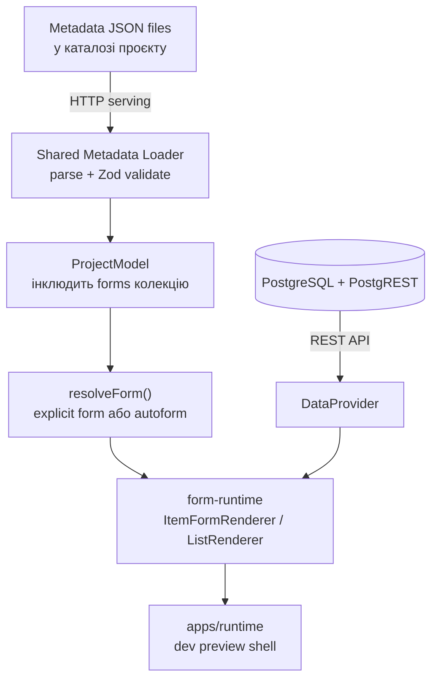

# Task: Phase 3 — Form Runtime & Dev Preview

> **Prerequisite:** Phase 2a (DDL Generator), Phase 2b (Posting Engine), Phase 2c (Deployment Adapter) — генерація SQL і розгортання на PostgreSQL мають працювати.
> **Prerequisite:** PostgreSQL з PostgREST або Supabase — потрібен REST API для runtime CRUD. Самої бази **недостатньо**.

## Контекст

Phase 2 дає інструменти для проєктування метаданих і генерації PostgreSQL-схем. Phase 3 замикає вертикальний зріз: **з тих самих JSON-метаданих система рендерить форми** — з автогенерацією для об'єктів без explicit form, з CRUD через PostgREST, і з мінімальним dev preview shell для перевірки результату.

**Ціль Phase 3:** Бібліотека рендерингу форм (`@simetra/form-runtime`) + dev preview shell (`apps/runtime`) для візуальної перевірки:

- автоматичні стандартні форми (autoform) для списків і деталей кожного об'єкта;
- explicit form перемагає autogenerated (precedence rule);
- мінімальний shell з sidebar по kinds для навігації і перевірки форм;
- CRUD через DataProvider → PostgREST/Supabase.

**Ключовий 1С-патерн:** якщо для сутності немає `list.form.json` або `item.form.json`, система **обов'язково** генерує стандартну форму з усіма доступними реквізитами в порядку, визначеному в конфігураторі. Explicit form завжди перемагає autogenerated.

**Форми як first-class частина сутності:** forms є canonical частиною `ProjectModel` — top-level колекція `forms: FormSchema[]`, де кожна форма прив'язана до конкретного об'єкта через `objectRef: MetadataRef`. Конфігуратор повністю володіє формами: створює, зберігає, перейменовує і видаляє їх разом із сутністю. На диску форми зберігаються як окремі файли у підкаталозі `forms/` об'єкта за BRD §7.2. У дереві метаданих конфігуратора форми відображаються як дочірня група «Форми» кожного об'єкта. В ObjectEditor — вкладка «Форми». Файлова структура:

```
metadata/                           ← каталог проєкту користувача
├── project.meta.json
├── catalogs/
│   └── products/
│       ├── products.meta.json
│       └── forms/                  ← Phase 3: форми об'єкта
│           ├── item.form.json
│           └── list.form.json
├── documents/
│   └── sales-order/
│       ├── sales-order.meta.json
│       └── forms/
│           └── item.form.json
└── ...
```

### Що НЕ входить у цю фазу

- `application.meta.json` і Zod-схеми application (Phase 4)
- `@simetra/app-runtime` — production runtime з subsystems, конфігурованим shell, dashboard (Phase 4)
- `<SimetraApp />` — production entry-point компонент (Phase 4)
- Маршрутизація по subsystems: `/{subsystem}/{object}` (Phase 4)
- Desktop shell (Tauri)
- VS Code extension
- Візуальний конструктор форм (drag-and-drop form designer) (Phase 4)
- Codegen / eject React-додатку (`@simetra/generator-react`, `@simetra/generator-react-app`)
- Dashboard widgets framework (Phase 4)
- Schema introspection / import existing DB
- Generated .NET / Node.js API
- `computedFields` — вбудований expression engine (Phase 3.1)
- Polymorphic refs у формах — `allowedTypes` не підтримуються в MVP runtime (показувати degraded behavior або заглушку)
- `separateTables` constants strategy — MVP підтримує лише `singleTable`

---

## Архітектурні рішення

### Монорепо-структура: нові пакети

```
packages/
├── core/                       ← ✅ існує, розширюється form schemas + autoform + shared metadata IO
├── form-runtime/               ← 🆕 React-бібліотека рендерингу форм
├── data-provider/              ← 🆕 абстрактний data-access contract (чистий TS)
├── data-provider-postgrest/    ← 🆕 перший adapter: PostgREST/Supabase
├── ui/                         ← ✅ існує (@workspace/ui, shadcn примітиви, роль не змінюється)
├── generator-api/              ← ✅ існує
├── generator-pg/               ← ✅ існує
└── cli/                        ← ✅ існує
apps/
├── web/                        ← ✅ існує (конфігуратор)
└── runtime/                    ← 🆕 dev preview shell для перевірки форм
```

> **Важливо:** `@workspace/ui` залишається shadcn/ui kit з примітивами. Domain-компоненти (CatalogCombobox, EnumSelect, RuntimeDataTable) живуть усередині `@simetra/form-runtime`. Виносити в окремий `@simetra/ui` доменний пакет — Phase 4, якщо буде потреба.

### Runtime-шари Phase 3



- **Core (form model)** — Zod-схеми `form.json`, алгоритм автоформи, `resolveForm()`, shared metadata IO layer. Forms є top-level колекцією в `ProjectModel` з `objectRef` зв'язком. Чистий TS + Zod, без React.
- **Form Runtime** — React-компоненти для рендерингу item/list forms за form model. Споживає DataProvider для CRUD і ref lookups. **Працює незалежно від shell** — це library, не application.
- **Data Provider** — абстрактний контракт для data access. Перший adapter: generic PostgREST fetch.
- **Dev Preview Shell** — `apps/runtime`, мінімальний Vite app для візуальної перевірки форм. НЕ production runtime, а dev tool.

### apps/runtime — dev preview tool

| Характеристика | apps/runtime (Phase 3) | SimetraApp (Phase 4) |
|----------------|------------------------|----------------------|
| Призначення | Dev preview для перевірки форм | Production runtime для end users |
| Навігація | Sidebar зі списком об'єктів по kinds | Повна навігація по subsystems з application.meta.json |
| Маршрутизація | Плоска: `/catalogs/Products`, `/documents/SalesOrder` | По BRD: `/{subsystem}/{object}/:id` |
| Shell | Один фіксований layout | Конфігурований через application.meta.json |
| Dashboard | Немає | Widgets framework |
| Розповсюдження | Тільки dev, не публікується як npm пакет | npm-пакет @simetra/app-runtime |

### Як apps/runtime працює технічно

1. **Env variable** `SIMETRA_METADATA_PATH` вказує на каталог metadata проєкту користувача.
2. **Vite dev server** через plugin проєктує цей каталог як static assets, доступні через HTTP.
3. **Browser** при завантаженні fetch-ає JSON-файли metadata через HTTP.
4. **Shared Metadata Loader** парсить JSON і валідує через Zod-схеми з `@simetra/core`. Результат: `ProjectModel` (включно з `forms` колекцією).
5. **`resolveForm()`** повертає explicit form (якщо є `forms/item.form.json`) або генерує autoform.
6. **form-runtime** рендерить форму через React + shadcn/ui компоненти.
7. **DataProvider** спілкується з PostgreSQL через PostgREST для CRUD.

### Пріоритет форм (precedence rule)

1. `forms/{form-kind}.form.json` (explicit) → пріоритет
2. Автогенерована стандартна форма з metadata → гарантований fallback
3. Explicit form **завжди** перемагає autogenerated, ніколи навпаки

### Runtime MVP — supported object matrix

| Kind | List page | Item page | Constants page | Примітка |
|------|-----------|-----------|----------------|----------|
| Catalog | ✅ | ✅ | — | Повний CRUD |
| Document | ✅ | ✅ | — | CRUD + Post/Unpost |
| CustomTable | ✅ | ✅ | — | Повний CRUD |
| Constant | — | — | ✅ | Одна сторінка для всіх констант |
| Enumeration | — | — | — | Read-only, значення задаються в конфігураторі |
| InformationRegister | — | — | — | Phase 4 (складна семантика periodicity/writeMode) |
| AccumulationRegister | — | — | — | Phase 4 (read-only в runtime, пишеться через posting) |

---

## Етапи

### Етап 1: Shared Metadata IO layer у `@simetra/core`

> **Мета:** DRY — один parser/validator для конфігуратора, CLI і runtime. Зараз існують два дублюючі loaders: `apps/web/src/storage/web-storage.ts` (parseFileStructure + buildProjectModel) і `packages/cli/src/build-model.ts`. Третій loader для runtime **не** створюємо — виносимо спільну pure-логіку в core.

- [Х] Створити `packages/core/src/metadata-io.ts`:
  - `parseMetadataFiles(files: Map<string, string>): { parsed: ParsedFiles, warnings: FileWarning[] }` — pure function, JSON parsing, file structure routing
  - `buildProjectModelFromParsed(parsed: ParsedFiles): { model: ProjectModel, warnings: FileWarning[] }` — Zod validation, збирання ProjectModel (forms включені в model.forms)
  - `FileWarning = { filePath: string, errors: string[] }`
  - `ParsedFiles = { project?: unknown, objects: ParsedObject[], forms: ParsedForm[] }`
- [Х] Цей layer **не** залежить від node:fs, browser API чи HTTP — він працює з `Map<string, string>` (path → content)
- [Х] Перевести `apps/web/src/storage/web-storage.ts` на використання shared layer (I/O залишається в WebStorage, parsing делегується core)
- [Х] Перевести `packages/cli/src/build-model.ts` на використання shared layer (I/O залишається в read-metadata.ts, parsing делегується core)
- [Х] Додати зчитування `forms/*.form.json` у shared parser (якщо файли присутні)
- [Х] Додати export у `packages/core/src/index.ts`
- [Х] **Тести:**
  - Round-trip: serializeToFiles → parseMetadataFiles → buildProjectModelFromParsed = original model (включно з forms)
  - Constants wrapper parsing (backward compat)
  - Forms parsing: explicit form читається і потрапляє в model.forms
  - Missing project.meta.json → error
  - Invalid JSON → warning, не abort
  - Невідома директорія → skip з warning

### Етап 2: Forms як canonical частина ProjectModel

> **Мета:** forms стають first-class колекцією всередині `ProjectModel`. Конфігуратор повністю володіє формами: зберігає, перейменовує і видаляє їх разом із сутністю. Повний rewrite `metadata/` при save зберігається як інваріант — forms записуються serializer-ом як окремі файли у `forms/` підкаталозі об'єкта.

> **Архітектурне рішення:** Forms — **окрема top-level колекція** в `ProjectModel`, а не вкладене поле в object schemas. Кожна `formSchema` має `objectRef: MetadataRef` для explicit зв'язку з об'єктом. Це зберігає чистоту доменної моделі (object schemas не змінюються, генератори DDL/SQL не бачать forms) і забезпечує простий round-trip серіалізації.

#### 2.1. Core: розширення ProjectModel

- [X] Додати `forms: z.array(formSchema).optional().default([])` до `projectModelSchema` у `packages/core/src/schemas/project-model.ts`
  - `formSchema` з Етапу 3 є prerequisite — або створити мінімальну версію тут і розширити в Етапі 3
  - Object schemas (catalogSchema, documentSchema, etc.) **НЕ змінюються** — forms не вбудовуються в об'єкти
- [X] Валідація: `objectRef` кожної форми має посилатись на існуючий об'єкт у моделі (`.refine()`)
- [X] Валідація: kinds що підтримують forms: `Catalog`, `Document`, `CustomTable`. Інші — відхиляти
- [X] Валідація: не більше одної форми кожного `kind` (ItemForm, ListForm) per object

#### 2.2. Serialization: forms → окремі файли

- [X] Розширити `serializeToFiles()` у `packages/core/src/metadata-io.ts`:
  - Після серіалізації `*.meta.json` файлів — серіалізувати кожну форму з `model.forms`
  - Path: `{kind-dir}/{object-kebab}/forms/{form-kind-kebab}.form.json` (наприклад `catalogs/products/forms/item.form.json`)
  - Використовувати `FORM_KEY_ORDER` з `serialization.ts` для canonical key ordering
- [X] Оновити `buildProjectModelFromParsed()` у `metadata-io.ts`:
  - Замість повернення окремої `Map<string, unknown>` — вкладати parsed forms у `model.forms` колекцію
  - Кожна `ParsedForm` з `objectSlug` + `objectKind` перетворюється на `FormSchema` з `objectRef: { kind, name }`
- [X] `$schema` URL для form.json: додати `buildFormSchemaUrl()` helper аналогічно до `buildConstantsSchemaUrl()`

#### 2.3. Store: metadata-store мутації для forms

- [X] `apps/web/src/stores/metadata-store.ts` — додати мутації:
  - `addForm(objectKind, objectName, formKind)` — створює порожню/autoform FormSchema і додає в `model.forms`
  - `updateForm(objectKind, objectName, formKind, data)` — оновлює існуючу форму
  - `deleteForm(objectKind, objectName, formKind)` — видаляє форму з `model.forms`
- [X] Каскадна логіка в існуючих мутаціях:
  - `renameObject(kind, oldName, newName)` — оновити `objectRef.name` у всіх forms де `objectRef.kind === kind && objectRef.name === oldName`
  - `deleteObject(kind, name)` — видалити всі forms де `objectRef.kind === kind && objectRef.name === name`
- [X] Forms мутації мають збільшувати `version` і `objectVersions` для undo/redo

#### 2.4. UI: секція Forms в ObjectEditor

- [X] `apps/web/src/components/editor/section-config.ts` — додати секцію `forms` для Catalog, Document, CustomTable:
  - `{ id: "forms", labelKey: "metadata.section.forms", icon: FormIcon }`
  - Не додавати для Enumeration, Constant, InformationRegister, AccumulationRegister
- [X] `apps/web/src/components/editor/object-editor.tsx` — рендерити секцію forms:
  - Список форм об'єкта (фільтрація `model.forms` по `objectRef`)
  - Кнопки: «Додати ItemForm», «Додати ListForm»
  - Для MVP: read-only перегляд JSON форми або placeholder для Phase 4 form designer

#### 2.5. UI: форми в дереві метаданих

- [X] `apps/web/src/components/layout/tree/tree-types.ts`:
  - Додати `TreeNodeType = "form"` до union
  - Додати `groupKey: "forms"` до `GROUP_ADD_KEYS`
- [X] `apps/web/src/components/layout/tree/tree-builder.ts`:
  - У `buildObjectChildren()` для Catalog, Document, CustomTable — додати групу «Forms»
  - Дочірні вузли = форми з `model.forms` відфільтровані по `objectRef`
  - Кожен вузол: `{ nodeType: "form", name: form.kind }` (наприклад «ItemForm», «ListForm»)
- [X] i18n: додати ключі `tree.forms`, `tree.addForm`, `metadata.section.forms`

#### 2.6. project-store: завантаження forms

- [X] `apps/web/src/stores/project-store.ts` — `openProject`:
  - `result.model` тепер включає `forms` (бо вони частина ProjectModel) — жодних додаткових дій
  - Видалити будь-який код що ігнорує `result.forms` окрему Map (якщо є)
- [X] Session persistence: forms зберігаються/відновлюються автоматично через `model: ProjectModel`

- [X] **Тести:**
  - Round-trip: save → open → forms збережені і відновлені в model.forms
  - Rename об'єкта → forms.objectRef.name оновлено
  - Delete об'єкта → forms видалені з model.forms
  - Duplicate form (same kind + same objectRef) → validation error
  - Form з objectRef на неіснуючий об'єкт → validation error
  - Form для unsupported kind (Enumeration) → validation error
  - serializeToFiles → forms записуються як окремі файли в forms/ підкаталозі
  - parseMetadataFiles → forms зчитуються і потрапляють в model.forms
  - Save повністю перезаписує metadata/ (включно з forms) — інваріант повного rewrite збережено
  - DDL generator ігнорує forms у ProjectModel (regression test)

### Етап 3: Zod-схеми form metadata у `@simetra/core`

- [X] Створити `packages/core/src/schemas/form.ts`:
  - `formKindSchema` — `z.enum(["ItemForm", "ListForm"])`
  - `formFieldSchema` — `{ element: "Field", ref: string, label?, component?, readOnly?, autoFocus?, placeholder?, className?, hidden? }`
  - `formGroupSchema` — `{ element: "Group", title?, children[] }`
  - `formColumnsSchema` — `{ element: "Columns", columns: FormColumn[] }`
  - `formTabsSchema` — `{ element: "Tabs", tabs: FormTab[] }`
  - `formTabularSectionSchema` — `{ element: "TabularSection", ref: string, columns?, allowAdd?, allowDelete?, allowReorder? }`
  - `formSeparatorSchema` — `{ element: "Separator" }`
  - `formLabelSchema` — `{ element: "Label", text: LocalizedString }`
  - `formAccordionSchema` — `{ element: "Accordion", title?, children[] }`
  - `formLayoutElementSchema` — discriminated union усіх елементів вище
  - `toolbarButtonSchema` — `{ type: "SaveButton" | "SaveAndCloseButton" | "PostButton" | "UnpostButton" | "DeletionMarkButton" | "Separator" | "CustomButton", ... }`
  - `formSchema` — `{ $schema?, kind: FormKind, objectRef: MetadataRef, title?, width?, layout: FormLayoutElement, toolbar?, commandBar? }`
  - **Важливо:** `objectRef: MetadataRef` є обов'язковим полем — це explicit зв'язок форми з конкретним об'єктом у ProjectModel
- [X] Додати export у `packages/core/src/schemas/index.ts`
- [X] Серіалізація: `FORM_KEY_ORDER` у `serialization.ts` (додано `width`)
- [X] `serializeForm()` function у `serialization.ts` — canonical JSON для form.json файлів
- [X] **Тести:**
  - Валідний item form → pass
  - Валідний list form → pass
  - Порожній layout → pass
  - Невалідний element type → fail
  - Невалідний ref → fail

### Етап 4: Алгоритм автоформи у `@simetra/core`

- [X] Створити `packages/core/src/autoform.ts`:
  - `generateItemForm(object, kind, metadata)` — генерує canonical `FormSchema` з metadata:
    1. Стандартні реквізити НЕ включаються в тіло форми (вони readonly, показуються в header або sidebar). Використовувати `getStandardAttributes()` з `packages/core/src/schemas/standard-attributes.ts` для визначення набору стандартних полів — **не** власний перелік
    2. Узяти всі user-defined attributes у порядку, визначеному масивом `attributes`
    3. Якщо є `tabularSections` → `Tabs`: перша вкладка "Основні" з полями, решта — по одній на кожну ТЧ
    4. Якщо немає ТЧ і полів > 6 → два стовпці `Columns`
    5. Якщо немає ТЧ і полів ≤ 6 → вертикальний список `Field`
    6. `toolbar` за типом:
       - `Catalog` → Save + DeletionMark
       - `Document` → Save + Post/Unpost + DeletionMark
       - `CustomTable` → Save
       - Інші (unsupported kinds) → Save
  - `generateListForm(object, kind, metadata)` — генерує canonical `FormSchema` для списку:
    1. Колонки = стандартні presentation реквізити (code/description для Catalog, number/date для Document) + user-defined attributes
    2. Порядок стовпців = порядок у масиві `attributes`
    3. Для великих об'єктів (>10 полів) — перші 8 + displayName полів
    4. Sorting defaults: Catalog → code asc, Document → date desc
  - `resolveForm(objectRef, formKind, model)` — де `model: ProjectModel`:
    1. Шукає explicit form у `model.forms` де `objectRef` і `kind` збігаються
    2. Якщо знайдено → повертає її
    3. Якщо ні → викликає `generateItemForm` / `generateListForm`
- [X] **Тести:**
  - Autoform для Catalog без ТЧ → вертикальний список
  - Autoform для Document з ТЧ → Tabs
  - Autoform для Catalog з >6 полів → Columns
  - List autoform: правильний порядок стовпців
  - resolveForm: explicit перемагає autogenerated
  - resolveForm: fallback коли explicit відсутній
  - Autoform determinism: однакові metadata → однакова форма (snapshot test)

### Етап 5: Data Provider — абстрактний контракт

- [X] Створити `packages/data-provider/`:
  - `package.json` — `@simetra/data-provider`, чистий TS, без React
  - `src/index.ts`:
    ```
    interface DataProvider {
      list(objectRef, options: ListOptions): Promise<ListResult>
      get(objectRef, id: string): Promise<Record<string, unknown> | null>
      create(objectRef, data: Record<string, unknown>): Promise<Record<string, unknown>>
      update(objectRef, id: string, data: Record<string, unknown>): Promise<Record<string, unknown>>
      delete(objectRef, id: string): Promise<void>
      
      searchRef(targetRef, query: string, options?): Promise<RefOption[]>
      getRefDisplay(targetRef, id: string): Promise<string>
      
      postDocument(objectRef, id: string): Promise<void>
      unpostDocument(objectRef, id: string): Promise<void>
      
      getConstants(): Promise<Record<string, unknown>>
      updateConstant(name: string, value: unknown): Promise<void>
    }

    interface ListOptions {
      page?: number
      pageSize?: number
      sortBy?: string
      sortDirection?: "asc" | "desc"
      filters?: FilterExpression[]
      search?: string
    }

    interface ListResult {
      data: Record<string, unknown>[]
      total: number
      page: number
      pageSize: number
    }

    interface RefOption {
      id: string
      display: string
    }
    ```
  - Constants: MVP підтримує лише `singleTable` strategy. Контракт `getConstants()` / `updateConstant()` відповідає одній таблиці `constants(key, value)`. Для `separateTables` — Phase 4 extension.
- [X] TypeScript типізація через generic `DataProvider` без прив'язки до конкретного SDK
- [X] **Тести:** type-level тести (compile check)

### Етап 6: PostgREST Data Provider

- [X] Створити `packages/data-provider-postgrest/`:
  - `package.json` — `@simetra/data-provider-postgrest`, залежить від `@simetra/data-provider`
  - Dependency: generic `fetch` — **не** `@supabase/supabase-js` (portable MVP, supabase adapter як окремий пакет при потребі)
  - Реалізація `DataProvider` через PostgREST REST API:
    - `list()` → `GET /rest/v1/{table}?select=*&order=...&limit=...&offset=...`
    - `get()` → `GET /rest/v1/{table}?id=eq.{id}`
    - `create()` → `POST /rest/v1/{table}`
    - `update()` → `PATCH /rest/v1/{table}?id=eq.{id}`
    - `delete()` → `DELETE /rest/v1/{table}?id=eq.{id}`
    - `searchRef()` → `GET /rest/v1/{table}?or=(code.ilike.*{q}*,description.ilike.*{q}*)&limit=20`
    - `postDocument()` → `POST /rest/v1/rpc/{post_function_name}` — naming **узгодити з generator-pg** generate-posting.ts, не hardcode
    - `unpostDocument()` → `POST /rest/v1/rpc/{unpost_function_name}` — аналогічно
    - `getConstants()` → `GET /rest/v1/constants`
    - `updateConstant()` → `PATCH /rest/v1/constants?key=eq.{name}`
  - Naming: імпортувати `toSnakeCase`, `tableName` з `@simetra/generator-pg` (вже exported в index.ts). **Не** дублювати PascalCase→snake_case
- [X] **Тести:** unit тести з msw (mock service worker)
- [X] Connection config: `{ url: string, anonKey?: string }` — мінімальний набір
- [X] Polymorphic refs: MVP **не підтримує**. `searchRef()` і `getRefDisplay()` працюють лише для single ref. Для polymorphic ref — помилка або заглушка

### Етап 7: Form Runtime — `@simetra/form-runtime`

- [X] Створити `packages/form-runtime/`:
  - `package.json` — `@simetra/form-runtime`, залежить від `@simetra/core`, `@simetra/data-provider`, `@workspace/ui`
  - React + react-hook-form + zod (zodResolver)
  
#### 7.1. Field type → Component mapping

- [X] `src/field-mapping.ts`:

  | Тип поля | Компонент | Умова |
  |---|---|---|
  | String (length ≤ 255) | `<Input />` | — |
  | String (length > 255) / Text | `<Textarea />` | — |
  | Integer, Numeric | `<Input type="number" />` | — |
  | Boolean | `<Switch />` | `<Checkbox />` через override |
  | Date | `<DatePicker />` | — |
  | DateTime | `<DatePicker />` + time | — |
  | Ref (kind=Enumeration) | `<Select />` | `<RadioGroup />` якщо ≤5 значень |
  | Ref (kind=Catalog) | `<CatalogCombobox />` | Autocomplete через data provider |
  | Ref (kind=Document) | `<DocumentCombobox />` | Autocomplete через data provider |
  | Ref (polymorphic) | **Заглушка** `<PolymorphicRefPlaceholder />` | Показує текст "Polymorphic ref — Phase 4". **Не** рендерити пару Select+Combobox у MVP |
  | TabularSection | `<RuntimeDataTable />` | Inline edit, add/delete |

#### 7.2. Runtime Zod schema generation

- [X] `src/schema-builder.ts`:
  - З metadata object + attributes генерує Zod schema на льоту
  - `required: true` → `.min(1)` або `.nonempty()`
  - `type: "Ref"` → `.string().uuid()`
  - `type: "Numeric"` → `.number()` з precision/scale
  - `type: "Boolean"` → `.boolean().default(false)`
  - Polymorphic ref attributes → **skip** (не додавати поле до runtime schema)

#### 7.3. Item Form Renderer

- [X] `src/item-form-renderer.tsx`:
  - Props: `objectRef, formModel, dataProvider, recordId?, onSave?, onCancel?`
  - Якщо `recordId` → завантажує запис через `dataProvider.get()`
  - Якщо ні → порожня форма для створення
  - Будує react-hook-form з zodResolver
  - **Стандартні реквізити** (code, description, date, number, posted, deletion_mark) рендеряться в окремій header/summary зоні. Визначаються через `getStandardAttributes()` з `@simetra/core`. User-defined attributes — в body форми
  - Рекурсивно рендерить layout tree: `Field → renderField()`, `Group → Card`, `Columns → grid`, `Tabs → shadcn Tabs`, `TabularSection → RuntimeDataTable`
  - Toolbar рендерить кнопки відповідно до `toolbar` schema
  - Save → `dataProvider.create()` або `dataProvider.update()`
  - Post/Unpost → `dataProvider.postDocument()` / `dataProvider.unpostDocument()`
  - `DataProvider` отримується через React context (`useDataProvider()` hook), а **не** через prop drilling або module import

#### 7.4. List Page Renderer

- [X] `src/list-renderer.tsx`:
  - Props: `objectRef, formModel, dataProvider, onRowClick?, onCreateClick?`
  - TanStack Table з колонками з form model
  - Server-side pagination через `dataProvider.list()`
  - Sorting: клік по заголовку стовпця
  - Search: пошукове поле зверху
  - Кнопка "Створити" → `onCreateClick`
  - Клік по рядку → `onRowClick(id)`
  - Для Ref-полів: показувати display value, не UUID
  - Для Boolean: чекбокс або іконка
  - Для DateTime: форматована дата

#### 7.5. Constants Form

- [X] `src/components/constants-form.tsx`:
  - Props: `constants: ConstantDefinition[], dataProvider`
  - Рендерить **всі** константи як одну форму (для `singleTable` strategy)
  - Кожна константа → поле відповідного типу (reuse field-mapping)
  - Save → `dataProvider.updateConstant()` для кожної зміненої константи
  - **Не підтримує** `separateTables` strategy в MVP

#### 7.6. Domain-компоненти

- [X] `src/components/catalog-combobox.tsx`:
  - Props: `targetRef, dataProvider, value?, onChange?`
  - Autocomplete через `dataProvider.searchRef()`
  - Display через `dataProvider.getRefDisplay()`
- [X] `src/components/enum-select.tsx`:
  - Props: `enumRef, metadata, value?, onChange?`
  - Значення з `enumeration.values` — не потребує data provider
- [X] `src/components/runtime-data-table.tsx`:
  - Props: `tabularSectionMeta, formModel, value: Row[], onChange`
  - TanStack Table з inline edit
  - Add/Delete rows
  - Line number auto-increment
- [X] `src/components/polymorphic-ref-placeholder.tsx`:
  - Візуальна заглушка з повідомленням про Phase 4
- [X] Кнопки дій документа:
  - `src/components/post-button.tsx`
  - `src/components/unpost-button.tsx`
  - `src/components/deletion-mark-button.tsx`
  - `src/components/save-button.tsx`

### Етап 8: Dev Preview Shell — `apps/runtime`

> **Мета:** мінімальний Vite-застосунок для візуальної перевірки form-runtime. Це **не** production app shell — повноцінний SimetraApp з subsystems, application.meta.json і production routing належить Phase 4.

- [ ] Створити `apps/runtime/`:
  - `package.json` — `runtime`, залежить від `@simetra/form-runtime`, `@simetra/data-provider-postgrest`, `@simetra/core`
  - `vite.config.ts` — dev server на порті 5174 (не 5173 як конфігуратор)
  - Router: `react-router` (flat routing, без subsystem nesting)
  - i18n: реюзати `i18next` setup з `apps/web` (виділити shared i18n config)

#### 8.1. Metadata loading

- [ ] `apps/runtime/src/load-metadata.ts`:
  - Metadata directory served як static files Vite dev server (plugin або `public/`)
  - Шлях до metadata — env variable `SIMETRA_METADATA_PATH` (зовнішня директорія проєкту, **не** `temp/metadata/`)
  - Використовує shared IO layer із `@simetra/core` (модуль `metadata-io.ts`, Етап 1) → `ProjectModel` (включно з `forms`)
  - **Не** створювати третій парсер — імпорт з `@simetra/core`

#### 8.2. Flat routing

- [ ] `apps/runtime/src/router.tsx`:
  - Маршрути генеруються з `ProjectModel` (усі 7 колекцій):
    - `/` → `HomePage` (список усіх об'єктів, grouped by kind)
    - `/{kind}/{objectName}` → `ListPage`
    - `/{kind}/{objectName}/new` → `ItemPage` (create)
    - `/{kind}/{objectName}/:id` → `ItemPage` (edit)
    - `/constants` → `ConstantsPage`
  - **Без** subsystems, `/settings`, або вкладеного routing — це Phase 4
  - Catch-all 404

#### 8.3. Minimal sidebar

- [ ] `apps/runtime/src/shell/sidebar-layout.tsx`:
  - Sidebar зліва: об'єкти grouped by kind (Catalogs, Documents, Registers, etc.)
  - Кожен об'єкт → link на list page
  - Constants → пункт "Налаштування" внизу
  - **Без** subsystem grouping — flat list
  - shadcn/ui sidebar component

#### 8.4. Standard pages

- [ ] `src/pages/home-page.tsx`:
  - Список усіх об'єктів by kind з лінками
- [ ] `src/pages/list-page.tsx`:
  - Використовує `resolveForm(objectRef, "ListForm", model)` → `ListRenderer`
  - Кнопка "Створити" → navigate to `/new`
  - Клік по рядку → navigate to `/:id`
- [ ] `src/pages/item-page.tsx`:
  - Використовує `resolveForm(objectRef, "ItemForm", model)` → `ItemFormRenderer`
  - Після save → navigate back to list
- [ ] `src/pages/constants-page.tsx`:
  - Використовує `ConstantsForm` з form-runtime
- [ ] `src/pages/not-found-page.tsx`

#### 8.5. Mock Data Provider (для розробки без БД)

- [ ] `apps/runtime/src/mock-provider.ts`:
  - In-memory `DataProvider` реалізація для швидкого dev/demo без PostgreSQL
  - `list()` → повертає порожній масив або seed data
  - `create()` / `update()` → зберігає в memory Map
  - `searchRef()` → пошук по in-memory даних
  - Конфігурується через env: `SIMETRA_DATA_PROVIDER=mock|postgrest`
  - Дозволяє запустити `apps/runtime` без PostgREST для UI verification

#### 8.6. Runtime config

- [ ] `apps/runtime/src/config.ts`:
  - `SIMETRA_API_URL` — URL PostgREST
  - `SIMETRA_ANON_KEY` — anon key (optional)
  - `SIMETRA_METADATA_PATH` — шлях до каталогу metadata (зовнішній проєкт)
  - `SIMETRA_DATA_PROVIDER` — `mock` або `postgrest` (default: `mock`)
  - Змінні з `.env`
  - `pnpm --filter runtime dev` — запуск dev preview
  - `pnpm --filter runtime build` — production build (dev preview, не production app)

### Етап 9: Інтеграційний сценарій та тести

- [ ] End-to-end сценарій (з PostgREST):
  1. У конфігураторі (`apps/web`) створити Catalog (Products), Document (SalesOrder) з ТЧ, Enumeration (OrderStatus), AccumulationRegister (InventoryBalance)
  2. Зберегти metadata на диск (перевірити, що forms записані serializer-ом у `forms/` підкаталозі об'єктів)
  3. `pnpm simetra generate --input ./metadata --output ./output` → DDL
  4. Застосувати DDL на PostgreSQL + PostgREST
  5. Запустити `apps/runtime` з `SIMETRA_DATA_PROVIDER=postgrest` → побачити sidebar з об'єктами by kind
  6. Відкрити список Products → autogenerated list form
  7. Створити новий Product → autogenerated item form
  8. Зберегти → запис у БД
  9. Відкрити SalesOrder → form з табличною частиною
  10. Заповнити, зберегти, провести → posting functions executed
- [ ] End-to-end сценарій (з mock provider):
  1. Запустити `apps/runtime` з `SIMETRA_DATA_PROVIDER=mock`
  2. Відкрити список будь-якого об'єкта → порожній list
  3. Створити запис → in-memory збереження
  4. Перевірити що форма рендерить усі поля відповідно до metadata
- [ ] Unit-тести для кожного пакету: `pnpm test`
- [ ] Integration-тести: форми, routing, data provider mock

---

## Рекомендовані патерни

### Forms as canonical state pattern
Forms є top-level колекцією `forms: FormSchema[]` у `ProjectModel`, а не окремою `Map` або вкладеним полем в object schemas. Кожна форма прив'язана до об'єкта через `objectRef: MetadataRef`. Генератори DDL/SQL ігнорують `forms` — вони не ітерують по цьому полю. Серіалізатор записує forms як окремі файли в `forms/` підкаталозі об'єкта. У конфігураторі forms відображаються як дочірня група об'єкта в дереві метаданих і як вкладка «Форми» в ObjectEditor.

### Shared IO pattern
Metadata parsing logic (`ProjectModel` assembly з `*.meta.json` + `*.form.json` файлів) живе в `@simetra/core` (модуль `metadata-io.ts`). CLI, web-storage і runtime — всі делегують до нього. Жодних третіх парсерів. Окремого пакету `@simetra/metadata-io` **не існує** — shared IO є частиною core.

### Form resolution pattern
Алгоритм `resolveForm()` має бути у core, а не в runtime. Це дозволяє використовувати його в CLI, тестах і майбутніх codegen-генераторах без залежності від React.

### Provider injection pattern
`DataProvider` interface має передаватись через React context (`useDataProvider()` hook), а не через prop drilling або module import. Це дозволяє легко замінювати adapters для тестів і різних deployment targets.

### Autoform determinism pattern
Autoform генерує **однакову** форму для однакових metadata. Жодних random ID, timestamps або рішень, що залежать від поточного стану runtime. Це дозволяє snapshot-тестувати autoform.

### Standard attributes separation pattern
Стандартні реквізити (code, description, date, number, posted, deletion_mark) показуються в окремій зоні форми (header або summary panel), а не змішуються з user-defined полями в тілі форми. Визначаються через `getStandardAttributes()` з `@simetra/core` — не hardcode список.

### Naming consistency pattern
Table names у PostgREST запитах обчислюються через ті самі naming-утиліти з `@simetra/generator-pg` (вже exported в `index.ts`). **Імпортувати**, а не дублювати PascalCase→snake_case.

---

## Антипатерни (уникати)

### ❌ Form model → raw metadata coupling
Не рендерити форму напряму з `Catalog` / `Document` schema. Завжди проходити через `FormSchema` (explicit або autogenerated). Це дозволяє runtime бути стабільним навіть коли metadata model еволюціонує.

### ❌ Dev preview ≠ production app shell
`apps/runtime` — це **dev preview tool** для візуальної верифікації form-runtime. Він **не** є production application shell. Не додавати subsystems, application.meta.json, SimetraApp entry point або production routing — це Phase 4.

### ❌ Third metadata loader
Не створювати третій парсер metadata в `apps/runtime`. CLI вже має `read-metadata.ts` + `build-model.ts`, web має `web-storage.ts`. Новий loader має делегувати до shared IO layer із `@simetra/core` (`metadata-io.ts`).

### ❌ Каскадний rename/delete без forms
При `renameObject()` і `deleteObject()` у metadata-store **обов'язково** оновлювати/видаляти forms з `model.forms` де `objectRef` збігається. Інакше orphaned forms залишаться в canonical state і серіалізуються на диск як файли з посиланням на неіснуючий об'єкт.

### ❌ Forms як окрема Map поза ProjectModel
Forms **не можуть** бути окремою `Map<string, unknown>` поруч із `ProjectModel`. Це призводить до втрати даних: save-path записує тільки canonical snapshot з ProjectModel, а окрема Map ігнорується. Forms мають бути top-level колекцією всередині `ProjectModel`, щоб `serializeToFiles()` записував їх як частину canonical snapshot.

### ❌ Forms вбудовані в object schemas
Не додавати `forms` поле до `catalogSchema`, `documentSchema` і т.д. Це створює split/merge проблему (один об'єкт в пам'яті → кілька файлів на диску) і тягне UI-дані в DDL pipeline. Forms мають бути окремою колекцією з `objectRef` зв'язком.

### ❌ Data provider lock-in
Не прив'язувати form-runtime напряму до supabase-js або PostgREST fetch. Data provider — це абстрактний контракт. `form-runtime` імпортує `DataProvider` interface, а не конкретну реалізацію.

### ❌ Polymorphic refs як "маленька фіча"
Polymorphic refs (два стовпці `_type` + `_id`) потребують комплексного рішення: data provider має робити JOIN по dynamic таблиці, UI має рендерити пару компонентів. У MVP — **заглушка** з placeholder. Повна підтримка — Phase 4.

### ❌ computedFields як "маленька фіча"
Не недооцінювати computedFields — це фактично вбудований expression engine з потребою синхронізації клієнтської та серверної поведінки. Якщо scope затісний, перенести в Phase 3.1.

### ❌ Auto-list "показати все"
Не показувати всі поля в auto-list для об'єктів з >10 полями. Обмежити кількість стовпців розумним дефолтом (8-10), решту доступними через column picker.

### ❌ Дублювання naming logic
Не створювати окрему версію PascalCase→snake_case для data provider. Naming utilities з `@simetra/generator-pg` вже exported — імпортувати звідти.

### ❌ Runtime metadata mutation
Runtime app **ніколи** не мутує metadata JSON. Він лише читає. Зміна metadata = повторне збереження в конфігураторі + перезавантаження runtime.

### ❌ Змішування form runtime з app runtime
`form-runtime` має працювати незалежно від `apps/runtime`. Можна використати `<ItemFormRenderer>` без shell, sidebar і маршрутів. Цей пакет — library, не application.

---

## Scope свідомо відкладений до Phase 4

Наступні елементи **не входять** у Phase 3. Вони задокументовані тут щоб уникнути scope creep:

| Елемент | Причина відкладення | BRD секція |
|---------|---------------------|------------|
| `application.meta.json` schema | Потребує subsystem routing — Phase 4 scope | §10.6.1 |
| `@simetra/app-runtime` пакет | Повний app shell з `<SimetraApp>` entry point | §10.6.9 |
| Subsystem routing | `/{subsystem}/{object}` nesting потребує application config | §10.6.3 |
| Polymorphic refs (повна підтримка) | Dynamic JOIN + пара компонентів — складна фіча | — |
| `separateTables` strategy для Constants | Data provider контракт обмежений `singleTable` в MVP | — |
| Form designer UI | Візуальний редактор form.json — Phase 4+ | §10.5.4 |
| Domain component extraction | `CatalogCombobox` etc. → `@simetra/ui` — коли API стабілізується | — |
| `computedFields` runtime evaluation | Expression engine для клієнт-серверної синхронізації | §5.8 |
| Production deployment | Docker, CI, hosting infra | — |

---

## Пов'язана документація

- `docs/BRD-metadata-configurator.md`, §5.8 — computedFields
- `docs/BRD-metadata-configurator.md`, §9.1 — технологічний стек
- `docs/BRD-metadata-configurator.md`, §10.5.1–10.5.6 — маппінг типів, form.json, autoform, runtime renderer (Phase 3)
- `docs/BRD-metadata-configurator.md`, §10.6.1–10.6.7 — application.meta.json, subsystems, routes, pages (**Phase 4**)
- `docs/architecture/OVERVIEW.md` — поточна архітектура
- `docs/architecture/metadata-model.md` — metadata model contract, standard attributes
- `docs/architecture/storage-and-persistence.md` — storage provider pattern, file layout, clearDirectory behavior
- `docs/tasks/phase2c-deployment-adapter.md` — deployment і межа з runtime
- `.github/instructions/architecture-core.instructions.md` — core: pure TS + Zod
- `.github/instructions/metadata-model.instructions.md` — правила Zod schemas
- `.github/instructions/ui-architecture.instructions.md` — UI patterns

---

## Definition of Done

- [ ] Документація синхронізована: BRD, architecture docs, instructions оновлені до Phase 3 рішень
- [ ] `pnpm lint ; pnpm typecheck` — clean для всіх нових і змінених пакетів
- [ ] `pnpm test` — green для всіх нових і змінених пакетів
- [ ] Shared metadata IO layer в `@simetra/core` (`metadata-io.ts`) — використовується в CLI, web-storage і runtime
- [ ] `ProjectModel` включає `forms: FormSchema[]` як top-level колекцію
- [ ] `serializeToFiles()` записує forms як окремі файли в `forms/` підкаталозі об'єкта
- [ ] `buildProjectModelFromParsed()` читає `*.form.json` і складає в `model.forms`
- [ ] Повний rewrite `metadata/` при save збережено як інваріант (forms записуються serializer-ом)
- [ ] Каскадний rename/delete: forms.objectRef оновлюється/видаляється при rename/delete об'єкта
- [ ] DDL generator ігнорує forms у ProjectModel (regression test)
- [ ] UI: секція «Форми» в ObjectEditor для Catalog, Document, CustomTable
- [ ] UI: група «Forms» під об'єктом у дереві метаданих
- [ ] Core: `form.ts`, `autoform.ts` — Zod schemas і алгоритми без React
- [ ] Autoform: snapshot tests для determinism verification
- [ ] `@simetra/data-provider` — абстрактний контракт, чистий TS
- [ ] `@simetra/data-provider-postgrest` — PostgREST adapter з тестами (msw)
- [ ] `@simetra/form-runtime` — item form renderer і list renderer з provider injection через context
- [ ] `apps/runtime` — dev preview shell з flat routing, sidebar by kind, mock provider
- [ ] Mock provider: `apps/runtime` запускається без PostgreSQL для UI verification
- [ ] Autoform: якщо explicit form відсутній, list і item forms генеруються автоматично
- [ ] Autoform: explicit form **завжди** перемагає autogenerated (precedence rule)
- [ ] Стандартні реквізити показуються в окремій зоні, визначаються через `getStandardAttributes()`
- [ ] Polymorphic refs: degraded behavior (placeholder), не crash
- [ ] Constants: `singleTable` strategy only, form component працює
- [ ] End-to-end сценарій (mock): configurator → metadata (з forms) → runtime dev preview → форми рендеряться
- [ ] End-to-end сценарій (PostgREST): metadata → DDL → apply → runtime → CRUD працює
- [ ] Документація оновлена: `docs/architecture/OVERVIEW.md` і пов'язані docs відображають нову структуру
