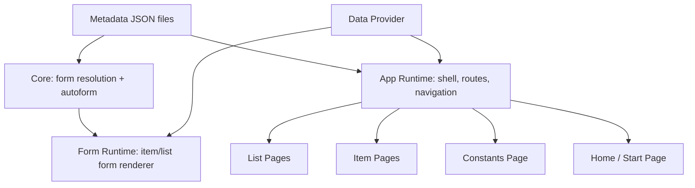

# Task: Phase 3 — Web Runtime Application

> **Prerequisite:** Phase 2a (DDL Generator), Phase 2b (Posting Engine), Phase 2c (Deployment Adapter) — генерація SQL і розгортання на PostgreSQL мають працювати.

## Контекст

Phase 2 дає інструменти для проєктування метаданих і генерації PostgreSQL-схем. Phase 3 замикає вертикальний зріз: **з тих самих JSON-метаданих система рендерить повноцінний web-додаток** — з оболонкою, розділами, списками і детальними картками об'єктів.

**Ціль Phase 3:** Запустити runtime web-додаток на окремому порті, де з `project.meta.json`, `*.meta.json` і опціонального `application.meta.json` формується:

- головне вікно застосунку з навігацією по розділах;
- сторінки списків для кожного об'єкта;
- сторінки деталей (item form) для кожного об'єкта;
- сторінка констант;
- автоматичні стандартні форми (autoform), якщо explicit `*.form.json` відсутній.

**Ключовий 1С-патерн:** якщо для сутності немає `list.form.json` або `item.form.json`, система **обов'язково** генерує стандартну форму з усіма доступними реквізитами в порядку, визначеному в конфігураторі. Explicit form завжди перемагає autogenerated.

### Що НЕ входить у цю фазу

- Desktop shell (Tauri)
- VS Code extension
- Візуальний конструктор форм (drag-and-drop form designer)
- Codegen / eject React-додатку (`@simetra/generator-react`, `@simetra/generator-react-app`)
- Кілька shell layouts (тільки один — SidebarWithHeader)
- Dashboard widgets framework (можна зробити placeholder стартову сторінку)
- Schema introspection / import existing DB
- Generated .NET / Node.js API
- `computedFields` MVP — якщо час дозволяє, інакше Phase 3.1

---

## Архітектурні рішення

### Монорепо-структура: нові пакети

```
packages/
├── core/                       ← ✅ існує, розширюється form/app schemas
├── form-runtime/               ← 🆕 runtime рендерер форм
├── app-runtime/                ← 🆕 runtime оболонка додатку
├── data-provider/              ← 🆕 абстрактний data-access contract
├── data-provider-postgrest/    ← 🆕 перший adapter: PostgREST/Supabase
├── ui/                         ← ✅ існує (@workspace/ui), розширюється domain-компонентами
├── generator-api/              ← ✅ існує
├── generator-pg/               ← ✅ існує
└── cli/                        ← ✅ існує
apps/
├── web/                        ← ✅ існує (конфігуратор)
└── runtime/                    ← 🆕 окремий Vite app — runtime web-додаток
```

### Три runtime-шари



- **Core (form model)** — Zod-схеми `form.json` і `application.meta.json`, алгоритм автоформи, `resolveForm()`. Чистий TS + Zod, без React.
- **Form Runtime** — React-компоненти для рендерингу item/list forms за form model. Споживає data provider для CRUD і ref lookups.
- **App Runtime** — React shell з маршрутами, sidebar, breadcrumbs, page composition. Споживає form runtime і data provider.
- **Data Provider** — абстрактний контракт для data access. Перший adapter: PostgREST або Supabase.

### Маршрутизація

```
/                                      → Start page (список розділів або placeholder dashboard)
/{subsystem}                           → Розділ: список об'єктів підсистеми
/{subsystem}/{object}                  → List page об'єкта
/{subsystem}/{object}/new              → Item page: створення
/{subsystem}/{object}/:id              → Item page: редагування
/settings                             → Constants page
```

### Пріоритет форм (precedence rule)

1. `forms/{form-kind}.form.json` (explicit) → пріоритет
2. Автогенерована стандартна форма з metadata → гарантований fallback
3. Explicit form **завжди** перемагає autogenerated, ніколи навпаки

---

## Етапи

### Етап 1: Zod-схеми form metadata у `@simetra/core`

- [ ] Створити `packages/core/src/schemas/form.ts`:
  - `formKindSchema` — `z.enum(["ItemForm", "ListForm"])`
  - `formFieldSchema` — `{ element: "Field", ref: string, label?, component?, readOnly?, autoFocus?, placeholder?, className?, hidden? }`
  - `formGroupSchema` — `{ element: "Group", title?, children[] }`
  - `formColumnsSchema` — `{ element: "Columns", columns: FormColumn[] }`
  - `formTabsSchema` — `{ element: "Tabs", tabs: FormTab[] }`
  - `formTabularSectionSchema` — `{ element: "TabularSection", ref: string, columns?, allowAdd?, allowDelete?, allowReorder? }`
  - `formSeparatorSchema` — `{ element: "Separator" }`
  - `formLabelSchema` — `{ element: "Label", text: LocalizedString }`
  - `formAccordionSchema` — `{ element: "Accordion", title?, children[] }`
  - `formLayoutElementSchema` — discriminated union усіх елементів вище
  - `toolbarButtonSchema` — `{ type: "SaveButton" | "SaveAndCloseButton" | "PostButton" | "UnpostButton" | "DeletionMarkButton" | "Separator" | "CustomButton", ... }`
  - `formSchema` — `{ $schema?, kind: FormKind, objectRef: MetadataRef, title?, width?, layout: FormLayoutElement, toolbar?, commandBar? }`
- [ ] Додати export у `packages/core/src/schemas/index.ts`
- [ ] Серіалізація: `FORM_KEY_ORDER` у `serialization.ts`
- [ ] **Тести:**
  - Валідний item form → pass
  - Валідний list form → pass
  - Порожній layout → pass
  - Невалідний element type → fail
  - Невалідний ref → fail

### Етап 2: Zod-схеми application metadata у `@simetra/core`

- [ ] Створити `packages/core/src/schemas/application.ts`:
  - `subsystemObjectSchema` — `{ ref: MetadataRef, showInList?, listForm? }`
  - `subsystemSchema` — `{ name, displayName, icon?, order, objects[] }`
  - `shellConfigSchema` — `{ layout: "SidebarWithHeader" }` (MVP — один layout)
  - `applicationSchema` — `{ $schema?, kind: "Application", displayName, shell?, subsystems[] }`
- [ ] Визначити, де зберігається `application.meta.json` — у `metadata/application.meta.json`
- [ ] Додати підтримку в serializer: key order, `$schema` URL
- [ ] Додати до `ProjectModel` опціональне поле `application?: Application`
- [ ] **Обов'язкова автогенерація без explicit файлу:**  
  Якщо `application.meta.json` відсутній, runtime будує дефолтну конфігурацію: одна підсистема на metadata kind, порядок = порядок kinds у конфігураторі, усі об'єкти видимі
- [ ] **Тести:** валідний/порожній application, автогенерація default

### Етап 3: Алгоритм автоформи у `@simetra/core`

- [ ] Створити `packages/core/src/autoform.ts`:
  - `generateItemForm(object, kind, metadata)` — генерує canonical `FormSchema` з metadata:
    1. Стандартні реквізити НЕ включаються в тіло форми (вони readonly, показуються в header або sidebar)
    2. Узяти всі user-defined attributes у порядку, визначеному масивом `attributes`
    3. Якщо є `tabularSections` → `Tabs`: перша вкладка "Основні" з полями, решта — по одній на кожну ТЧ
    4. Якщо немає ТЧ і полів > 6 → два стовпці `Columns`
    5. Якщо немає ТЧ і полів ≤ 6 → вертикальний список `Field`
    6. `toolbar` за типом:
       - `Catalog` → Save + DeletionMark
       - `Document` → Save + Post/Unpost + DeletionMark
       - Інші → Save
  - `generateListForm(object, kind, metadata)` — генерує canonical `FormSchema` для списку:
    1. Колонки = стандартні presentation реквізити (code/description для Catalog, number/date для Document) + user-defined attributes
    2. Порядок стовпців = порядок у масиві `attributes`
    3. Для великих об'єктів (>10 полів) — перші 8 + displayName полів
    4. Sorting defaults: Catalog → code asc, Document → date desc
  - `resolveForm(objectRef, formKind, explicitForms?, metadata)`:
    1. Шукає explicit form у `explicitForms` map
    2. Якщо знайдено → повертає її
    3. Якщо ні → викликає `generateItemForm` / `generateListForm`
- [ ] **Тести:**
  - Autoform для Catalog без ТЧ → вертикальний список
  - Autoform для Document з ТЧ → Tabs
  - Autoform для Catalog з >6 полів → Columns
  - List autoform: правильний порядок стовпців
  - resolveForm: explicit перемагає autogenerated
  - resolveForm: fallback коли explicit відсутній

### Етап 4: Data Provider — абстрактний контракт

- [ ] Створити `packages/data-provider/`:
  - `package.json` — `@simetra/data-provider`, чистий TS, без React
  - `src/index.ts`:
    ```
    interface DataProvider {
      list(objectRef, options: ListOptions): Promise<ListResult>
      get(objectRef, id: string): Promise<Record<string, unknown> | null>
      create(objectRef, data: Record<string, unknown>): Promise<Record<string, unknown>>
      update(objectRef, id: string, data: Record<string, unknown>): Promise<Record<string, unknown>>
      delete(objectRef, id: string): Promise<void>
      
      searchRef(targetRef, query: string, options?): Promise<RefOption[]>
      getRefDisplay(targetRef, id: string): Promise<string>
      
      postDocument(objectRef, id: string): Promise<void>
      unpostDocument(objectRef, id: string): Promise<void>
      
      getConstants(): Promise<Record<string, unknown>>
      updateConstant(name: string, value: unknown): Promise<void>
    }

    interface ListOptions {
      page?: number
      pageSize?: number
      sortBy?: string
      sortDirection?: "asc" | "desc"
      filters?: FilterExpression[]
      search?: string
    }

    interface ListResult {
      data: Record<string, unknown>[]
      total: number
      page: number
      pageSize: number
    }

    interface RefOption {
      id: string
      display: string
    }
    ```
- [ ] TypeScript типізація через generic `DataProvider` без прив'язки до конкретного SDK
- [ ] **Тести:** type-level тести (compile check)

### Етап 5: PostgREST / Supabase Data Provider

- [ ] Створити `packages/data-provider-postgrest/`:
  - `package.json` — `@simetra/data-provider-postgrest`, залежить від `@simetra/data-provider`
  - Dependency: `@supabase/supabase-js` або generic PostgREST fetch
  - Реалізація `DataProvider` через PostgREST REST API:
    - `list()` → `GET /rest/v1/{table}?select=*&order=...&limit=...&offset=...`
    - `get()` → `GET /rest/v1/{table}?id=eq.{id}`
    - `create()` → `POST /rest/v1/{table}`
    - `update()` → `PATCH /rest/v1/{table}?id=eq.{id}`
    - `delete()` → `DELETE /rest/v1/{table}?id=eq.{id}`
    - `searchRef()` → `GET /rest/v1/{table}?or=(code.ilike.*{q}*,description.ilike.*{q}*)&limit=20`
    - `postDocument()` → `POST /rest/v1/rpc/post_{document}`
    - `unpostDocument()` → `POST /rest/v1/rpc/unpost_{document}`
    - `getConstants()` → `GET /rest/v1/constants`
    - `updateConstant()` → `PATCH /rest/v1/constants?key=eq.{name}`
  - Naming: використовувати `naming.ts` з `@simetra/generator-pg` для snake_case table names
- [ ] **Тести:** unit тести з мок-сервером або msw
- [ ] Connection config: `{ url: string, anonKey: string }` — мінімальний набір

### Етап 6: Form Runtime — `@simetra/form-runtime`

- [ ] Створити `packages/form-runtime/`:
  - `package.json` — `@simetra/form-runtime`, залежить від `@simetra/core`, `@simetra/data-provider`, `@workspace/ui`
  - React + react-hook-form + zod (zodResolver)
  
#### 6.1. Field type → Component mapping

- [ ] `src/field-mapping.ts`:

  | Тип поля | Компонент | Умова |
  |---|---|---|
  | String (length ≤ 255) | `<Input />` | — |
  | String (length > 255) / Text | `<Textarea />` | — |
  | Integer, Numeric | `<Input type="number" />` | — |
  | Boolean | `<Switch />` | `<Checkbox />` через override |
  | Date | `<DatePicker />` | — |
  | DateTime | `<DatePicker />` + time | — |
  | Ref (kind=Enumeration) | `<Select />` | `<RadioGroup />` якщо ≤5 значень |
  | Ref (kind=Catalog) | `<CatalogCombobox />` | Autocomplete через data provider |
  | Ref (kind=Document) | `<DocumentCombobox />` | Autocomplete через data provider |
  | Ref (polymorphic) | `<Select />` (тип) + `<Combobox />` (значення) | Пара компонентів |
  | TabularSection | `<RuntimeDataTable />` | Inline edit, add/delete |

#### 6.2. Runtime Zod schema generation

- [ ] `src/schema-builder.ts`:
  - З metadata object + attributes генерує Zod schema на льоту
  - `required: true` → `.min(1)` або `.nonempty()`
  - `type: "Ref"` → `.string().uuid()`
  - `type: "Numeric"` → `.number()` з precision/scale
  - `type: "Boolean"` → `.boolean().default(false)`

#### 6.3. Item Form Renderer

- [ ] `src/item-form-renderer.tsx`:
  - Props: `objectRef, formModel, dataProvider, recordId?, onSave?, onCancel?`
  - Якщо `recordId` → завантажує запис через `dataProvider.get()`
  - Якщо ні → порожня форма для створення
  - Будує react-hook-form з zodResolver
  - Рекурсивно рендерить layout tree: `Field → renderField()`, `Group → Card`, `Columns → grid`, `Tabs → shadcn Tabs`, `TabularSection → RuntimeDataTable`
  - Toolbar рендерить кнопки відповідно до `toolbar` schema
  - Save → `dataProvider.create()` або `dataProvider.update()`
  - Post/Unpost → `dataProvider.postDocument()` / `dataProvider.unpostDocument()`

#### 6.4. List Page Renderer

- [ ] `src/list-renderer.tsx`:
  - Props: `objectRef, formModel, dataProvider, onRowClick?, onCreateClick?`
  - TanStack Table з колонками з form model
  - Server-side pagination через `dataProvider.list()`
  - Sorting: клік по заголовку стовпця
  - Search: пошукове поле зверху
  - Кнопка "Створити" → `onCreateClick`
  - Клік по рядку → `onRowClick(id)`
  - Для Ref-полів: показувати display value, не UUID
  - Для Boolean: чекбокс або іконка
  - Для DateTime: форматована дата

#### 6.5. Domain-компоненти

- [ ] `src/components/catalog-combobox.tsx`:
  - Props: `targetRef, dataProvider, value?, onChange?`
  - Autocomplete через `dataProvider.searchRef()`
  - Display через `dataProvider.getRefDisplay()`
- [ ] `src/components/enum-select.tsx`:
  - Props: `enumRef, metadata, value?, onChange?`
  - Значення з `enumeration.values` — не потребує data provider
- [ ] `src/components/runtime-data-table.tsx`:
  - Props: `tabularSectionMeta, formModel, value: Row[], onChange`
  - TanStack Table з inline edit
  - Add/Delete rows
  - Line number auto-increment
- [ ] Кнопки дій документа:
  - `src/components/post-button.tsx`
  - `src/components/unpost-button.tsx`
  - `src/components/deletion-mark-button.tsx`
  - `src/components/save-button.tsx`

### Етап 7: App Runtime — `@simetra/app-runtime`

- [ ] Створити `packages/app-runtime/`:
  - `package.json` — `@simetra/app-runtime`, залежить від `@simetra/core`, `@simetra/form-runtime`, `@simetra/data-provider`
  - Router: `react-router` (або TanStack Router)

#### 7.1. Shell layout — SidebarWithHeader

- [ ] `src/shell/sidebar-layout.tsx`:
  - Sidebar зліва (collapsible): розділи з іконками та підписами
  - Header зверху: breadcrumbs, назва поточного розділу
  - Main content area
  - Responsive: sidebar collapse на малих екранах
  - shadcn/ui sidebar component + sheet для мобільних

#### 7.2. Sidebar navigation

- [ ] `src/shell/sidebar-nav.tsx`:
  - Рендерить `subsystems[]` з application metadata
  - Кожен subsystem → навігаційний розділ
  - Кожен object у subsystem → link на list page
  - Active state tracking
  - Constants → окремий пункт "Налаштування" внизу sidebar

#### 7.3. Route generation

- [ ] `src/router.tsx`:
  - З `application` metadata і `ProjectModel` автоматично генерує маршрути:
    - `/` → `HomePage`
    - `/{subsystem}` → `SubsystemPage`
    - `/{subsystem}/{object}` → `ListPage`
    - `/{subsystem}/{object}/new` → `ItemPage` (create)
    - `/{subsystem}/{object}/:id` → `ItemPage` (edit)
    - `/settings` → `ConstantsPage`
  - Catch-all 404

#### 7.4. Standard pages

- [ ] `src/pages/home-page.tsx`:
  - Список усіх розділів з кількістю об'єктів
  - Або placeholder "Welcome" з посиланнями на підсистеми
- [ ] `src/pages/subsystem-page.tsx`:
  - Список об'єктів підсистеми з іконками, описом і посиланням на list page
- [ ] `src/pages/list-page.tsx`:
  - Використовує `resolveForm(objectRef, "ListForm", ...)` для form model
  - Передає у `ListRenderer`
  - Breadcrumbs: Home > Subsystem > Object (list)
  - Кнопка "Створити" → navigate to `/new`
  - Клік по рядку → navigate to `/:id`
- [ ] `src/pages/item-page.tsx`:
  - Використовує `resolveForm(objectRef, "ItemForm", ...)` для form model
  - Передає у `ItemFormRenderer`
  - Breadcrumbs: Home > Subsystem > Object > Item
  - Після save → navigate back to list або лишитись на сторінці
- [ ] `src/pages/constants-page.tsx`:
  - Список усіх констант
  - Кожна константа — поле з відповідним компонентом за типом
  - Save через `dataProvider.updateConstant()`
- [ ] `src/pages/not-found-page.tsx`

#### 7.5. SimetraApp — entry point

- [ ] `src/simetra-app.tsx`:
  ```
  <SimetraApp
    metadata={projectModel}
    dataProvider={dataProvider}
    forms={explicitForms}    // Map<string, FormSchema> — optional
    application={appConfig}  // optional, autogenerated if absent
    locale="uk"
  />
  ```
  - Збирає shell + router + providers
  - Якщо `application` не передано → автогенерація default application config
  - Якщо `forms` не передано → усі форми autogenerated

### Етап 8: Runtime Host App — `apps/runtime`

- [ ] Створити `apps/runtime/`:
  - Vite 6 app, окремий від `apps/web` (конфігуратор)
  - `package.json` — `runtime`, залежить від `@simetra/app-runtime`, `@simetra/data-provider-postgrest`, `@simetra/core`
  - `vite.config.ts` — dev server на порті 5174 (або інший, не 5173 як конфігуратор)
  - `src/main.tsx`:
    1. Завантажує metadata з файлів або URL
    2. Створює `PostgRESTDataProvider` з config
    3. Рендерить `<SimetraApp />`
  - Configuration: env variables або config file для connection settings
  - `pnpm --filter runtime dev` — запуск runtime app
  - `pnpm --filter runtime build` — production build

#### 8.1. Metadata loading

- [ ] Варіант A: завантажити metadata з локальних файлів (для dev)
- [ ] Варіант B: отримати metadata від конфігуратора через URL / shared directory
- [ ] `apps/runtime/src/load-metadata.ts`:
  - Зчитує `project.meta.json` + усі `*.meta.json` по структурі каталогів
  - Парсить через Zod-схеми core
  - Повертає `ProjectModel` + optional `Application` + optional `Map<string, FormSchema>`

#### 8.2. Runtime config

- [ ] `apps/runtime/src/config.ts`:
  - `SIMETRA_API_URL` — URL PostgREST / Supabase
  - `SIMETRA_ANON_KEY` — anon key для PostgREST
  - `SIMETRA_METADATA_PATH` — шлях до каталогу metadata
  - Змінні з `.env` або `runtime.config.json`

### Етап 9: Інтеграційний сценарій та тести

- [ ] End-to-end сценарій:
  1. У конфігураторі (`apps/web`) створити Catalog (Products), Document (SalesOrder) з ТЧ, Enumeration (OrderStatus), AccumulationRegister (InventoryBalance)
  2. Зберегти metadata на диск
  3. `simetra generate` → DDL
  4. Застосувати DDL на PostgreSQL (вручну або через CLI apply)
  5. Запустити `apps/runtime` → побачити shell з розділами
  6. Відкрити список Products → autogenerated list form
  7. Створити новий Product → autogenerated item form
  8. Зберегти → запис у БД
  9. Відкрити SalesOrder → form з табличною частиною
  10. Заповнити, зберегти, провести → posting functions executed
- [ ] Unit-тести для кожного пакету: `pnpm test`
- [ ] Integration-тести: форми, routing, data provider mock

---

## Clarify (питання перед імплементацією)

- [ ] **Router: react-router vs TanStack Router?**
  - Чому це важливо: визначає API маршрутизації для app runtime
  - Варіанти: react-router v7 (стабільний, широкий adoption) / TanStack Router (type-safe, file-based)
  - Вплив: архітектура app-runtime, DX

- [ ] **Application metadata: окремий файл чи секція project.meta.json?**
  - Чому це важливо: визначає, де розробник конфігурує розділи застосунку
  - Варіанти: окремий `metadata/application.meta.json` (BRD) / вбудований в `project.meta.json`
  - Вплив: serialization, file layout, configurator UI

- [ ] **Data Provider: supabase-js чи generic PostgREST fetch?**
  - Чому це важливо: supabase-js дає auth, realtime, storage "безкоштовно", але прив'язує до Supabase SDK
  - Варіанти: supabase-js (більше features) / generic fetch (більш portable)
  - Рекомендація: generic PostgREST fetch для MVP, supabase adapter як окремий пакет при потребі

- [ ] **Metadata loading strategy: static import чи runtime fetch?**
  - Чому це важливо: визначає, як runtime app отримує metadata
  - Варіанти: Vite static import під час build / fetch JSON під час runtime
  - Рекомендація: fetch під час runtime (дозволяє змінювати metadata без rebuild)

- [ ] **Де живуть domain-компоненти: у form-runtime чи @simetra/ui?**
  - Чому це важливо: BRD каже `@simetra/ui`, але поточний `@workspace/ui` — це shadcn примітиви
  - Варіанти: окремий `@simetra/ui` пакет / всередині `form-runtime`
  - Рекомендація: всередині `form-runtime` на Phase 3, винести в `@simetra/ui` на Phase 4 при потребі

- [ ] **Namespace: @simetra/data-provider чи @simetra/runtime-data?**
  - Чому це важливо: naming convention для runtime пакетів
  - Варіанти: data-provider (описовий) / runtime-data (grouped)
  - Вплив: DX, discoverability

- [ ] **Чи має runtime app підтримувати i18n?**
  - Чому це важливо: BRD каже LocalizedString для displayName скрізь
  - Варіанти: i18next як у конфігураторі / просте вбудоване читання locale
  - Рекомендація: просте вбудоване, без i18next overhead для runtime MVP

- [ ] **Autoform: чи включати стандартні реквізити у форму?**
  - Чому це важливо: 1С показує code/description у header, а не як звичайні поля
  - Варіанти: A) стандартні реквізити в окремому header/sidebar, user-defined у body / B) усе разом
  - Рекомендація: A — header зі стандартними, body з user-defined (як у 1С)

---

## Рекомендовані патерни

### Form resolution pattern
Алгоритм `resolveForm()` має бути у core, а не в runtime. Це дозволяє використовувати його в CLI, тестах і майбутніх codegen-генераторах без залежності від React.

### Provider injection pattern
`DataProvider` interface має передаватись через React context, а не через імпорт модуля. Це дозволяє легко замінювати adapters для тестів і різних deployment targets.

### Autoform determinism pattern
Autoform генерує **однакову** форму для однакових metadata. Жодних random ID, timestamps або рішень, що залежать від поточного стану runtime. Це дозволяє snapshot-тестувати autoform.

### Standard attributes separation pattern
Стандартні реквізити (code, description, date, number, posted, deletion_mark) показуються в окремій зоні форми (header або summary panel), а не змішуються з user-defined полями в тілі форми. Це ключовий UX-патерн 1С.

### Naming consistency pattern
Table names у PostgREST запитах обчислюються через ті самі naming-утиліти, що й у DDL генераторі. Не дублювати PascalCase→snake_case, а імпортувати з `@simetra/generator-pg/naming` або винести naming у core.

---

## Антипатерни (уникати)

### ❌ Form model → raw metadata coupling
Не рендерити форму напряму з `Catalog` / `Document` schema. Завжди проходити через `FormSchema` (explicit або autogenerated). Це дозволяє runtime бути стабільним навіть коли metadata model еволюціонує.

### ❌ App runtime = configurator extension
Не вбудовувати runtime app у `apps/web` (конфігуратор). Це окремий застосунок зі своїм entry point, стеком залежностей і lifecycle. Конфігуратор проєктує, runtime рендерить.

### ❌ Data provider lock-in
Не прив'язувати form-runtime напряму до supabase-js. Data provider — це абстрактний контракт. `form-runtime` імпортує `DataProvider` interface, а не конкретну реалізацію.

### ❌ computedFields как "маленька фіча"
Не недооцінювати computedFields — це фактично вбудований expression engine з потребою синхронізації клієнтської та серверної поведінки. Якщо scope затісний, перенести в Phase 3.1.

### ❌ Auto-list "показати все"
Не показувати всі поля в auto-list для об'єктів з >10 полями. Обмежити кількість стовпців розумним дефолтом (8-10), решту доступними через column picker.

### ❌ Дублювання naming logic
Не створювати окрему версію PascalCase→snake_case для runtime. Naming utilities мають бути єдиними для генератора і runtime. Винести в core або shared utility.

### ❌ Runtime metadata mutation
Runtime app **ніколи** не мутує metadata JSON. Він лише читає. Зміна metadata = повторне збереження в конфігураторі + перезавантаження runtime.

### ❌ Змішування form runtime з app runtime
`form-runtime` має працювати незалежно від `app-runtime`. Можна використати `<ItemFormRenderer>` без shell, sidebar і маршрутів. Цей пакет — library, не application.

---

## Пов'язана документація

- `docs/BRD-metadata-configurator.md`, §5.8 — computedFields
- `docs/BRD-metadata-configurator.md`, §9.1 — технологічний стек
- `docs/BRD-metadata-configurator.md`, §10.5.1–10.5.6 — маппінг типів, form.json, autoform, runtime renderer
- `docs/BRD-metadata-configurator.md`, §10.6.1–10.6.7 — application.meta.json, subsystems, routes, pages
- `docs/architecture/OVERVIEW.md` — поточна архітектура
- `docs/architecture/metadata-model.md` — metadata model contract
- `docs/architecture/storage-and-persistence.md` — storage provider pattern
- `docs/tasks/phase2c-deployment-adapter.md` — deployment і межа з runtime
- `.github/instructions/architecture-core.instructions.md` — core: pure TS + Zod
- `.github/instructions/metadata-model.instructions.md` — правила Zod schemas
- `.github/instructions/ui-architecture.instructions.md` — UI patterns

---

## Definition of Done

- [ ] `pnpm lint ; pnpm typecheck` — clean для всіх нових і змінених пакетів
- [ ] `pnpm test` — green для всіх нових і змінених пакетів
- [ ] Core: `form.ts`, `application.ts`, `autoform.ts` — Zod schemas і алгоритми без React
- [ ] `@simetra/data-provider` — абстрактний контракт, чистий TS
- [ ] `@simetra/data-provider-postgrest` — PostgREST adapter з тестами
- [ ] `@simetra/form-runtime` — item form renderer і list renderer
- [ ] `@simetra/app-runtime` — shell, router, standard pages
- [ ] `apps/runtime` — self-contained Vite app, запускається на окремому порті
- [ ] Autoform: якщо explicit form відсутній, list і item forms генеруються автоматично
- [ ] Autoform: explicit form **завжди** перемагає autogenerated (precedence rule)
- [ ] Стандартні реквізити показуються в окремій зоні, не змішані з user-defined
- [ ] End-to-end сценарій: configurator → metadata → DDL → apply → runtime → CRUD працює
- [ ] Документація оновлена: `docs/architecture/OVERVIEW.md` відображає нову структуру
