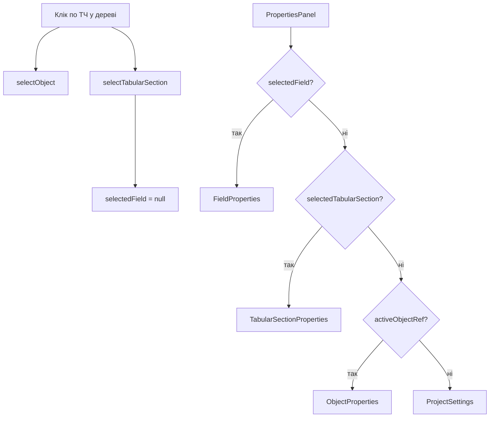

# Task: Стандартні реквізити — комплексне закриття всіх питань

## Контекст

Код-ревью та дослідження стандартних реквізитів виявило 4 проблеми різної критичності, які варто закрити в одній задачі, щоб не розмазувати по фазах. Проблеми стосуються: UI контексту табличних частин (відсутній), прокидання `recorderTypes` в UI adapter, панелі властивостей ТЧ, і фінальної актуалізації архітектурної документації.

Дослідження підтвердило повну відповідність BRD ↔ Core для всіх 7 MVP типів + TabularSection. Розбіжності з 1С (Catalog `predefined` boolean, Enumeration `Ref`/`Order`) є свідомими адаптаціями — вони задокументовані і НЕ потребують виправлення коду.

## Вимоги

### Part 1: TabularSectionProperties — нова панель властивостей ТЧ

> **Суть:** при виділенні табличної частини у дереві — права панель має показувати властивості ТЧ (не об'єкта і не поля). Зараз клік по ТЧ показує ObjectProperties, бо selection model не має окремого рівня для ТЧ.

- [Х] Додати `TabularSectionSelection` interface у `apps/web/src/stores/ui-store.ts`: `{ objectRef: MetadataRef; tabularSectionName: string }`
- [Х] Додати state `selectedTabularSection: TabularSectionSelection | null` у `UiState`
- [Х] Додати action `selectTabularSection(sel: TabularSectionSelection | null)` у `UiActions`
- [Х] Правила зв'язку між selection levels:
  - `selectTabularSection` — очищає `selectedField`
  - `selectObject` — очищає і `selectedField`, і `selectedTabularSection`
  - `selectField` — очищає `selectedTabularSection`
- [Х] У `apps/web/src/components/layout/tree-panel.tsx`: при кліку на nodeType `"tabularSection"` — крім `selectObject` також викликати `selectTabularSection({ objectRef: { kind, name: objectName }, tabularSectionName: nodeName })`
- [Х] Створити компонент `TabularSectionProperties` у `apps/web/src/components/properties/`:
  - Показує **технічне ім'я** ТЧ (editable через inline input з commit-on-blur, rename through store action)
  - Показує **displayName** ТЧ (editable, LocalizedString — аналог "Синоніму" в 1С; спосіб commit має відповідати фактичній реалізації компонента, не обов'язково commit-on-blur)
  - Кнопка "Стандартні реквізити" → відкриває `StandardAttributesDialog` з `tabularSectionName`
  - UX аналогічний `ObjectProperties`: використовує shadcn/ui `Accordion` для груп
- [Х] При rename технічного імені ТЧ — синхронізувати `selectedTabularSection.tabularSectionName` у ui-store
- [Х] У `apps/web/src/components/layout/properties-panel.tsx`: змінити пріоритет контексту:
  1. `selectedField` → `FieldProperties`
  2. **`selectedTabularSection` → `TabularSectionProperties`** (новий рівень)
  3. `activeObjectRef` (selectedObject → activeWindow → activeTab) → `ObjectProperties`
  4. Нічого → `ProjectSettings`
- [Х] Переконатись що всі місця, які скидають selection (`selectObject`, `closeTab`, `closeAllForObject`, `removeObject`, тощо) — також скидають `selectedTabularSection: null`

### Part 2: Кнопка "Стандартні реквізити" у header ТЧ

> **Суть:** окрім правої панелі, кнопку Standard Attributes дублювати прямо в header кожної ТЧ у accordion редакторі — як швидкий доступ, аналогічно як об'єкт має кнопку на панелі ObjectProperties.

- [Х] У `apps/web/src/components/editor/tabular-sections-editor.tsx`: у header кожного AccordionItem (поруч із кнопкою delete) додати icon button для Standard Attributes
- [Х] Кнопка відкриває `StandardAttributesDialog` з відповідним `tabularSectionName`
- [Х] Використовувати існуючий `StandardAttributesDialog` без змін (він вже підтримує `tabularSectionName` prop)

### Part 3: recorderTypes — bug fix у extract-settings.ts

> **Суть:** `extractStandardAttributeSettings` в `apps/web/src/lib/extract-settings.ts` не прокидає `recorderTypes` для InformationRegister і AccumulationRegister. Через це `recorder_id` у StandardAttributesDialog і AdditionalIndexesDialog відображається без конкретного ref target.

- [Х] У case `"InformationRegister"`: додати `recorderTypes` до результату (поруч із `periodicity`, `writeMode`)
- [Х] У case `"AccumulationRegister"`: додати `recorderTypes` до результату (поруч із `registerType`)
- [Х] Перевірити що `StandardAttributesDialog` коректно відображає ref target для `recorder_id` після виправлення
- [Х] Перевірити що `AdditionalIndexesDialog` також коректно використовує оновлені settings (smoke check)

### Part 4: Очищення dead path для StdAttrs ТЧ

> **Суть:** зараз є мертвий код, який передає `tabularSectionName` через `ObjectProperties` → `StandardAttributesDialog`. Цей шлях ніколи не спрацьовує (PropertiesPanel рендерить FieldProperties коли selectedField існує). Після Part 1 tabularSectionName передаватиметься через `TabularSectionProperties` — dead path у ObjectProperties треба видалити.

- [Х] У `apps/web/src/components/properties/object-properties.tsx`: видалити передачу `selectedField?.tabularSectionName` у `StandardAttributesDialog`. Prop `tabularSectionName` більше не потрібен у цьому контексті
- [Х] Переконатись що `StandardAttributesDialog` зберігає prop `tabularSectionName` (він використовуватиметься з `TabularSectionProperties`)

### Part 5: Тести

- [Х] Unit тест для `selectTabularSection` action: перевірити що очищає `selectedField`, встановлює `selectedTabularSection`
- [Х] Unit тест: `selectObject` очищає `selectedTabularSection`
- [Х] Unit тест: `selectField` очищає `selectedTabularSection`
- [Х] Regression тест: `closeTab` / `closeAllForObject` / `removeObject` — очищають `selectedTabularSection` якщо вона належала закритому об'єкту
- [Х] Unit тест: `extractStandardAttributeSettings` для InformationRegister з `recorderTypes` — повертає їх у результаті
- [Х] Unit тест: `extractStandardAttributeSettings` для AccumulationRegister з `recorderTypes` — повертає їх у результаті
- [Х] Component тест: `TabularSectionProperties` рендерить технічне ім'я, displayName і кнопку Standard Attributes
- [Х] Component тест: `PropertiesPanel` рендерить `TabularSectionProperties` коли `selectedTabularSection` !== null

### Part 6: Актуалізація архітектурної документації

> **Суть:** архітектурна документація має бути узгоджена з фактичним станом коду після виконання Parts 1–5. Після цих змін у наявних документах можуть лишитися некоректні описи selection model, properties panel пріоритетів або standard attributes. Цю фазу виконувати **після** Parts 1–5.

- [Х] Перевірити `docs/architecture/OVERVIEW.md` — чи є згадки properties panel або selection model, актуалізувати
- [Х] Перевірити `docs/architecture/state-management.md` — додати `selectedTabularSection` до опису ui-store
- [Х] Перевірити `docs/architecture/ui-components.md` — додати `TabularSectionProperties` у опис properties panel hierarchy та оновити пріоритет контексту
- [Х] Перевірити `docs/architecture/metadata-model.md` — актуалізувати секцію standard attributes: зафіксувати що ТЧ мають id + line_number, і що description override дозволений
- [Х] Перевірити `docs/architecture/patterns-and-decisions.md` — додати ADR або зафіксувати рішення:
  - Catalog `predefined` змодельовано через `predefined_name` (boolean не потрібен)
  - Enumeration не має standard attrs (order вже в values model)
  - Standard attrs мають readonly structure (набір/типи фіксовані), але editable description override (аналог Синоніму в 1С)
- [Х] Оновити `docs/phase1-known-limitations.md` — додати або актуалізувати запис про стандартні реквізити ТЧ (закрито)
- [Х] Якщо в документації зустрічається формулювання "Стандартні реквізити для кожного типу (readonly)" — уточнити: "readonly structure, editable description"

## Clarify (питання перед імплементацією)

- [Х] **tabularSectionSchema — додавати standardAttributeOverrides?**: зараз у `tabularSectionSchema` немає `standardAttributeOverrides`. Для повної симетрії з object-level варто додати, але це зміна core schema + serialization + save path у діалозі + тести.
  - Чому це важливо: визначає чи ТЧ standard attrs readonly чи editable description
  - Варіанти: (A) не додавати — ТЧ standard attrs строго readonly у діалозі; (B) додати — дозволити description override як для object-level (потребує: додати поле у `tabularSectionSchema`, оновити serializer, оновити `StandardAttributesDialog` read/write path для ТЧ overrides, додати тести)
  - Вплив на рішення: core schema + serialization + UI
  - Рішення: (B) додати — дозволити description override як для object-level

## Рекомендовані патерни

### Трирівнева selection model
Selection у ui-store має три взаємовиключних рівні:
1. Object level (`selectedObject`) — найменш специфічний
2. Tabular Section level (`selectedTabularSection`) — середній
3. Field level (`selectedField`) — найбільш специфічний

Вибір більш специфічного рівня очищає менш специфічні **нижні** рівні. Зворотне теж: вибір менш специфічного очищає все нижче. `selectedObject` завжди встановлюється, бо ТЧ і field завжди належать об'єкту.

### Перевикористання StandardAttributesDialog
Діалог вже підтримує `tabularSectionName` prop — при його наявності використовує `getTabularSectionStandardAttributes()` замість `getStandardAttributes()`. Не створювати окремий діалог для ТЧ стандартних реквізитів.

### Context-sensitive Properties Panel
PropertiesPanel визначає що рендерити за найбільш специфічним non-null selection. Порядок перевірки: field → tabularSection → object → project. Не використовувати nested if/else — використовувати ранній return.

### Inline rename у Properties Panel
Для технічного імені ТЧ використовувати той самий UX pattern що і для object properties в ObjectProperties: inline text field з commit-on-blur. `displayName` також редагується inline, але спосіб commit має відповідати фактичній реалізації компонента. Rename технічного імені потребує окремої store action (аналог `renameObject` для ТЧ), яка також оновлює `selectedTabularSection.tabularSectionName` у ui-store для синхронізації.

## Антипатерни (уникати)

### ❌ Окремий діалог для ТЧ Standard Attributes
Не створювати `TabularSectionStandardAttributesDialog`. `StandardAttributesDialog` вже має необхідну логіку — перевикористати його.

### ❌ Видалення getTabularSectionStandardAttributes з core
НЕ видаляти цю функцію з `packages/core/src/schemas/standard-attributes.ts`. Вона потрібна DDL generator у Phase 2 і вже використовується в `StandardAttributesDialog`. Попередня задача (`phase1-closure-fixes.md` Fix 4) пропонувала видалення — ця задача скасовує те рішення.

### ❌ Дублювання recorderTypes mapping
Не створювати окрему утиліту для recorderTypes. Використовувати існуючий `extractStandardAttributeSettings` — просто додати відсутні поля.

### ❌ Зміна BRD як частина code task
BRD (`docs/BRD-metadata-configurator.md`) — окремий from-source-of-truth документ. Зміни до BRD (наприклад, уточнення "readonly" → "readonly structure, editable description") виконувати окремо, не в цій задачі. Тут — тільки актуалізація architecture docs.

### ❌ Показувати StdAttrs ТЧ у списку StdAttrs об'єкта
Стандартні реквізити ТЧ (`id`, `line_number`) — це НЕ стандартні реквізити об'єкта. Вони відображаються окремо, на рівні самої ТЧ. Не змішувати їх у одному списку.

## Архітектурні рішення

### Selection model після змін

Трирівнева selection model у ui-store. `selectedObject` завжди вказує на поточний об'єкт. `selectedTabularSection` (новий) — середній рівень. `selectedField` — найбільш специфічний. PropertiesPanel обирає компонент за найбільш специфічним non-null рівнем.

### TabularSectionProperties data flow

Компонент отримує `objectRef` і `tabularSectionName` від selection. Далі знаходить об'єкт у поточній `model` за `kind/name` і шукає потрібну ТЧ у масиві `tabularSections`. Рендерить: технічне ім'я (editable, rename через store action), displayName (editable), кнопка Standard Attributes (відкриває існуючий `StandardAttributesDialog` з prop `tabularSectionName`).

### recorderTypes fix

Adapter `extractStandardAttributeSettings` для InformationRegister і AccumulationRegister має прокидати `recorderTypes` з об'єкта метаданих. Після фіксу діалоги `StandardAttributesDialog` і `AdditionalIndexesDialog` показуватимуть конкретні Document ref targets для `recorder_id` замість generic "Ref".

### Зведена карта стандартних реквізитів (результат аудиту)

| Тип | Core std attrs | BRD match | 1С адаптації |
|-----|---------------|-----------|-------------|
| Catalog | id, code, description, deletion_mark, parent_id, is_folder, owner_id, predefined_name, created_at, updated_at | ✅ Повна | predefined boolean → тільки predefined_name; created_at/updated_at додані |
| Document | id, number, date, posted, deletion_mark, created_at, updated_at | ✅ Повна | created_at/updated_at додані |
| Enumeration | (немає) | ✅ Повна | Ref/Order з 1С не потрібні (order в values model) |
| InformationRegister | period, recorder_id, line_number, active (умовні) | ✅ Повна | — |
| AccumulationRegister | period, recorder_id, line_number, active, movement_type (умовні) | ✅ Повна | — |
| Constant | (немає) | ✅ Повна | — |
| CustomTable | id (optional) | ✅ Повна | Simetra-specific тип |
| TabularSection | id, line_number | ✅ Повна | UI не підключений (ця задача) |

## Scope файлів (орієнтовний)

| Part | Файли |
|------|-------|
| 1 | `apps/web/src/stores/ui-store.ts`, `apps/web/src/components/layout/tree-panel.tsx`, `apps/web/src/components/layout/properties-panel.tsx`, `apps/web/src/components/properties/tabular-section-properties.tsx` (новий), `apps/web/src/stores/metadata-store.ts` (rename TS action) |
| 2 | `apps/web/src/components/editor/tabular-sections-editor.tsx` |
| 3 | `apps/web/src/lib/extract-settings.ts` |
| 4 | `apps/web/src/components/properties/object-properties.tsx` |
| 5 | `apps/web/src/__tests__/` (нові та оновлені тестові файли) |
| 6 | `docs/architecture/*.md`, `docs/phase1-known-limitations.md` |

## Пов'язана документація

- `docs/BRD-metadata-configurator.md` — бізнес-вимоги:
  - §5.1–5.10 — специфікація типів метаданих та їхніх стандартних реквізитів
  - §5.8 — TabularSection: стандартні реквізити `id`, `line_number`
- `docs/architecture/OVERVIEW.md` — загальна архітектура
- `docs/architecture/` — актуальний набір архітектурних документів, з якими має узгоджуватися Part 6
- `docs/research/Завдання 1 Повна карта метаданих 1СПідприємство 8.3.md` — повне порівняння стандартних реквізитів 1С (§5.2, Додаток A)
- `.github/instructions/ui-architecture.instructions.md` — правила побудови UI, properties panel контекст
- `.github/instructions/metadata-model.instructions.md` — правила роботи зі схемами, стандартні реквізити readonly

## Definition of Done

- [x] Клік по ТЧ у дереві → права панель показує `TabularSectionProperties` з технічним ім'ям, displayName і кнопкою Standard Attributes
- [x] Кнопка Standard Attributes відкриває діалог із `id` і `line_number`
- [x] Перейменування технічного імені ТЧ працює через праву панель, selection синхронізується
- [x] Встановлення/зміна displayName ТЧ працює через праву панель
- [x] У header ТЧ в accordion є icon button для швидкого доступу до Standard Attributes
- [x] `recorder_id` у StandardAttributesDialog та AdditionalIndexesDialog для регістрів показує конкретні ref targets (Document names)
- [x] Dead path `selectedField?.tabularSectionName` у ObjectProperties видалений
- [x] Selection model: selectObject очищає TS і field, selectTS очищає field, selectField очищає TS
- [x] Architeture docs актуалізовані (якщо вже створені) з новою selection model і properties hierarchy
- [x] Всі нові та оновлені тести проходять
- [x] `pnpm lint` — без помилок
- [x] `pnpm typecheck` — без помилок
- [x] `pnpm test` — всі тести проходять
